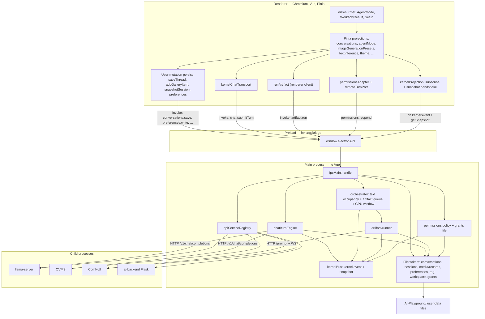
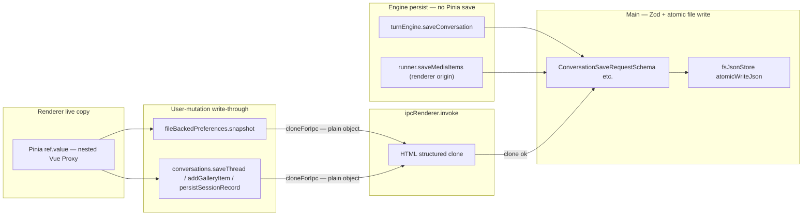
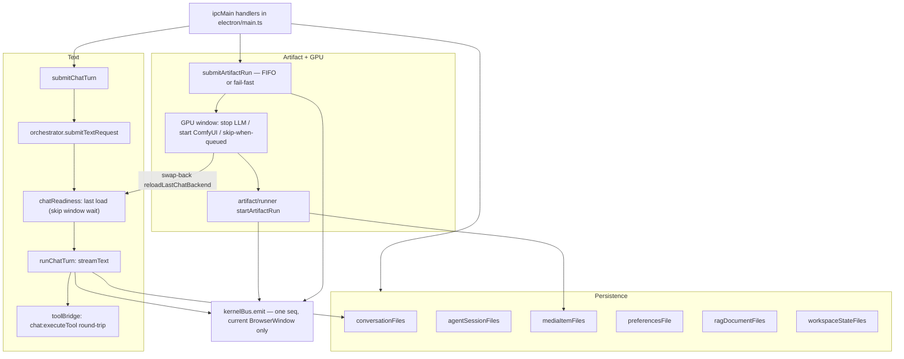

# Architecture as landed — processes, persistence, common sequences

**This is the implementation after migration steps 1–15**, not the target in
[`architecture-target.md`](./architecture-target.md). That file's §2 "Today" diagram is the
draft-time symptom picture (chat `streamText` in the renderer, media as UI mutation). Steps 1–7
moved Artifact, chat turns, the kernel bus and the orchestrator into main; step 8 moved app data
onto kernel-owned files; step 9 moved RAG retrieval and the embedding-server ensure into the chat
engine; step 10 put chat turns on the orchestrator as `text` occupancy; step 11 moved transcript
*when* onto the engines (chat file on turn start/end, renderer-origin gallery items from the
artifact runner, agent-session records on turn complete / capability rewrite); step 12 moved the
NL `media` specialist's inner Comfy tools in-process (Pi `media` no longer `executeToolInRenderer`);
step 13 moved Permissions policy into main (renderer is the dialog adapter); step 14 put
`activity` / `error` / `stored` and the live inference profile on the kernel bus; step 15 admits
Agent Mode and Home Agent `/load` through the same `text` gate as Chat. The §8.3 spine is complete.
What this document shows is how those pieces actually talk today.
Parked follow-ups live in [`architecture-target.md` §8.2](./architecture-target.md#82-parked-follow-ups-from-landed-steps).

The Mermaid here is the reviewable source. Paste any block into Excalidraw's _Mermaid to Excalidraw_
if you want it on the canvas.

---

## 1. Processes and components

Three Electron worlds plus the native/Python backends. Vue and Pinia exist only in the renderer.
Main has no Vue. Preload is the only thing that may call `ipcRenderer`.



What still lives in the renderer on purpose: message list and Chat instance, tool *closures*
(they read Pinia), the Permissions dialog / channel adapter (policy is main), screenshot /
web-browse, the Image Gen sidebar fields that `runArtifact` *reads* to build a request (it no
longer writes the active preset). Which model to load is still a Pinia fact shipped on the turn
/ IPC; the load itself and the live inference profile are main.

What lives in main: `streamText`, RAG retrieval after GPU admit, last-load memory and swap-back
reload, Artifact execution, GPU policy including chat-turn occupancy, Permissions grant policy,
the one writer of conversation / session / media / preference / rag-document / permission-grants
files (chat and renderer-origin gallery writes happen on turn/run lifecycle; Pinia still
forwards user mutations), the ordered event stream (`activity` / `error` / `stored` included).

---

## 2. Persistence and the IPC boundary

Step 8 made the kernel the one writer. Step 11 moved *when* for engine-owned transcripts: chat
turns persist from `turnEngine` (start + end), renderer-origin gallery items from
`artifact/runner.finish()`, agent sessions from turn-complete / capability rewrite — not a Pinia
map watch. The renderer is a live projection. User-mutation writes are still fire-and-forget IPC;
the Pinia maps stay the working copy.

Pinia `ref` object values are Vue reactive proxies. `JSON.stringify` walks them (that is how
`pinia-plugin-persistedstate` used to work). Electron `ipcRenderer.invoke` uses structured clone,
which **rejects** a `Proxy`. The DTO at the process boundary is `cloneForIpc`
(`JSON.parse(JSON.stringify)`): persist helpers clone before invoke, preload clones persist and
chat-submit payloads, and `makeForwardPersist` also catches a synchronous structured-clone throw
so it cannot bubble into Chat send. Main never sees Vue.



| Path | Channel | DTO today |
| --- | --- | --- |
| Theme, TTS, per-preset knobs, last-used names | `preferences:write` | `cloneForIpc` in `snapshot()` and preload |
| Launch flags | `settings.json` via the same helper | `cloneForIpc` in `snapshot()` and preload |
| Conversation thread (user mutation) | `conversations:save` | `cloneForIpc` at `saveThread` and preload |
| Conversation thread (chat turn) | `saveConversation` in `turnEngine` | `cloneForIpc` of messages in main; `persist` rides `chat:submitTurn` |
| Media gallery (user add/delete) | `mediaItems:save` / `mediaItems:delete` | `cloneForIpc` at `addGalleryItem` / delete and preload |
| Media gallery (renderer generate) | `saveMediaItems` in `artifact/runner.finish()` | items already plain in the run |
| Agent session record | `agentMode:saveSession` | `cloneForIpc` at `persistSessionRecord` (turn complete / rewrite), not a map watch |
| Chat turn | `chat:submitTurn` | `cloneForIpc` in `kernelChatTransport` and preload |

`toRaw` is shallow. Nested message objects stay proxied, which is why persist uses JSON clone
rather than `toRaw`. The setup wizard's `toRaw(pendingPreferredDevice)` is enough for one
device object.

---

## 3. Kernel internals (as landed)



Chat turns occupy the orchestrator as `text` requests (`queue-event`, not the artifact FIFO).
They stay concurrent by conversation. Local turns wait for the chat GPU window with no
proceed-anyway bound; cloud turns occupy without waiting. Nested media from a chat/agent tool
uses `queue` and may take the GPU while that conversation's occupancy is still live. Panel /
Home Agent `fail-fast` refuses while a local chat turn occupies. Swap-back reloads the last
successful remembered load in-process (no renderer RPC); cloud disarms that reload without
forgetting the snapshot. The GPU idle wait counts AI SDK streams, in-flight Pi agent HTTP, and
unrelated text occupancy.

---

## 4. Sequence — renderer boot and projection handshake

File-backed stores hydrate in `src/main.ts` **before Vue mounts**, so Chat / history / gallery never
see an empty map. The kernel bus handshake is listener-first so a recreated window can adopt an
in-flight turn.

```mermaid
sequenceDiagram
  participant Main as Electron main
  participant Pre as Preload
  participant Boot as src/main.ts
  participant Conv as conversations store
  participant Files as conversationFiles
  participant Bus as kernelBus
  participant Vue as App.vue

  Main->>Main: createWindow, setKernelEventWindow
  Boot->>Conv: init()
  Conv->>Pre: conversations.bootstrap
  Pre->>Files: conversations:bootstrap
  Files-->>Conv: threads + lastMainKey or empty
  alt leftover Pinia key and files empty
    Conv->>Files: conversations:migrate(legacy JSON)
    Files-->>Conv: written threads
  end
  Note over Conv: hydrated = true; write-through now armed
  Boot->>Boot: agentMode.init, imageGenerationPresets.init
  Boot->>Boot: Promise.all theme / TTS / textInference / presets / launch flags
  Boot->>Vue: mount
  Vue->>Pre: onKernelEvent + getSnapshot
  Note over Vue,Bus: subscribe BEFORE snapshot so nothing slips
  Bus-->>Vue: snapshot at seq N
  Bus-->>Vue: events with seq > N
```

Setup wizard (`globalSetup.loadingState = setupWizard`) can still be on screen after this hydrate.
The first preference mutation then flushes `preferences.json` through `snapshot()` (clone-safe). A
conversation user mutation (rename, TTS) uses `saveThread`. Chat generate does not.

---

## 5. Sequence — send "Hi" in Chat

`stampMetaForConversation` records preset/variant on the live thread. It does **not** write the
file. Durability rides `ChatTurnRequest.persist`: the engine writes on turn start (user message
survives a crash mid-stream) and turn end (assembled assistant, `ragSource` stamped). Download
consent still runs in the renderer **before** `chat:submitTurn`. LLM load and RAG retrieval happen
in the engine after GPU admit.

```mermaid
sequenceDiagram
  participant U as User
  participant Chat as Chat.vue
  participant Store as openAiCompatibleChat
  participant TI as textInference
  participant Conv as conversations
  participant IPC as ipcRenderer.invoke
  participant Eng as turnEngine
  participant Files as conversationFiles
  participant Orch as orchestrator
  participant LLM as llama-server / OVMS
  participant Bus as kernelBus

  U->>Chat: Send "Hi"
  Chat->>Store: generate(question)
  Store->>TI: ensureGlobalsMatchConversation
  Store->>TI: stampMetaForConversation
  TI->>Conv: setThreadMeta(key, preset+variant)
  Note over Conv: live copy only — no save
  Store->>TI: checkModelAvailability
  Note over Store,TI: download consent only — no LLM IPC
  Store->>Store: chat.sendMessage
  Store->>IPC: chat.submitTurn(request + persist)
  IPC->>Eng: submitChatTurn — Zod parse, begin snapshot
  Eng-->>Store: { turnId }
  Eng->>Files: saveConversation(request.messages)
  Eng->>Orch: submitTextRequest (occupancy + GPU wait if local)
  Eng->>Eng: ensureChatBackendReady (skip window wait; stop OVMS image + load)
  opt rag on the request
    Eng->>Eng: retrieveRagForTurn after admit
    Eng->>Bus: chat-rag
  end
  Eng->>LLM: streamText HTTP
  LLM-->>Eng: tokens
  Eng->>Bus: chat-chunk (coalesced)
  Bus->>Store: kernel:event
  Store->>Conv: applyConversationMessages (live copy)
  Eng->>Files: saveConversation(messages + assistant)
```

A tool call round-trips to the renderer (`chat:executeTool`): parent-turn chat tools still live
in Pinia. Direct Agent Mode image tools and the NL `media` specialist's inner Comfy tools skip
that and call the runner in-process. Screenshot and web-browse still `executeToolInRenderer`.
The tool bridge times out a wedged renderer closure after 10 minutes.

---

## 6. Sequence — Image Gen button

Panel generate no longer borrows `currentMode` or mutates another preset's sidebar. `runArtifact`
resolves the workflow, creates placeholder items, and submits to main. The orchestrator fail-fasts
a second panel run and takes the GPU window around ComfyUI.

```mermaid
sequenceDiagram
  participant U as User
  participant Panel as WorkflowResult / PromptArea
  participant IG as imageGenerationPresets
  participant RA as runArtifact
  participant Orch as orchestrator
  participant Ready as chatReadiness
  participant Art as artifact/runner
  participant Comfy as ComfyUI
  participant Bus as kernelBus
  participant Media as mediaItemFiles

  U->>Panel: Generate
  Panel->>IG: generate()
  IG->>RA: runArtifact({ workflow, params, origin renderer })
  RA->>IG: ensureModelsAreAvailableFor
  RA->>IG: track items (in-memory placeholders)
  RA->>Orch: artifact.run (IPC)
  Note over Orch: fail-fast if another panel run is admitted or a local chat turn occupies
  Orch->>Orch: acquire GPU window — stop chat LLM if needed
  Orch->>Art: startArtifactRun
  Art->>Comfy: /prompt + WS
  Comfy-->>Art: executing / progress / output
  Art->>Bus: artifact-phase, artifact-item
  Bus->>IG: projection updates items
  Art->>Media: saveMediaItems(done renderer items)
  Art-->>Orch: result
  Orch->>Ready: reloadLastChatBackend (skip GPU admit)
  Note over Ready: last remembered local load; cloud disarms swap-back
```

Chat `comfyUI` / `editImage` tools and Home Agent `/imgGen` call the same `runArtifact`. Chat-tool
and Pi in-process origins **queue** FIFO instead of fail-fast, so nested media can run while its
parent text occupancy is live. Panel fail-fast refuses while a local chat turn occupies. The GPU
skip-when-queued rule means a spritesheet pays one LLM⇄ComfyUI swap, not one per sprite. Agent-origin
runs do not write gallery records. User add/delete still goes through Pinia IPC.

---

## 7. Sequence — setup wizard (install + device)

Wizard UI is renderer. Install and device selection are main (service registry). The preferred
device is already `toRaw`'d because this path hit the clone trap earlier.

```mermaid
sequenceDiagram
  participant U as User
  participant Wiz as setupWizard
  participant BS as backendServices
  participant Reg as apiServiceRegistry
  participant Pref as fileBackedPreferences
  participant IPC as ipcRenderer.invoke

  U->>Wiz: enable llama.cpp / ComfyUI, Install
  Wiz->>BS: setUpService
  BS->>Reg: setUpService IPC
  Reg-->>Wiz: serviceSetUpProgress
  U->>Wiz: pick Arc B580
  Wiz->>Wiz: toRaw(pendingPreferredDevice)
  Wiz->>BS: selectDevice
  BS->>Reg: selectDevice IPC
  U->>Wiz: Continue
  Note over Pref,IPC: stores already hydrated in src/main.ts before mount
  Pref->>IPC: preferences.write(JSON-cloned snapshot)
  Note over Pref,IPC: this path is clone-safe; conversation user-mutation save is too
```

---

## 8. What to look at when something "leaks Vue"

| Question | Answer in this tree |
| --- | --- |
| Does main import Vue? | No. Kernel modules parse Zod and write JSON. |
| Where does a Proxy become a problem? | `ipcRenderer.invoke` argument clone, in the renderer. |
| Who is supposed to emit a DTO? | The persist / submit adapter (preload or the write-through helper), not the file writer. |
| Why did preferences work after the first fix? | `snapshot()` JSON-clones before `preferences:write`. |
| Why did Chat still toast? | Pre-step-11: `stampMeta` → `saveThread` passed a proxied thread. Chat send no longer saves; the engine writes `cloneForIpc(messages)` in main. User mutations still clone at `saveThread`. |

The architectural fix is one choke point that serializes projection state to plain JSON before
structured clone — not Vue types in main, and not a `toRaw` in every store.
