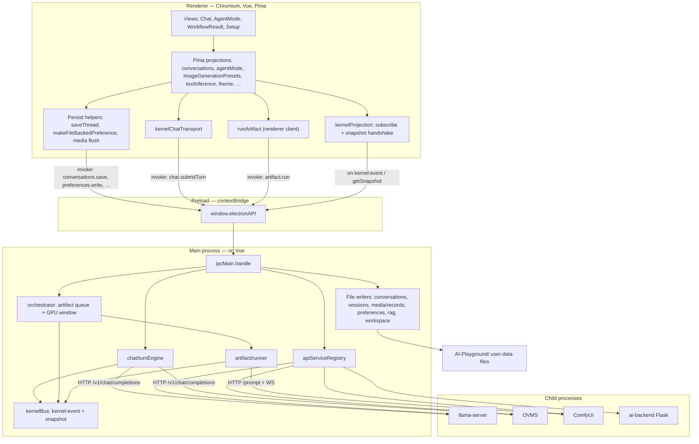
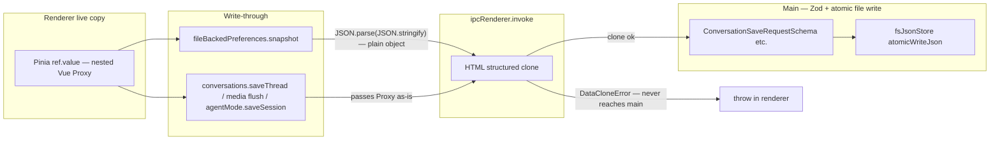
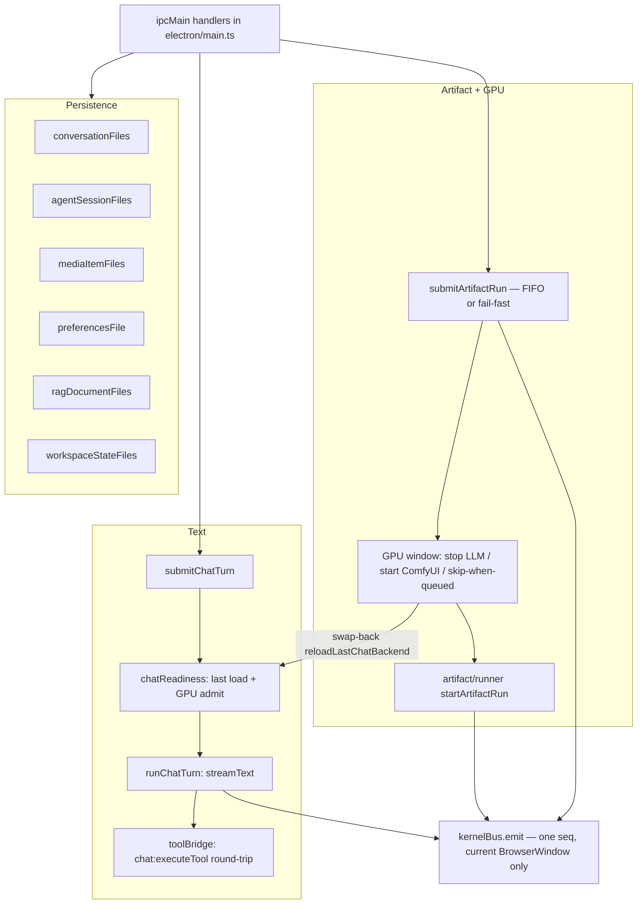
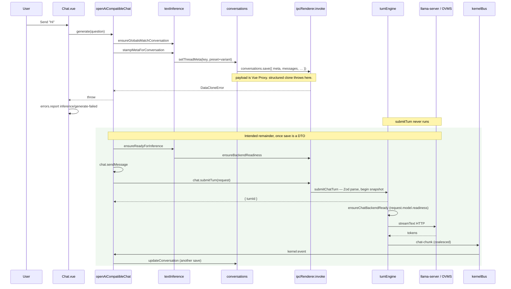
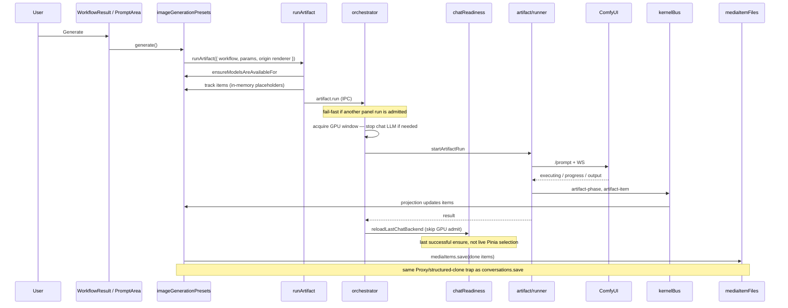

# Architecture as landed — processes, persistence, common sequences

**This is the implementation after migration steps 1–8**, not the target in
[`architecture-target.md`](./architecture-target.md). That file's §2 "Today" diagram is the
draft-time symptom picture (chat `streamText` in the renderer, media as UI mutation). Steps 1–7
moved Artifact, chat turns, the kernel bus and the orchestrator into main; step 8 moved app data
onto kernel-owned files. What this document shows is how those pieces actually talk today.

The Mermaid here is the reviewable source. Paste any block into Excalidraw's _Mermaid to Excalidraw_
if you want it on the canvas.

---

## 1. Processes and components

Three Electron worlds plus the native/Python backends. Vue and Pinia exist only in the renderer.
Main has no Vue. Preload is the only thing that may call `ipcRenderer`.



What still lives in the renderer on purpose: message list and Chat instance, tool *closures*
(they read Pinia), download consent UI, screenshot / web-browse, the Image Gen sidebar fields that
`runArtifact` *reads* to build a request (it no longer writes the active preset). Which model to
load is still a Pinia fact shipped on the turn / IPC; the load itself is main.

What lives in main: `streamText`, last-load memory and swap-back reload, Artifact execution, GPU
policy, the one writer of conversation / session / media / preference files, the ordered event
stream.

---

## 2. Persistence and the IPC boundary

Step 8 made the kernel the one writer. The renderer is a live projection. Writes are
fire-and-forget IPC; the Pinia maps stay the working copy.

The missing piece is a **DTO at the process boundary**. Pinia `ref` object values are Vue reactive
proxies. `JSON.stringify` walks them (that is how `pinia-plugin-persistedstate` used to work).
Electron `ipcRenderer.invoke` uses structured clone, which **rejects** a `Proxy`. Main never sees
Vue — invoke throws in the renderer.



| Path | Channel | DTO today |
| --- | --- | --- |
| Theme, TTS, per-preset knobs, last-used names | `preferences:write` | JSON-cloned in `snapshot()` |
| Launch flags | `settings.json` via the same helper | JSON-cloned in `snapshot()` |
| Conversation thread | `conversations:save` | **live Proxy** (`meta`, `messages`, `ragHashes`) |
| Media gallery item | `mediaItems:save` | **live Proxy** (the `done` `MediaItem`) |
| Agent session record | `agentMode:saveSession` | **live Proxy** (the session object) |
| Chat turn | `chat:submitTurn` | `options.messages` from the AI SDK Chat — also a reactive graph |

`toRaw` is shallow. Nested message objects stay proxied. That is why the setup wizard's
`toRaw(pendingPreferredDevice)` is enough for one device object and not enough for a thread.

---

## 3. Kernel internals (as landed)



Chat turns do **not** enter the artifact queue. They are concurrent by conversation. Their
backend load (`chatReadiness`) is admitted through the orchestrator so a load cannot OOM against an
active ComfyUI run. Swap-back reloads the last successful load in-process (no renderer RPC). Nested
media from a chat/agent tool *does* take the GPU window.

---

## 4. Sequence — renderer boot and projection handshake

File-backed stores hydrate in `src/main.ts` **before Vue mounts**, so Chat / history / gallery never
see an empty map. The kernel bus handshake is listener-first so a recreated window can adopt an
in-flight turn.

```mermaid
sequenceDiagram
  participant Main as Electron main
  participant Pre as Preload
  participant Boot as src/main.ts
  participant Conv as conversations store
  participant Files as conversationFiles
  participant Bus as kernelBus
  participant Vue as App.vue

  Main->>Main: createWindow, setKernelEventWindow
  Boot->>Conv: init()
  Conv->>Pre: conversations.bootstrap
  Pre->>Files: conversations:bootstrap
  Files-->>Conv: threads + lastMainKey or empty
  alt leftover Pinia key and files empty
    Conv->>Files: conversations:migrate(legacy JSON)
    Files-->>Conv: written threads
  end
  Note over Conv: hydrated = true; write-through now armed
  Boot->>Boot: agentMode.init, imageGenerationPresets.init
  Boot->>Boot: Promise.all theme / TTS / textInference / presets / launch flags
  Boot->>Vue: mount
  Vue->>Pre: onKernelEvent + getSnapshot
  Note over Vue,Bus: subscribe BEFORE snapshot so nothing slips
  Bus-->>Vue: snapshot at seq N
  Bus-->>Vue: events with seq > N
```

Setup wizard (`globalSetup.loadingState = setupWizard`) can still be on screen after this hydrate.
The first preference mutation then flushes `preferences.json` through `snapshot()` (clone-safe). A
conversation mutation uses `saveThread` (not clone-safe).

---

## 5. Sequence — send "Hi" in Chat

This is the path behind the clone toast: `stampMetaForConversation` runs **before** backend
readiness and **before** `chat:submitTurn`. `setThreadMeta` → `saveThread` → `invoke` throws
synchronously. `makeForwardPersist` only `.catch`es a rejected promise, so the throw reaches
`Chat.vue`'s generate `catch` as `inference/generate-failed`.



A tool call in that remainder round-trips to the renderer (`chat:executeTool`): the closures still
live in Pinia. Direct Agent Mode image tools skip that and call the runner in-process; the NL
`media` specialist still `executeToolInRenderer`.

---

## 6. Sequence — Image Gen button

Panel generate no longer borrows `currentMode` or mutates another preset's sidebar. `runArtifact`
resolves the workflow, creates placeholder items, and submits to main. The orchestrator fail-fasts
a second panel run and takes the GPU window around ComfyUI.



Chat `comfyUI` / `editImage` tools and Home Agent `/imgGen` call the same `runArtifact`. Chat-tool
and Pi in-process origins **queue** FIFO instead of fail-fast. The GPU skip-when-queued rule means
a spritesheet pays one LLM⇄ComfyUI swap, not one per sprite.

---

## 7. Sequence — setup wizard (install + device)

Wizard UI is renderer. Install and device selection are main (service registry). The preferred
device is already `toRaw`'d because this path hit the clone trap earlier.

```mermaid
sequenceDiagram
  participant U as User
  participant Wiz as setupWizard
  participant BS as backendServices
  participant Reg as apiServiceRegistry
  participant Pref as fileBackedPreferences
  participant IPC as ipcRenderer.invoke

  U->>Wiz: enable llama.cpp / ComfyUI, Install
  Wiz->>BS: setUpService
  BS->>Reg: setUpService IPC
  Reg-->>Wiz: serviceSetUpProgress
  U->>Wiz: pick Arc B580
  Wiz->>Wiz: toRaw(pendingPreferredDevice)
  Wiz->>BS: selectDevice
  BS->>Reg: selectDevice IPC
  U->>Wiz: Continue
  Note over Pref,IPC: stores already hydrated in src/main.ts before mount
  Pref->>IPC: preferences.write(JSON-cloned snapshot)
  Note over Pref,IPC: this path is clone-safe; conversation save is not
```

---

## 8. What to look at when something "leaks Vue"

| Question | Answer in this tree |
| --- | --- |
| Does main import Vue? | No. Kernel modules parse Zod and write JSON. |
| Where does a Proxy become a problem? | `ipcRenderer.invoke` argument clone, in the renderer. |
| Who is supposed to emit a DTO? | The persist / submit adapter (preload or the write-through helper), not the file writer. |
| Why did preferences work after the first fix? | `snapshot()` JSON-clones before `preferences:write`. |
| Why did Chat still toast? | `stampMeta` → `saveThread` still passes `conversationList.value[key]`. |

The architectural fix is one choke point that serializes projection state to plain JSON before
structured clone — not Vue types in main, and not a `toRaw` in every store.
