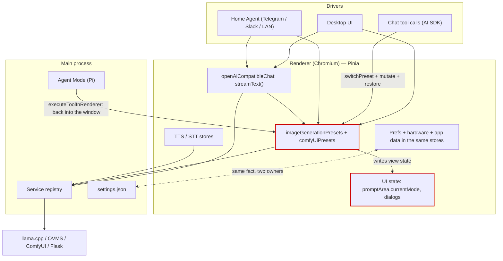
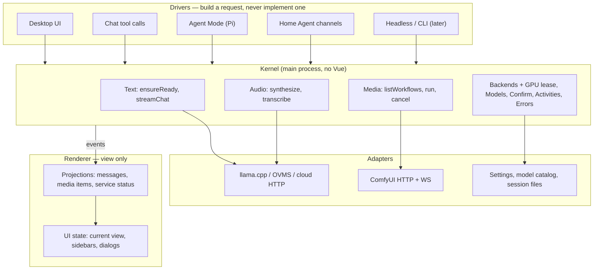
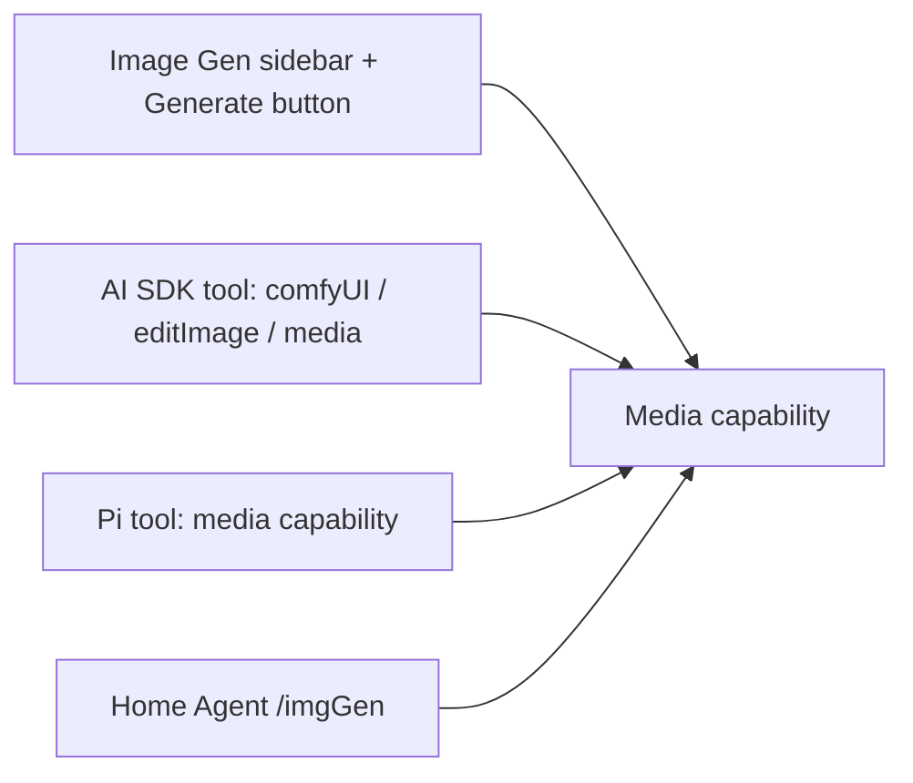
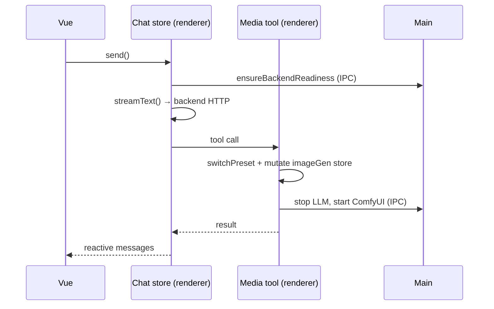
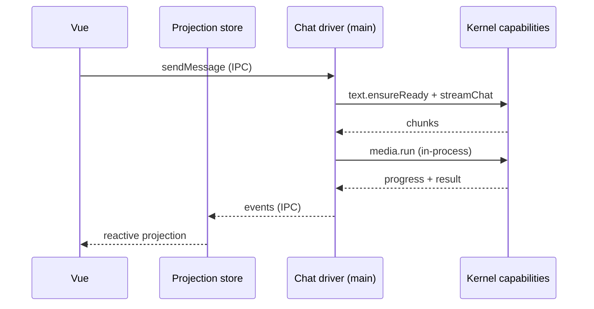
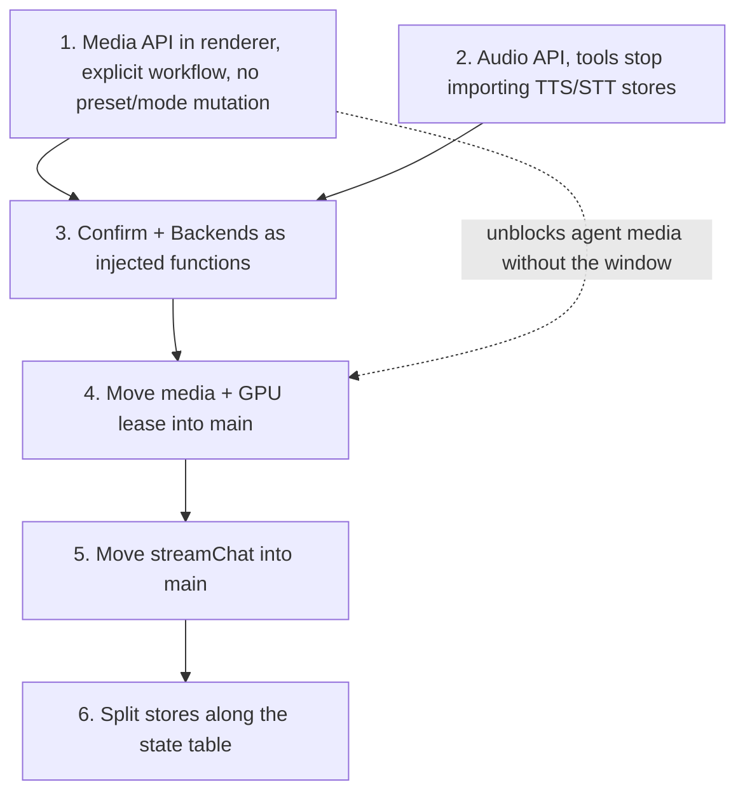

# Target architecture — capabilities, drivers, state ownership

**Status: draft for discussion. Nothing here is implemented.** This is a map of where the app is
today, where we want it, and the order in which we could get there. It exists to be argued with —
see [§10 Open questions](#10-open-questions-decisions-we-owe-ourselves).

## 0. How to read and edit this

The Mermaid diagrams in this file are the source of truth: they render on GitHub, they diff in
review, and they sit next to the code they describe. `docs/diagrams/architecture-target.excalidraw`
is a hand-draggable copy of the two main diagrams (§2 and §3) for whiteboard sessions — open it at
[excalidraw.com](https://excalidraw.com) via _File → Open_. Any other diagram here can be turned
into shapes with Excalidraw's built-in _Mermaid to Excalidraw_ (the "+" in the toolbar): paste a
block, drag it around, then fold whatever we decide back into this file.

A shared canvas alone would drift from the code within a week and is unreviewable in a PR, which is
why the prose and the decisions live here and the canvas is scratch space.

---

## 1. Symptoms — what actually hurts today

Every item below is a thing in the tree right now, not a hypothetical.

**One operation has four implementations.** "Generate an image" is reachable from the Image Gen
button, a chat tool call, an Agent Mode tool, and Home Agent `/imgGen`. They do not share an entry
point; they share a _mutable UI store_.

**Media generation is implemented as UI state mutation.** `tools/comfyUi.ts` snapshots seven fields
off `imageGenerationPresets` (`prompt`, `negativePrompt`, `inferenceSteps`, `width`, `height`,
`seed`, `batchSize`) plus the active preset and variant, calls `presetSwitching.switchPreset()` to
borrow the workflow, writes the tool's arguments into those same fields, runs the generation, and
restores everything in a `finally`. `tools/comfyUiImageEdit.ts` does the same. An agent asking for a
picture is literally impersonating a user clicking through the sidebar.

**The UI mode is part of that mutation.** `promptArea` carries both `currentMode` and
`userSelectedMode`, and `setModeOnly()` exists so background tool calls can "borrow a mode without
disturbing the UI". Two variables track one concept because a capability writes view state.

**The agent is in main but has to reach back into the window.** `electron/agentMode/capabilities/media.ts`
builds Pi tools whose `execute` calls `executeToolInRenderer(...)`, "because the Pinia stores driving
ComfyUI are there". So a headless host still needs a live renderer to make an image.

**Stores mix state that has different owners and lifetimes.** `textInference` persists `backend`,
`selectedModels`, `maxTokens`, `contextSize`, `temperature`, `ragList`, `settingsPerPreset` and
`screenshotWindow` in one bag — a user preference, a hardware-shaped choice, an indexed document set
and a capture-source pick. `backendServices` persists `lastSelectedDeviceIdPerBackend` while
`settings.json` separately persists `lastSelectedDevicePerBackend`: the same fact in two stores with
two owners.

**App data lives in the renderer's localStorage.** `imageGenerationPresets` persists
`generatedImages`, with a custom serializer that strips data URIs specifically to stay under the
localStorage quota. `conversations` persists every transcript; `agentMode` persists `sessions` next
to `defaultCapabilities` and `planningThinkingOnly` (session data next to user preferences).

**Home Agent needs the whole renderer graph.** `store/homeAgent.ts` imports chat, image generation,
prompt area, preset switching, confirmations, dialogs, TTS and STT. A Telegram message only works
because a window is alive to host that graph.

---

## 2. Today



The two red boxes are the problem. Everything that wants media goes through a store whose real job
is painting the Image Gen view, and that store writes view state as a side effect.

---

## 3. Target



Three rules make the picture real:

1. A **driver** turns intent into a typed request and hands it to a capability. It never talks to
   ComfyUI, llama.cpp or the service registry.
2. A **capability** never reads or writes UI state. It emits events; the view decides what to paint.
3. The **renderer** subscribes and renders. It owns what to show, not what to run.

---

## 4. Capability surfaces

A capability is a stable operation surface — not a Pi extension and not an AI SDK `tool()`. Those
two are _projections_ of a capability onto a model, and they are the thinnest possible layer:
schema, argument mapping, result shaping.

### 4.1 Media

```ts
type MediaKind = 'create-image' | 'edit-image' | 'create-video' | 'create-3d'

type MediaRequest = {
  kind: MediaKind
  workflow: string // preset id — explicit, never "whatever is active"
  prompt?: string
  source?: MediaRef // workspace path, data URI, or a previous item id
  params: MediaParams // seed, size, steps, batch, extra node inputs
}

type MediaCapability = {
  listWorkflows(filter?: { kind?: MediaKind }): WorkflowInfo[]
  run(request: MediaRequest, ctx: RunContext): Promise<MediaResult>
  cancel(runId: string): void
  // events: progress | item | failed | done
}
```

`RunContext` carries the abort signal, a `confirm` handle (weights download, gated HF repo, VRAM
warning) and the originator (`ui | chat-tool | agent | home-agent`) for tracing and GPU policy.

What this deletes: the save/mutate/restore block in `tools/comfyUi.ts`, the `switchPreset` round
trip, and `setModeOnly`. The GPU handoff currently in `tools/chatBackends.ts` (`stopChatBackends` /
`returnGpuToChat`) moves _inside_ the media implementation — a tool has no business knowing that
llama.cpp must die before ComfyUI can start.

### 4.2 Audio

```ts
type AudioCapability = {
  synthesize(req: { text: string; voice?: VoiceRef; language?: string; instruct?: string }): Promise<AudioResult>
  transcribe(req: { audio: AudioRef; language?: string }): Promise<TranscriptResult>
  listVoices(): VoiceInfo[]
}
```

Today `tools/synthesizeTextToSpeech.ts` imports `useQwen3TextToSpeech`, `useTextToSpeech`,
`useConversations` and `useActivities`. After this it builds a request and calls `synthesize`.

### 4.3 Text

```ts
type TextCapability = {
  ensureReady(cfg: { backend: LlmBackend; model: string; contextSize?: number; args?: string }): Promise<void>
  streamChat(req: ChatRequest): AsyncIterable<ChatEvent>
}
```

`ChatRequest` carries messages, the resolved sampling snapshot, the tool set and RAG context as
_inputs_. Nothing inside reads Pinia. `src/lib/chatModel.ts` calling `useTextInference()` inside the
model factory is the pattern to invert: the turn decides its configuration once, then passes it.

### 4.4 Supporting surfaces

| Surface        | Owns                                                        | Replaces today                                            |
| -------------- | ----------------------------------------------------------- | --------------------------------------------------------- |
| `Backends`     | start/stop/setup, device selection, the single GPU lease     | `backendServices` + `tools/chatBackends.ts`                |
| `Models`       | catalog, "is it on disk", download with progress             | `models` store + parts of `modelLibrary`                   |
| `Confirm`      | ask a human: download, gated repo, VRAM warning              | direct `useDialogStore()` calls inside inference paths     |
| `Activities`   | what the app is busy with                                    | `store/activities.ts` (already the right shape)            |
| `Errors`       | typed failures and how they surface                          | `store/errors.ts` (already the right shape)                |

`Confirm` is the one that unblocks headless: adapters are the modal dialog, an in-channel yes/no
(Home Agent already implements this), auto-allow for CI, and stdin for a CLI.

### 4.5 Projections



The agent capability catalog in `electron/agentMode/capabilities/` keeps its current job: deciding
_which kernel surfaces this session exposes_, plus skills, toolbox policy and session shape
(`ownSession`, `planningEnd`, `planHandoff`). It stops being a second implementation route.
`resolveBuiltinTools()` is the same idea for the AI SDK session. One catalog of capabilities, two
ways of hanging them on a model.

---

## 5. Drivers

| Driver             | Supplies                                             | Runs in         | Needs Chromium? |
| ------------------ | ---------------------------------------------------- | --------------- | --------------- |
| Desktop UI         | form values, active preset, user intent               | renderer        | yes, it is the UI |
| Chat tool calls    | model-chosen arguments against a JSON schema          | main (after §7) | no              |
| Agent Mode (Pi)    | same, through Pi tool definitions                     | main            | no              |
| Home Agent         | channel message, `/imgGen` picks, in-channel confirms | main (after §7) | no              |
| Headless / CLI     | scripted requests                                     | main or Node    | no              |

Two tools genuinely need the window and should stay bridged: window screenshot capture and in-page
web browsing/debugging, both of which drive a real `BrowserWindow`. Everything else crossing that
bridge today is doing so because of where the stores are.

---

## 6. State ownership

Classify by **who writes it** and **how long it lives**, not by which feature it belongs to.

| Bucket             | Lives in                              | Examples                                                                                              | Written by                     |
| ------------------ | ------------------------------------- | ----------------------------------------------------------------------------------------------------- | ------------------------------ |
| Machine config     | `settings.json`                       | product mode, `disabledBackends`, HF endpoint, `preferredDevice`, OEM override, `showDebugSettingsInUI` | setup wizard, dev settings, hand-edit |
| Hardware           | detected live; last choice in machine config | device lists + UUIDs, installed backend versions, VRAM gates                                       | backend adapters on probe/select |
| User preferences   | one prefs store (renderer now, user-data file once chat moves) | theme, locale, keep-models-loaded, favorites, per-preset temperature / tools / thinking, default voice | settings UI                    |
| App / session data | kernel memory + explicit files        | conversations, agent sessions, generated media, RAG index, loaded model, in-flight runs                 | kernel                         |
| UI state           | Pinia, mostly unpersisted             | current view, sidebars, dialog stack, scroll, `userSelectedMode`                                        | Vue only                       |

### Where today's fields land

| Today                                                         | Bucket             | Note                                                                 |
| ------------------------------------------------------------- | ------------------ | -------------------------------------------------------------------- |
| `textInference.backend`, `selectedModels`                      | user preference    | per preset, not global                                                |
| `textInference.temperature`, `maxTokens`, `contextSize`        | user preference    | belongs in `settingsPerPreset`, which already exists                  |
| `textInference.ragList`                                        | app data           | an indexed document set, not a setting                                |
| `textInference.screenshotWindow`                               | UI / input pref    | not inference at all                                                  |
| `backendServices.lastSelectedDeviceIdPerBackend`               | hardware           | duplicate of `settings.json` `lastSelectedDevicePerBackend` — pick one |
| `backendServices.comfyUiParameters`, `llamaCppParameters`      | machine config     | launch flags; today renderer-persisted                                |
| `backendServices.currentServiceInfo`                           | app data           | live process status, correctly ephemeral                              |
| `imageGenerationPresets.settingsPerPreset`                     | user preference    | keep                                                                  |
| `imageGenerationPresets.generatedImages`                       | app data           | in localStorage with a quota-dodging serializer; should be files      |
| `conversations.conversationList`                               | app data           | ditto                                                                 |
| `agentMode.sessions`, `workspaceDir`                           | app data           | —                                                                     |
| `agentMode.defaultCapabilities`, `planningThinkingOnly`        | user preference    | same store as the line above                                          |
| `promptArea.currentMode`                                       | UI state           | stops being writable by capabilities                                  |
| `promptArea.userSelectedMode`                                  | UI state           | can be deleted once nothing borrows the mode                          |

Rule of thumb: **if a headless run would still need it, it is not UI state**. If a fresh install
should ship it, it is machine config. If the user chose it and would be annoyed to lose it, it is a
preference. If the app produced it, it is app data and belongs in a file the kernel owns.

---

## 7. Moving chat into main

The AI SDK is a Node library; `streamText()` is in the renderer only because that is where the
stores were. Agent Mode already proved the shape: main runs the turn, the renderer registers
handlers for chunks, tool progress and completion.

**Today**



**Target**



**Moves:** `streamText`, tool resolution, the nested media specialist (`runMediaAgent`), RAG
retrieval, conversation persistence.
**Stays:** message rendering, tool cards, screenshot + web-browse tools, everything in §6's UI row.
**Risks to plan for:** Laminar's renderer-side telemetry bridge (`src/lib/laminarTelemetry.ts`) can
be simplified rather than ported, since main is where it ends up anyway; the RAG utility process is
already a main-process concern; `@ai-sdk/vue` bindings in components need a projection store behind
them; abort/cancel becomes an IPC message; and conversation persistence should move to files at the
same time rather than round-tripping localStorage over IPC.

**Do not do this first.** If `streamText` moves while the comfy tools still mutate Pinia, we own two
processes sharing UI state over IPC forever.

---

## 8. Migration order



| Step | Done when                                                                                  | Shippable alone |
| ---- | ------------------------------------------------------------------------------------------ | --------------- |
| 1    | `tools/comfyUi.ts` has no `switchPreset` and no save/restore block; UI and tools call `run` | yes             |
| 2    | `tools/synthesizeTextToSpeech.ts` imports no store                                          | yes             |
| 3    | no `useDialogStore()` inside an inference or download path                                  | yes             |
| 4    | `capabilities/media.ts` no longer calls `executeToolInRenderer`                             | yes             |
| 5    | renderer has no `streamText`; a turn survives with the window hidden                        | no, needs 1–4   |
| 6    | each field in §6's table sits in its bucket; `userSelectedMode` deleted                     | incremental     |

Steps 1–3 are worth doing even if we never move chat: they are what make the capabilities testable
without Electron.

---

## 9. What this buys

- One code path per operation. The Send button, a chat tool, Pi and `/imgGen` differ only in how
  they build the request.
- A media run stops changing what the user is looking at.
- Adding a driver (CLI, headless service, a second window) is "call the capability", not "boot Pinia
  without Vue".
- "Where does the last GPU choice live?" has an answer instead of a grep.

---

## 10. Open questions (decisions we owe ourselves)

1. **What does headless mean for us — hidden window, or no Chromium at all?** Hidden window is
   nearly free and stops after step 4. No Chromium means step 5 plus finding homes for the
   screenshot and web-browse tools. This choice sizes the whole plan.
2. **Do we converge the two harnesses?** Chat runs the AI SDK, Agent Mode runs Pi. They can stay two
   adapters behind one capability set, or become one. Converging is a bigger change than everything
   in §8 and should be decided on its own merits, not smuggled in.
3. **Where do conversations and generated media live after step 5** — user-data files owned by the
   kernel (my assumption), or a real embedded DB? `better-sqlite3` is already a dependency for
   persistent memory.
4. **May an agent change user preferences?** Home Agent's `configureHomeAgent` tool already does,
   behind a confirmation. If capabilities cannot write preferences, that tool needs an explicit
   preferences surface with its own confirm.
5. **Confirmation policy when nobody is watching.** Auto-allow downloads in headless? Cap by size?
   Refuse and report? This is a product decision that shapes the `Confirm` adapter set.
6. **Does the Image Gen view keep an "active workflow"?** It needs one to render the form. The
   question is whether that is UI state the view owns, or whether the view is a form over a
   `MediaRequest` draft.
7. **Who queues concurrent work?** There is one GPU, one `mediaPipeline` lane today, and after step
   5 the kernel could get requests from four drivers at once. Explicit queue with fairness, or first
   come first served?
8. **Do we version the kernel's interface?** If a CLI talks to a running app, IPC becomes a contract.
   A local socket with a versioned protocol is a different commitment than an internal function
   call.
