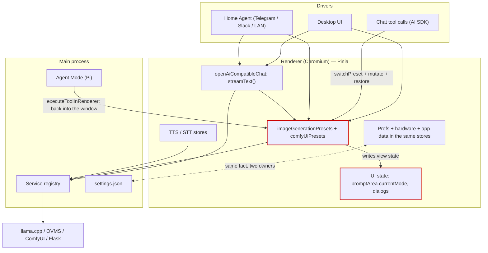
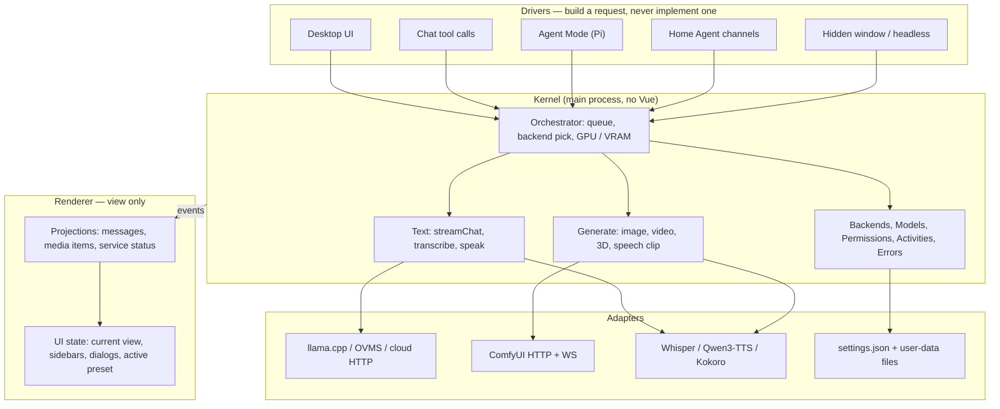
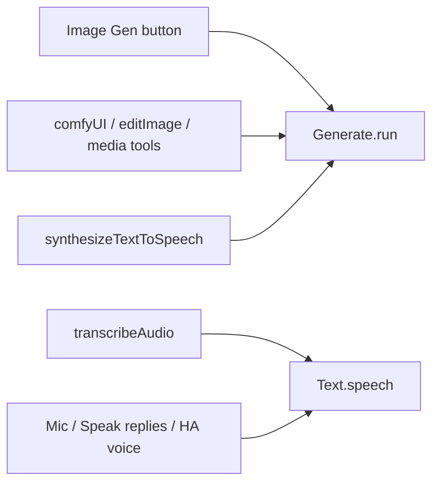
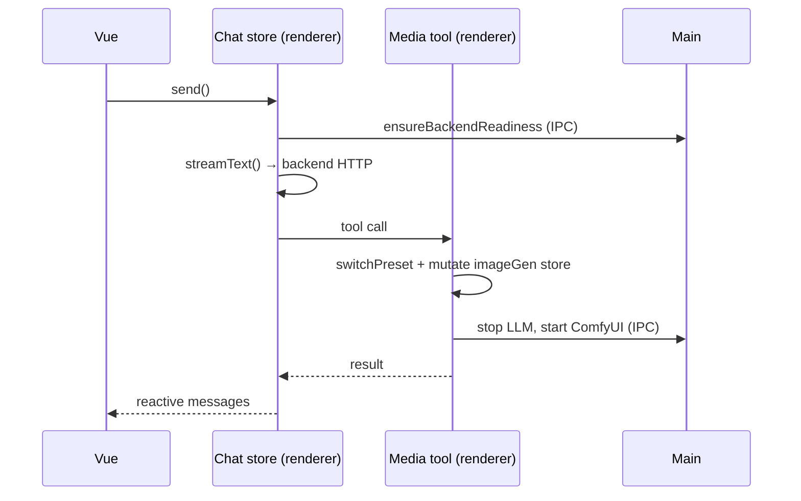
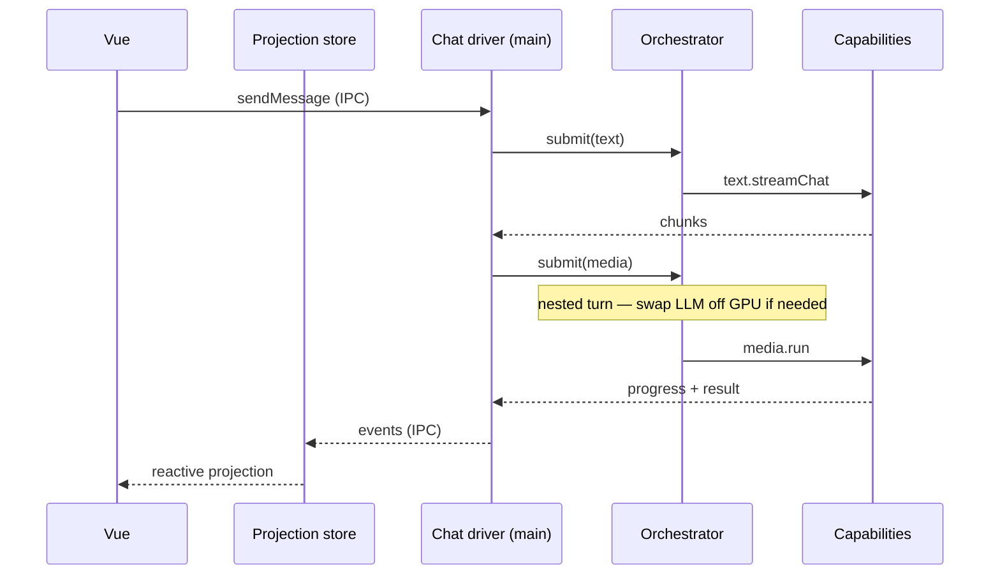
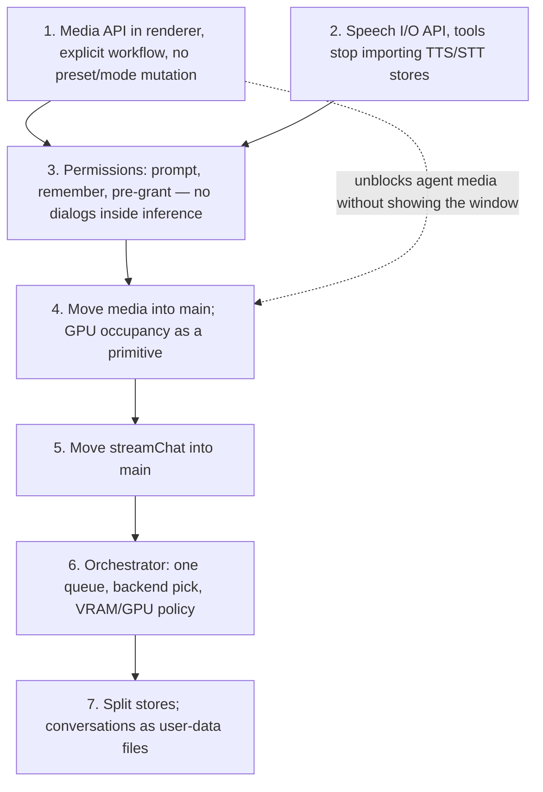

# Target architecture — capabilities, drivers, state ownership

**Status: draft for discussion. Nothing here is implemented.** This is a map of where the app is
today, where we want it, and the order in which we could get there. It exists to be argued with —
see [§10 Decisions](#10-decisions).

## 0. How to read and edit this

The Mermaid diagrams in this file are the source of truth: they render on GitHub, they diff in
review, and they sit next to the code they describe. `docs/diagrams/architecture-target.excalidraw`
is a hand-draggable copy of the two main diagrams (§2 and §3) for whiteboard sessions — open it at
[excalidraw.com](https://excalidraw.com) via _File → Open_. Any other diagram here can be turned
into shapes with Excalidraw's built-in _Mermaid to Excalidraw_ (the "+" in the toolbar): paste a
block, drag it around, then fold whatever we decide back into this file.

A shared canvas alone would drift from the code within a week and is unreviewable in a PR, which is
why the prose and the decisions live here and the canvas is scratch space.

---

## 1. Symptoms — what actually hurts today

Every item below is a thing in the tree right now, not a hypothetical.

**One operation has four implementations.** "Generate an image" is reachable from the Image Gen
button, a chat tool call, an Agent Mode tool, and Home Agent `/imgGen`. They do not share an entry
point; they share a _mutable UI store_.

**Media generation is implemented as UI state mutation.** `tools/comfyUi.ts` snapshots seven fields
off `imageGenerationPresets` (`prompt`, `negativePrompt`, `inferenceSteps`, `width`, `height`,
`seed`, `batchSize`) plus the active preset and variant, calls `presetSwitching.switchPreset()` to
borrow the workflow, writes the tool's arguments into those same fields, runs the generation, and
restores everything in a `finally`. `tools/comfyUiImageEdit.ts` does the same. An agent asking for a
picture is literally impersonating a user clicking through the sidebar.

**The UI mode is part of that mutation.** `promptArea` carries both `currentMode` and
`userSelectedMode`, and `setModeOnly()` exists so background tool calls can "borrow a mode without
disturbing the UI". Two variables track one concept because a capability writes view state.

**The agent is in main but has to reach back into the window.** `electron/agentMode/capabilities/media.ts`
builds Pi tools whose `execute` calls `executeToolInRenderer(...)`, "because the Pinia stores driving
ComfyUI are there". So a headless host still needs a live renderer to make an image.

**Stores mix state that has different owners and lifetimes.** `textInference` persists `backend`,
`selectedModels`, `maxTokens`, `contextSize`, `temperature`, `ragList`, `settingsPerPreset` and
`screenshotWindow` in one bag — a user preference, a hardware-shaped choice, an indexed document set
and a capture-source pick. `backendServices` persists `lastSelectedDeviceIdPerBackend` while
`settings.json` separately persists `lastSelectedDevicePerBackend`: the same fact in two stores with
two owners.

**App data lives in the renderer's localStorage.** `imageGenerationPresets` persists
`generatedImages`, with a custom serializer that strips data URIs specifically to stay under the
localStorage quota. `conversations` persists every transcript; `agentMode` persists `sessions` next
to `defaultCapabilities` and `planningThinkingOnly` (session data next to user preferences).

**Home Agent needs the whole renderer graph.** `store/homeAgent.ts` imports chat, image generation,
prompt area, preset switching, confirmations, dialogs, TTS and STT. A Telegram message only works
because a window is alive to host that graph.

---

## 2. Today



The two red boxes are the problem. Everything that wants media goes through a store whose real job
is painting the Image Gen view, and that store writes view state as a side effect.

---

## 3. Target



Four rules make the picture real:

1. A **driver** turns intent into a typed request and hands it to the kernel. It never talks to
   ComfyUI, llama.cpp or the service registry.
2. The **orchestrator** is the only thing that decides *when* a request runs and *which* backend is
   loaded for it. Capabilities do the work; they do not start each other's processes.
3. A **capability** never reads or writes UI state. It emits events; the view decides what to paint.
4. The **renderer** subscribes and renders. It owns what to show, not what to run. Headless, for
   now, is the same renderer with the window hidden — Chromium stays, Vue does not own the run.

---

## 4. Capability surfaces

A capability is a stable operation surface — not a Pi extension and not an AI SDK `tool()`. Those
two are _projections_ of a capability onto a model, and they are the thinnest possible layer:
schema, argument mapping, result shaping.

### 4.1 Generate (artifacts)

This is "produce a file the user keeps": an image, an edited image, a video, a 3D model, **or a
speech clip**. The MIME type is not the capability. ComfyUI is one adapter; the TTS engines are
another. Both answer `run`.

```ts
type ArtifactKind = 'create-image' | 'edit-image' | 'create-video' | 'create-3d' | 'create-speech'

type GenerateRequest = {
  kind: ArtifactKind
  workflow?: string // Comfy preset id; omitted for speech, which is not a Comfy workflow
  prompt?: string
  source?: MediaRef
  params: MediaParams // seed/size/steps *or* voice/language/instruct
}

type GenerateCapability = {
  listWorkflows(filter?: { kind?: ArtifactKind }): WorkflowInfo[]
  run(request: GenerateRequest, ctx: RunContext): Promise<MediaResult>
  cancel(runId: string): void
}
```

`create-speech` is how `tools/synthesizeTextToSpeech` (save a WAV into the thread / `audio/` folder)
and voice-design previews show up — the same item/progress/result shape as an image, which is why
TTS *felt* media-esque. It is not how the mic or "Speak replies" work; those are §4.2.

GPU handoff for Comfy kinds is an orchestrator concern, not `run`'s. Speech-clip generation usually
does **not** require swapping the LLM off the GPU (today OVMS keeps the speech sub-server up while
chat stops; Qwen3-TTS is its own sidecar). The orchestrator knows that per adapter; generate does
not.

What this deletes for Comfy kinds: the save/mutate/restore block in `tools/comfyUi.ts`, the
`switchPreset` round trip, and `setModeOnly`.

### 4.2 Speech as conversation I/O (belongs with Text)

Mic, Home Agent voice notes, "Speak replies", channel voice bubbles: these are not artifacts. They
are how a **text turn** is encoded and decoded. STT is a prompt entering the kernel; TTS-as-reply is
the assistant message leaving it. That is why they sit in the prompt bar and on every Home Agent
channel, and why video generation does not.

```ts
type SpeechIO = {
  transcribe(req: { audio: AudioRef; language?: string }): Promise<TranscriptResult>
  speak(req: { text: string; voice?: VoiceRef; language?: string }): Promise<AudioResult>
  listVoices(): VoiceInfo[]
}
```

`streamChat` may call `speak` at the end of a turn when the preset has `speakReplies`. The prompt
bar and Home Agent call `transcribe` *before* `streamChat`. The `transcribeAudio` tool is a thin
projection of `transcribe` for when the model should do it explicitly.

Same TTS/STT **adapters** as `create-speech`. Two drivers, one engine: do not grow a second Qwen3
client for the tool vs the prompt bar.

### 4.3 Text

```ts
type TextCapability = {
  ensureReady(cfg: { backend: LlmBackend; model: string; contextSize?: number; args?: string }): Promise<void>
  streamChat(req: ChatRequest): AsyncIterable<ChatEvent>
  speech: SpeechIO
}
```

`ChatRequest` carries messages, the resolved sampling snapshot, the tool set and RAG context as
_inputs_. Nothing inside reads Pinia. `src/lib/chatModel.ts` calling `useTextInference()` inside the
model factory is the pattern to invert: the turn decides its configuration once, then passes it.

**Folders follow that split, not MIME type:**

```
kernel/
  text/           # streamChat, ensureReady, speech I/O
  generate/       # run(image|video|3d|speech-clip)
  orchestrator/
  backends/
  permissions/
adapters/
  llamaCpp / ovms / cloud
  comfy
  speech          # whisper, qwen3-tts, kokoro, external — used by text.speech *and* generate
```

Putting `audio/` next to `media/` made the engine look like a product surface. It is not. Video is
a generate kind; a spoken reply is text I/O; a saved WAV is generate using the speech adapter.

### 4.4 Orchestrator

This is the piece that only exists once text and generate share a process. Today the same job is
smeared across three places that cannot see each other:

- `tools/mediaPipeline.ts` — two serial lanes (one per delegated `media` request, one per ComfyUI
  run) so parallel tool calls do not steal each other's preset and items.
- `tools/chatBackends.ts` — `stopChatBackends` / `returnGpuToChat`, plus `comfyRunsWaiting()` so a
  spritesheet does not swap the LLM off the GPU once per sprite when Keep Models Loaded is off.
- `ensureBackendReadiness` — start the right server and load the right model, with no knowledge of
  what else is queued.

After the move, every driver submits a request to one scheduler:

```ts
type KernelRequest =
  | { kind: 'text'; req: ChatRequest }
  | { kind: 'generate'; req: GenerateRequest }
  // speech I/O is not a third kind: transcribe/speak ride on a text turn, or are
  // generate(create-speech) when the user asked for a file.

type Orchestrator = {
  submit(request: KernelRequest, ctx: RunContext): Promise<unknown>
  cancel(runId: string): void
  // events: queued | backend-change | running | done
}
```

What it knows: incoming requests from every driver, which backends are installed, what is loaded
right now, the selected device and a coarse VRAM budget, Keep Models Loaded, and the permission
grants that apply. What it decides: queue vs start, whether this request needs a backend swap (LLM
off for ComfyUI, ComfyUI off for a chat turn), whether to skip the reload because more media is
waiting, and when a download/VRAM warning has to go through Permissions before work starts.

Fairness can stay simple at first (FIFO, media nested inside a chat/agent turn stays with that
turn). The important part is that the policy lives in one function instead of in the tools.

### 4.5 Supporting surfaces

| Surface        | Owns                                                                 | Replaces today                                            |
| -------------- | -------------------------------------------------------------------- | --------------------------------------------------------- |
| `Backends`     | start/stop/setup, device selection — the verbs the orchestrator uses | `backendServices` + service registry                      |
| `Models`       | catalog, "is it on disk", download with progress                     | `models` store + parts of `modelLibrary`                   |
| `Permissions`  | ask, remember, pre-grant: download, gated repo, VRAM, pref changes   | `useDialogStore()` inside inference; Home Agent confirms   |
| `Activities`   | what the app is busy with                                            | `store/activities.ts` (already the right shape)            |
| `Errors`       | typed failures and how they surface                                  | `store/errors.ts` (already the right shape)                |

**Permissions** is the consent layer. A capability (or the orchestrator, for a backend swap that
needs a download) calls `permissions.request(action)`. Adapters: modal dialog in the desktop UI,
in-channel yes/no on Home Agent (already exists for settings and downloads), and a **grant list**
the user can review and pre-fill so an agentic or channel-driven task does not stall on a prompt
nobody is looking at. Hidden-window / headless still has a user — they are just not in this window.
There is no silent auto-allow; there is prompt-once, remember, or pre-grant. See §10.4–10.5.

### 4.6 Projections



The agent capability catalog in `electron/agentMode/capabilities/` keeps its current job: deciding
_which kernel surfaces this session exposes_, plus skills, toolbox policy and session shape
(`ownSession`, `planningEnd`, `planHandoff`). It stops being a second implementation route.
`resolveBuiltinTools()` is the same idea for the AI SDK session. One catalog of capabilities, two
ways of hanging them on a model.

---

## 5. Drivers

| Driver             | Supplies                                             | Runs in         | Needs a window?      |
| ------------------ | ---------------------------------------------------- | --------------- | -------------------- |
| Desktop UI         | form values, active preset, user intent               | renderer        | yes, it is the UI    |
| Chat tool calls    | model-chosen arguments against a JSON schema          | main (after §7) | no                   |
| Agent Mode (Pi)    | same, through Pi tool definitions                     | main            | no                   |
| Home Agent         | channel message, `/imgGen` picks, in-channel confirms | main (after §7) | no                   |
| Hidden window      | same kernel as desktop; BrowserWindow not shown       | renderer+main   | Chromium, not a view |

Two tools genuinely need Chromium and should stay bridged: window screenshot capture and in-page
web browsing/debugging, both of which drive a real `BrowserWindow`. A hidden window still provides
that. Everything else crossing the bridge today is doing so because of where the stores are. A CLI
with no Chromium at all is out of scope until we decide it isn't.

---

## 6. State ownership

Classify by **who writes it** and **how long it lives**, not by which feature it belongs to.

| Bucket             | Lives in                              | Examples                                                                                              | Written by                     |
| ------------------ | ------------------------------------- | ----------------------------------------------------------------------------------------------------- | ------------------------------ |
| Machine config     | `settings.json`                       | product mode, `disabledBackends`, HF endpoint, `preferredDevice`, OEM override, `showDebugSettingsInUI` | setup wizard, dev settings, hand-edit |
| Hardware           | detected live; last choice in machine config | device lists + UUIDs, installed backend versions, VRAM gates                                       | backend adapters on probe/select |
| User preferences   | one prefs file (see §6.1)             | theme, locale, keep-models-loaded, favorites, per-preset knobs, default voice, **default preset (`Preset \| last`)** | settings UI; agents only via Permissions |
| App / session data | kernel memory + user-data files       | conversations, agent sessions, generated media, RAG index, loaded model, in-flight runs                 | kernel                         |
| UI state           | Pinia, mostly unpersisted             | current view, sidebars, dialog stack, scroll, **active preset / mode for this session**                 | Vue only                       |

### Where today's fields land

| Today                                                         | Bucket             | Note                                                                 |
| ------------------------------------------------------------- | ------------------ | -------------------------------------------------------------------- |
| `textInference.backend`, `selectedModels`                      | user preference    | per preset, not global                                                |
| `textInference.temperature`, `maxTokens`, `contextSize`        | user preference    | belongs in `settingsPerPreset`, which already exists                  |
| `textInference.ragList`                                        | app data           | an indexed document set, not a setting                                |
| `textInference.screenshotWindow`                               | UI / input pref    | not inference at all                                                  |
| `backendServices.lastSelectedDeviceIdPerBackend`               | hardware           | duplicate of `settings.json` `lastSelectedDevicePerBackend` — pick one |
| `backendServices.comfyUiParameters`, `llamaCppParameters`      | machine config     | launch flags; today renderer-persisted                                |
| `backendServices.currentServiceInfo`                           | app data           | live process status, correctly ephemeral                              |
| `imageGenerationPresets.settingsPerPreset`                     | user preference    | keep                                                                  |
| `imageGenerationPresets.generatedImages`                       | app data           | in localStorage with a quota-dodging serializer; should be files      |
| `conversations.conversationList`                               | app data           | ditto                                                                 |
| `agentMode.sessions`, `workspaceDir`                           | app data           | —                                                                     |
| `agentMode.defaultCapabilities`, `planningThinkingOnly`        | user preference    | same store as the line above                                          |
| `promptArea.currentMode`                                       | UI state           | session-only; hydrated at startup from default-preset pref            |
| `promptArea.userSelectedMode`                                  | UI state           | can be deleted once nothing borrows the mode                          |
| last-used preset per category (today inside preset switching)  | user preference    | the `last` half of `defaultPreset: Preset \| last`                    |
| active preset while the app is running                         | UI state           | not written back except as "last used" when the pref is `last`        |

Rule of thumb: **if a headless run would still need it, it is not UI state**. If a fresh install
should ship it, it is machine config. If the user chose it and would be annoyed to lose it, it is a
preference. If the app produced it, it is app data and belongs in a file the kernel owns.

The Image Gen (and Chat, Video, …) view keeps an active workflow so it has a form to render. That
selection is UI state. On a cold start it is filled from a user preference
`defaultPreset: <preset name> | "last"` (default `"last"`, which is what `switchToLastUsedForCategory`
already does). After that, clicking a preset card only changes what this session shows — it does
not change the preference unless the user edits the setting. A media tool never reads this value; it
passes `workflow` on the request.

### 6.1 User-data files — layout, performance, correctness

App data should live next to the media the user can already find, not in Chromium's localStorage
(opaque, quota-capped, the reason `generatedImages` has a serializer whose job is stripping data
URIs) and not only in Electron `userData` (hidden, easy to lose on uninstall).

We already have this split for generated output:

| Path | Content |
| ---- | ------- |
| `~/Documents/AI-Playground/media` (Windows) / `~/AI-Playground/media` | images, video, RAG docs |
| `…/games` | Game Agent library |
| `…/audio` | TTS output |

Conversations and agent transcripts join that tree. Machine config (`settings.json`, last GPU,
disabled backends) stays in Electron `userData` — that is device state, not something to copy
between machines by zipping a folder.

```
AI-Playground/
  media/                  # already
  games/                  # already
  audio/                  # already
  conversations/
    index.json            # id, title, preset, mtime — cheap to list
    <id>.json             # one thread, schemaVersion inside
  agent-sessions/         # same idea; Pi's own files can stay as they are
```

User preferences that a human would want in a backup (`defaultPreset`, theme, per-preset knobs)
can live as `AI-Playground/preferences.json`. Things a restore onto a different PC should not
blindly apply (device ids, disabled backends) stay in `userData`.

**Performance — the current store is the thing to beat, not SQLite.** Pinia persist rewrites the
entire `conversationList` into one localStorage key on every message. One file per conversation,
written by the kernel, is already an improvement: listing the history panel reads `index.json`,
opening a thread reads one file, and a turn in conversation A does not rewrite B.

What would actually hurt:

- **Write-per-token.** Streaming a reply at 50 tok/s must not `fsync` a 2 MB JSON 50 times a
  second. Write on turn complete, plus a periodic checkpoint during long agent turns so a crash
  does not lose ten minutes. The in-memory projection is the live copy; the file is the durable
  one.
- **Loading every thread at startup.** Don't. The index is enough for the history list.
- **Pixels in JSON.** Keep doing what `sanitizeBulkyToolOutputs` and the `generatedImages`
  serializer already do: media is a file, the transcript holds an `aipg-media://` (or
  workspace-relative) reference.
- **Main-process stalls.** `JSON.stringify` of a huge thread on the main thread can hitch the
  window. Write via a worker or after the turn, not on every IPC chunk.

SQLite is already in the tree for persistent memory (`better-sqlite3` / `pi-hermes-memory`), and it
is the right tool for *derived* work: full-text search across chats, "find this image's parent
turn". That index is rebuildable from the files. It is not the source of truth. Mixing "the user
opens a JSON in an editor" with "the only copy lives in a DB they cannot inspect" would undo the
ownership argument.

**Correctness — the real risks, and they are already ours:**

- **Torn writes on crash.** Write to `*.json.tmp` and rename. Same trick for `index.json`.
- **Interrupted turns.** `completeOrphanedToolParts` exists because a persisted orphaned tool call
  bricks the thread on the next send. Files do not remove that; they make it a kernel
  responsibility at checkpoint time, not a Pinia `afterHydrate`.
- **One writer.** Renderer, Home Agent and Pi must not append the same file. The kernel owns the
  files; everyone else sends events. That is the actual correctness win of the move — localStorage
  is "one writer" only because one window exists.
- **Demo mode.** Today `demoAwareStorage` swaps localStorage for sessionStorage. Files need a
  session-scoped directory that is deleted on exit, not a write into the user's real library.
- **The user editing a file while the app is running.** v1: last-write from the kernel wins; we do
  not watch. Document it. A later watcher is possible because they are files.
- **Schema.** Each document carries `schemaVersion`. Migrations are per-file, lazy, on read.
- **Windows.** Antivirus briefly locking a file we just wrote; path-length; names that are not
  legal filenames. Conversation ids are slugs (Game Agent already does this), titles stay inside
  the JSON.
- **HMR.** Pinia's hot-update merge has already eaten session maps. Files do not.
- **Migration from localStorage.** One-shot, on first kernel boot that sees the old keys and no
  `conversations/index.json`. Do not dual-write.

None of that is a reason to pick SQLite as the store. It is a reason to treat the file layer as a
real persistence adapter (atomic write, checkpoint policy, one writer) instead of `JSON.stringify`
into `userData` on every mutation.

---

## 7. Moving chat into main

The AI SDK is a Node library; `streamText()` is in the renderer only because that is where the
stores were. Agent Mode already proved the shape: main runs the turn, the renderer registers
handlers for chunks, tool progress and completion.

**Today**



**Target**



**Moves:** `streamText`, tool resolution, the nested media specialist (`runMediaAgent`), RAG
retrieval, conversation persistence.
**Stays:** message rendering, tool cards, screenshot + web-browse tools, everything in §6's UI row.
**Risks to plan for:** Laminar's renderer-side telemetry bridge (`src/lib/laminarTelemetry.ts`) can
be simplified rather than ported, since main is where it ends up anyway; the RAG utility process is
already a main-process concern; `@ai-sdk/vue` bindings in components need a projection store behind
them; abort/cancel becomes an IPC message; and conversation persistence should move to files at the
same time rather than round-tripping localStorage over IPC.

**Do not do this first.** If `streamText` moves while the comfy tools still mutate Pinia, we own two
processes sharing UI state over IPC forever. The orchestrator also cannot exist until both text and
media requests arrive in the same process — until then it would just be another name for
`ensureBackendReadiness`.

---

## 8. Migration order



| Step | Done when                                                                                  | Shippable alone |
| ---- | ------------------------------------------------------------------------------------------ | --------------- |
| 1    | `tools/comfyUi.ts` has no `switchPreset` and no save/restore block; UI and tools call `run` | yes             |
| 2    | `transcribeAudio` / speak-replies import no TTS/STT store; same speech adapter as generate   | yes             |
| 3    | no `useDialogStore()` inside inference/download; grants are a reviewable list               | yes             |
| 4    | `capabilities/media.ts` no longer calls `executeToolInRenderer`                             | yes             |
| 5    | renderer has no `streamText`; a turn survives with the window hidden                        | no, needs 1–4   |
| 6    | text and media no longer start each other's backends; one queue visible in Activities       | no, needs 5     |
| 7    | each field in §6's table sits in its bucket; `userSelectedMode` deleted; files own transcripts | incremental  |

Steps 1–3 are worth doing even if we never move chat: they are what make the capabilities testable
without Electron. Step 6 is the reason to move them at all — until then the GPU policy stays
scattered.

---

## 9. What this buys

- One code path per operation. The Send button, a chat tool, Pi and `/imgGen` differ only in how
  they build the request.
- A media run stops changing what the user is looking at.
- Hidden-window Home Agent, and later a CLI, call the same kernel as the desktop.
- GPU policy is one function, not three helpers that cannot see each other's queues.
- "Where does the last GPU choice live?" has an answer instead of a grep. Transcripts are files the
  user can copy.

---

## 10. Decisions

| # | Question | Decision |
| --- | --- | --- |
| 1 | Headless = hidden window, or no Chromium? | **Hidden window for now.** Chromium stays; Vue does not own the run. Screenshot and web-browse keep working. A Chromium-free CLI is a later product decision. |
| 2 | Converge AI SDK and Pi? | **No.** Two harnesses, one capability set. Converging is its own project. |
| 3 | Files vs SQLite for conversations / media? | **User-data files as source of truth** (see §6.1). SQLite stays for persistent memory and may later be a rebuildable search index, not the store. |
| 4 | May an agent change user preferences? | **Yes, after consent.** Same Permissions surface as downloads. |
| 5 | Confirmation when nobody is watching? | **Still consent**, via the channel the user is on, or a **pre-grant** they set in settings so an agentic task does not block. No silent auto-allow. |
| 6 | Is the active workflow UI state? | **Yes.** Cold start hydrates from `defaultPreset: Preset \| "last"` (a user preference). Runtime selection stays in UI state. |
| 7 | Who queues concurrent work? | **An orchestrator in the kernel** (§4.4). Not FIFO-vs-fairness as an afterthought — it is why text and media move into the same process. |
| 8 | Version the kernel IPC as a public protocol? | **No.** Internal function + existing Electron IPC. A versioned socket is a different product. |

Still worth a follow-up when we design Permissions and the orchestrator in detail (not blocking this
map): the exact grant vocabulary (`download:<model>`, `change-pref:*`, `vram-warning`, …), whether
FIFO is enough or a chat turn's nested media jumps the queue, and whether `defaultPreset` is per
mode or one global.
