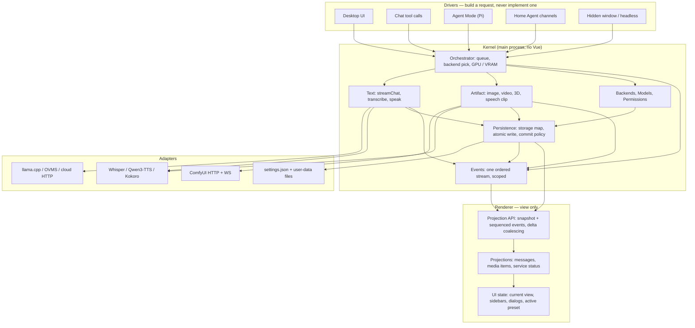
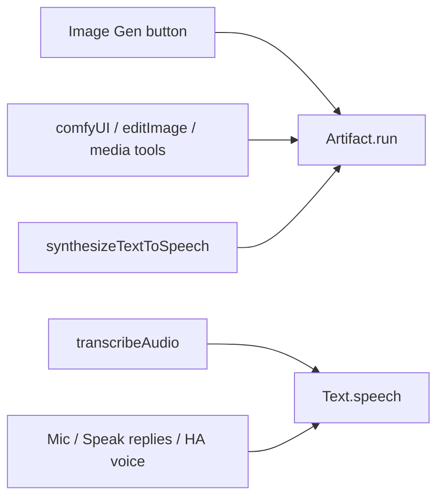
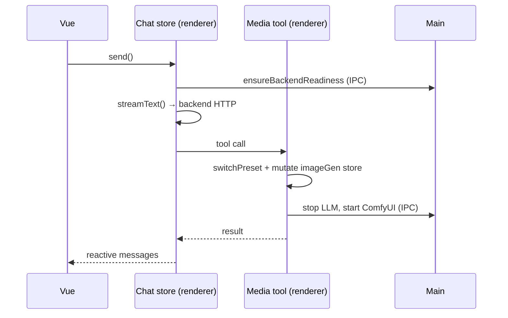
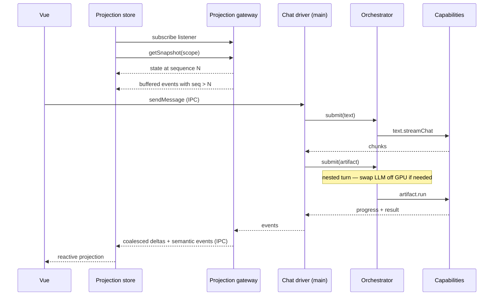
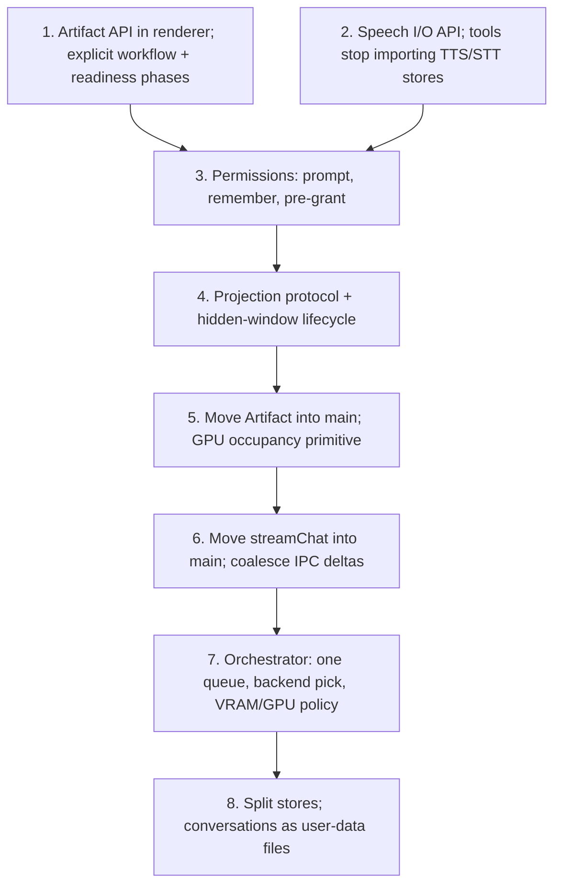

# Target architecture — capabilities, drivers, state ownership

**Status: steps 1–7 of the migration order (§8) are implemented; the rest is draft for discussion.**
Media generation is owned by the main-process Artifact runner; speech drivers go through `speechIO`;
inference/download consent through Permissions; main→renderer notifications through one kernel
event stream (`kernel:event`) with a listener-first snapshot handshake; chat turns run in main
and stream back as kernel `chat-chunk` events; media runs share one main-side queue and GPU
window. Parked follow-ups from those landings live in
[§8.2](#82-parked-follow-ups-from-landed-steps) — they do not block step 8.
Everything after step 7 is a map of where we want it, and the order in which we could get there.
It exists to be argued with — see [§10 Decisions](#10-decisions).

## 0. How to read and edit this

The Mermaid diagrams in this file are the source of truth: they render on GitHub, they diff in
review, and they sit next to the code they describe. `docs/diagrams/architecture-target.excalidraw`
is a hand-draggable copy of the two main diagrams (§2 and §3) at a coarser grain — the per-capability
event and persistence fan-in is only in the Mermaid — for whiteboard sessions. Open it at
[excalidraw.com](https://excalidraw.com) via _File → Open_. Any other diagram here can be turned
into shapes with Excalidraw's built-in _Mermaid to Excalidraw_ (the "+" in the toolbar): paste a
block, drag it around, then fold whatever we decide back into this file.

A shared canvas alone would drift from the code within a week and is unreviewable in a PR, which is
why the prose and the decisions live here and the canvas is scratch space.

---

## 1. Symptoms — what actually hurts today

Every item below was a thing in the tree when this document was drafted, not a hypothetical. The
first two — the four implementations of one operation, and media generation as UI state mutation —
were removed by step 1 (§8): every driver now calls `runArtifact`, and no tool save/restores
selection state or borrows a mode.

**One operation has four implementations.** "Generate an image" is reachable from the Image Gen
button, a chat tool call, an Agent Mode tool, and Home Agent `/imgGen`. They do not share an entry
point; they share a _mutable UI store_.

**Media generation was implemented as UI state mutation.** `tools/comfyUi.ts` used to snapshot seven
fields
off `imageGenerationPresets` (`prompt`, `negativePrompt`, `inferenceSteps`, `width`, `height`,
`seed`, `batchSize`) plus the active preset and variant, call `presetSwitching.switchPreset()` to
borrow the workflow, write the tool's arguments into those same fields, run the generation, and
restore everything in a `finally`. `tools/comfyUiImageEdit.ts` did the same. An agent asking for a
picture was literally impersonating a user clicking through the sidebar.

**The UI mode was part of that mutation.** `promptArea` carries both `currentMode` and
`userSelectedMode`, and `setModeOnly()` existed so background tool calls could "borrow a mode without
disturbing the UI". Two variables tracked one concept because a capability wrote view state. (The
tool-side mode borrowing is gone; the two variables remain until §8 step 8.)

**The agent is in main but the NL `media` tool still reaches back into the window.** Direct
`generateImage` / `editImage` tools execute in-process against the main-process runner
(`mediaDirect.ts`). The delegated `media` specialist still lives in the renderer, so
`mediaDelegation.ts` calls `executeToolInRenderer(...)`. A headless host still needs a live
renderer for that one tool (and for download consent / chat reload).

**Stores mix state that has different owners and lifetimes.** `textInference` persists `backend`,
`selectedModels`, `maxTokens`, `contextSize`, `temperature`, `ragList`, `settingsPerPreset` and
`screenshotWindow` in one bag — a user preference, a hardware-shaped choice, an indexed document set
and a capture-source pick. `backendServices` persists `lastSelectedDeviceIdPerBackend` while
`settings.json` separately persists `lastSelectedDevicePerBackend`: the same fact in two stores with
two owners.

**App data lives in the renderer's localStorage.** `imageGenerationPresets` persists
`generatedImages`, with a custom serializer that strips data URIs specifically to stay under the
localStorage quota. `conversations` persists every transcript; `agentMode` persists `sessions` next
to `defaultCapabilities` and `planningThinkingOnly` (session data next to user preferences).

**Home Agent needs the whole renderer graph.** `store/homeAgent.ts` imports chat, image generation,
prompt area, preset switching, confirmations, dialogs, TTS and STT. A Telegram message only works
because a window is alive to host that graph.

---

## 2. Today

```mermaid
flowchart TD
  subgraph drivers["Drivers"]
    ui["Desktop UI"]
    chatTools["Chat tool calls (AI SDK)"]
    ha["Home Agent (Telegram / Slack / LAN)"]
  end

  subgraph renderer["Renderer (Chromium) — Pinia"]
    chat["openAiCompatibleChat: streamText()"]
    media["imageGenerationPresets + comfyUiPresets"]
    audio["TTS / STT stores"]
    mixed["Prefs + hardware + app data in the same stores"]
    uiState["UI state: promptArea.currentMode, dialogs"]
  end

  subgraph main["Main process"]
    pi["Agent Mode (Pi)"]
    registry["Service registry"]
    settings["settings.json"]
  end

  backends["llama.cpp / OVMS / ComfyUI / Flask"]

  ui --> media
  ui --> chat
  chatTools -->|runArtifact (step 1)| media
  ha --> chat
  ha --> media
  chat --> media
  media -->|"writes view state"| uiState
  pi -->|"direct tools: in-process runner; NL media still executeToolInRenderer"| media
  chat --> registry
  media --> registry
  audio --> registry
  registry --> backends
  mixed <-.->|"same fact, two owners"| settings

  classDef bad stroke:#c00,stroke-width:2px
  class media,uiState bad
```

The two red boxes are the problem. Everything that wants media goes through a store whose real job
is painting the Image Gen view, and that store writes view state as a side effect.

---

## 3. Target



Four rules make the picture real:

1. A **driver** turns intent into a typed request and hands it to the kernel. It never talks to
   ComfyUI, llama.cpp or the service registry.
2. The **orchestrator** is the only thing that decides *when* a request runs and *which* backend is
   loaded for it. Capabilities do the work; they do not start each other's processes.
3. A **capability** never reads or writes UI state, and never builds a file path. It names what it
   produced and emits events; **Persistence** decides where that lands (§4.5) and the view decides
   what to paint.
4. **Every** capability and the orchestrator emit onto one ordered event stream (§4.6) — not one
   channel per capability, and not only Text. A projection connects with a snapshot plus sequence
   watermark; events alone are insufficient.
5. The **renderer** subscribes and renders. It owns what to show, not what to run. Headless, for
   now, means main remains alive while the app window may be hidden. Chromium stays available
   lazily for browser-backed tools; Vue does not own the run.

---

## 4. Capability surfaces

A capability is a stable operation surface — not a Pi extension and not an AI SDK `tool()`. Those
two are _projections_ of a capability onto a model, and they are the thinnest possible layer:
schema, argument mapping, result shaping.

### 4.1 Artifact

This is "produce a file the user keeps": an image, an edited image, a video, a 3D model, **or a
speech clip**. The MIME type is not the capability. ComfyUI is one adapter; the TTS engines are
another. Both answer `run`.

**Implemented in the renderer by `src/assets/js/artifact/runArtifact.ts`** (step 1): request/result
types, side-effect-free workflow/variant resolution, source injection, readiness via the model
dialog, tracked-item registration and terminal-state watching, with cancel through the
`ArtifactRunContext` abort signal. **Step 5 moved the engine into main**
(`electron/artifact/runner.ts`): the renderer client now resolves the request, runs the
permissions-layer pre-flight, registers tracked items and submits over `artifact:run`; main owns
readiness, installs, the ComfyUI websocket engine, per-item seeds, the watchdog and crash
detection, and streams phase/item events on the kernel stream (the renderer projects them onto the
same FSM). The model pre-flight, download consent and post-swap chat reload stay renderer-side by
design — main requests them over `artifact:request`/`artifact:respond`
(`src/assets/js/artifact/mediaRequestBridge.ts`). In-process Pi tools and renderer chat tools both submit through the
orchestrator's GPU window now (step 7; the refcounted `gpuOccupancy` primitive and the renderer
wraps it replaced are deleted — one bracket per run, never nested). The Image Gen
store only projects renderer-originated runs (in-process agent items stay in the workspace). The
Pi media tools execute beside the runner in-process (`electron/agentMode/capabilities/mediaDirect.ts`
+ `mediaDelegation.ts` for the NL tool); the `listWorkflows` / `inspectRequirements` surface, explicit
phase enum, speech kinds and the kernel request queue (§7) are still ahead.

`kind` is advisory in the step-1 renderer runner: routing is still by preset mediaType (the
ComfyUI engine serves every workflow the same way), but callers must pass the kind that matches
what they asked for — `artifactKindForMedia` for tools and Home Agent `/imgGen`, the panel mode
for the UI wrapper — so per-kind adapters in later steps can rely on it without re-deriving it
from the preset. Home Agent submits one `runArtifact` call; backend start and node/package
installs are the runner's, and missing models still use the in-channel download flow.

```ts
type ArtifactKind = 'create-image' | 'edit-image' | 'create-video' | 'create-3d' | 'create-speech'

type ArtifactRequest = {
  kind: ArtifactKind
  workflow?: string // Comfy preset id; omitted for speech, which is not a Comfy workflow
  prompt?: string
  source?: MediaRef
  params: MediaParams // seed/size/steps *or* voice/language/instruct
}

type ArtifactCapability = {
  listWorkflows(filter?: { kind?: ArtifactKind }): WorkflowInfo[]
  inspectRequirements(request: ArtifactRequest): Promise<ArtifactRequirements>
  run(request: ArtifactRequest, ctx: RunContext): Promise<ArtifactResult>
  cancel(runId: string): void
}
```

`create-speech` is how `tools/synthesizeTextToSpeech` (save a WAV into the thread / `audio/` folder)
and voice-design previews show up — the same item/progress/result shape as an image, which is why
TTS *felt* media-esque. It is not how the mic or "Speak replies" work; those are §4.2.

GPU handoff for Comfy kinds is an orchestrator concern, not `run`'s. Speech-clip generation usually
does **not** require swapping the LLM off the GPU (today OVMS keeps the speech sub-server up while
chat stops; Qwen3-TTS is its own sidecar). The orchestrator knows that per adapter; `artifact.run`
does not.

What this deletes for Comfy kinds: the save/mutate/restore block in `tools/comfyUi.ts`, the
`switchPreset` round trip, and `setModeOnly`.

`run` owns the complete readiness lifecycle; drivers do not sequence `ensureWorkflowReady()` then
`run()`. `inspectRequirements()` is side-effect-free input to the orchestrator. It resolves the
workflow's backend, models, custom nodes and Python packages without installing or downloading
anything. Once submitted, `run` advances through explicit phases:

```ts
type ArtifactPhase =
  | 'queued'
  | 'preparing-backend'
  | 'installing-components'
  | 'loading-components'
  | 'loading-model'
  | 'running'
  | 'completed'
  | 'failed'
  | 'cancelled'
```

These replace, rather than discard, today's `GenerateState` lifecycle
(`start_backend → install_workflow_components → load_workflow_components → generating`). Phase
events carry the existing setup/download/generation progress so the projection can paint the same
UI after media moves to main. Missing components and models pass through Permissions before
preparation starts.

**Current product invariant:** listing, selecting or making a workflow active may inspect catalog
metadata but must not install components or download model weights. Readiness starts only when a
driver submits an actual run. Changing that is an explicit product decision, not an accidental
consequence of this refactor.

### 4.2 Speech as conversation I/O (belongs with Text)

Mic, Home Agent voice notes, "Speak replies", channel voice bubbles: these are not artifacts. They
are how a **text turn** is encoded and decoded. STT is a prompt entering the kernel; TTS-as-reply is
the assistant message leaving it. That is why they sit in the prompt bar and on every Home Agent
channel, and why video generation does not.

```ts
type SpeechIO = {
  transcribe(req: { audio: AudioRef; language?: string }): Promise<TranscriptResult>
  speak(req: { text: string; voice?: VoiceRef; language?: string }): Promise<AudioResult>
  listVoices(): VoiceInfo[]
}
```

`streamChat` may call `speak` at the end of a turn when the preset has `speakReplies`. The prompt
bar and Home Agent call `transcribe` *before* `streamChat`. The `transcribeAudio` tool is a thin
projection of `transcribe` for when the model should do it explicitly.

Same TTS/STT **adapters** as `create-speech`. Two drivers, one engine: do not grow a second Qwen3
client for the tool vs the prompt bar.

**Implemented in the renderer by `src/assets/js/speech/speechIO.ts`** (step 2): every speech driver
(the mic and STT preset, `transcribeAudio`, "Speak replies" and the Speak button,
`synthesizeTextToSpeech`, the direct TTS preset, the Home Agent voice paths) goes through this one
adapter and imports no TTS/STT store. Engine readiness (interactive vs dialog-free unattended),
endpoint resolution, the full Qwen3 voice request and desktop playback state live there; the
stores keep engine config, persistence and the engine clients, which only the adapter (and the
settings panels) consumes. `listVoices()` and the per-engine adapters the kernel will want are
still ahead.

### 4.3 Text

```ts
type TextCapability = {
  ensureReady(cfg: { backend: LlmBackend; model: string; contextSize?: number; args?: string }): Promise<void>
  streamChat(req: ChatRequest): AsyncIterable<ChatEvent>
  speech: SpeechIO
}
```

`ChatRequest` carries messages, the resolved sampling snapshot, the tool set and RAG context as
_inputs_. Nothing inside reads Pinia. `src/lib/chatModel.ts` calling `useTextInference()` inside the
model factory is the pattern to invert: the turn decides its configuration once, then passes it.

**Folders follow that split, not MIME type:**

```
kernel/
  text/           # streamChat, ensureReady, speech I/O
  artifact/       # run(image|video|3d|speech-clip)
  orchestrator/
  backends/
  permissions/
adapters/
  llamaCpp / ovms / cloud
  comfy
  speech          # whisper, qwen3-tts, kokoro, external — used by text.speech *and* artifact
```

Putting `audio/` next to `media/` made the engine look like a product surface. It is not. Video is
an artifact kind; a spoken reply is text I/O; a saved WAV is an artifact that uses the speech adapter.

### 4.4 Orchestrator

This is the piece that only exists once text and artifact share a process. Until step 7 the same
job was smeared across three places that could not see each other — the renderer's
`tools/mediaPipeline.ts` (two serial lanes), `tools/chatBackends.ts` (`stopChatBackends` /
`returnGpuToChat` plus the `comfyRunsWaiting()` swap-batching skip) and a `withGpuForMedia`
wrap for in-process tools — all three deleted by the move.

Step 7 landed the scheduler's core (`electron/orchestrator/orchestrator.ts`): one FIFO for
artifact runs plus a request lane for whole `media` requests, and one GPU window that brackets
every media run (chat backends stopped before, ComfyUI freed and the chat backend restarted
after, skipped with Keep Models Loaded or while more runs are queued). `ensureBackendReadiness`
is admitted through the same window. The full shape below — chat turns as queue entries, VRAM
budgets — remains the step-8+ target; a chat turn still runs straight in the engine and only
its backend readiness waits:

```ts
type KernelRequestMap = {
  text: { request: ChatRequest; result: ChatResult }
  artifact: { request: ArtifactRequest; result: ArtifactResult }
}

type KernelRequest<K extends keyof KernelRequestMap> = {
  id: string
  kind: K
  payload: KernelRequestMap[K]['request']
}

type Orchestrator = {
  submit<K extends keyof KernelRequestMap>(
    request: KernelRequest<K>,
    ctx: RunContext,
  ): Promise<KernelRequestMap[K]['result']>
  cancel(runId: string): void
  // events: queued | backend-change | running | done
}
```

Speech I/O is not a third request kind: `transcribe` / `speak` ride on a text turn, or become
`artifact(create-speech)` when the user asked for a file.

What it knows: incoming requests from every driver, which backends are installed, what is loaded
right now, the selected device and a coarse VRAM budget, Keep Models Loaded, and the permission
grants that apply. What it decides: queue vs start, whether this request needs a backend swap (LLM
off for ComfyUI, ComfyUI off for a chat turn), whether to skip the reload because more media is
waiting, and when a download/VRAM warning has to go through Permissions before work starts.

Fairness can stay simple at first (FIFO, media nested inside a chat/agent turn stays with that
turn). The important part is that the policy lives in one function instead of in the tools.

### 4.5 Persistence — who decides what, where and when

The earlier diagram drew `support --> store`, which implied Backends/Models owned storage. They do
not. Persistence is its own surface, and the ownership splits four ways:

| Question | Owner | Why |
| --- | --- | --- |
| **What** the document is | the capability / session owner | only Text knows a transcript's shape; only Artifact knows an item's |
| **When** it must be durable | the capability, as domain events (`turn complete`, `run settled`, `session shutdown`) | a timer cannot know a turn ended |
| **Where** it lives | Persistence, from one storage map | so "where does X live" is answerable by reading one file, not grepping |
| **How** it is written | Persistence only | atomic write, index upkeep, `schemaVersion` + migration, demo-mode root, single-writer discipline |

```ts
type Collection = 'conversations' | 'agent-sessions' | 'media' | 'games' | 'audio' | 'preferences'

type Persistence = {
  put(c: Collection, id: string, doc: Doc, opts?: { commit: 'now' | 'debounced' }): Promise<void>
  get(c: Collection, id: string): Promise<Doc | undefined>
  list(c: Collection): Promise<IndexEntry[]> // reads the index, not every document
  writeBlob(c: Collection, name: string, bytes: Uint8Array): Promise<MediaRef>
  remove(c: Collection, id: string): Promise<void>
}
```

Rules that make this worth having:

1. **No capability builds a path.** It names a collection and an id. The storage map in §6.1 is the
   only place that knows `~/Documents/AI-Playground` vs `~/AI-Playground` vs `userData`.
2. **Bytes vs references.** Artifact calls `writeBlob` and gets a `MediaRef`; Text stores only that
   ref. This is the missing rule that `sanitizeBulkyToolOutputs` and the `generatedImages`
   serializer are currently working around — both exist because payloads reach a document that
   should only ever have held a reference.
3. **One writer per document.** The owning capability. Home Agent, Pi and the renderer send
   requests; they never write. That is the correctness win of moving persistence into the kernel —
   localStorage is "single writer" only by accident of there being one window.
4. **Commit points are domain events; the write policy is not.** A capability says "this is
   durable now"; Persistence decides immediate vs debounced, batches an agent turn's checkpoints,
   and flushes on quit. Otherwise we grow five debounce constants in five stores.
5. **Machine config is not in here.** `settings.json` in `userData` keeps its own zod-validated,
   main-owned path. Persistence is for the user's library and app data.
6. **Deletion does not cascade.** Deleting a conversation does not delete images it referenced —
   those are the user's files in their library, and a thread is not their owner.
7. **Demo mode is a different root**, chosen inside Persistence — the analogue of today's
   `demoAwareStorage` swap to `sessionStorage`. No capability learns about it.
8. **Run-owned temporary blobs are cleaned up** on completion, failure or cancellation. Completed
   artifacts belong to the user's library, and transcripts only reference them. Cross-library
   orphan detection or garbage collection is deferred until the product has a reason to offer it.

### 4.6 Events — one stream, not one per capability

Fair catch: the events arrow came off Text because that is how I drew it, not because Text is
special. It was wrong. Every capability and the orchestrator emit, onto **one** ordered stream:

```ts
type KernelEvent = { scope: EventScope; seq: number } & (
  | { type: 'activity'; ... } // begin / update / end — today's Activities
  | { type: 'error'; ... } // AppError — today's Errors
  | { type: 'chat-chunk'; ... } // text
  | { type: 'artifact-item'; ... } // queued / progress / done / failed
  | { type: 'queue'; ... } // queued / backend-change / running — orchestrator
  | { type: 'service'; ... } // backend status
  | { type: 'stored'; ... } // a Ref the projection can render
)

type EventScope =
  | { kind: 'global' }
  | { kind: 'chat'; conversationKey: string }
  | { kind: 'run'; runId: string }
```

Why one stream rather than a channel per capability:

- **Ordering.** A progress event must not overtake the item it belongs to, and an artifact item
  produced inside a chat turn has to interleave correctly with that turn's chunks. One sequence
  per scope gives that for free; N channels do not.
- **One bridge, one reconnect.** Hidden-window and future drivers subscribe once. The
  anti-stuck reconciliation (`endScope()` today) has one place to live instead of one per
  capability.
- **The renderer already has this shape.** `activities` + `errors` sinks and `agentModeIpc`'s
  chunk/progress/done handlers are three-quarters of this bus; scope already exists as
  `ActivityScope` (`global | chat | imageGen`).

`Permissions` is the deliberate exception: a prompt is a **request/response**, not a notification.
It rides its own call so a driver can `await` an answer (or return a pre-grant) instead of watching
a stream for a reply.

#### Projection hydration

Events alone cannot initialize a renderer that opens or reconnects halfway through a run. The
projection boundary therefore has a snapshot query and a sequence watermark:

```ts
type ProjectionSnapshot<T> = {
  scope: EventScope
  sequence: number
  state: T
}

type ProjectionGateway = {
  getSnapshot(scope: EventScope): Promise<ProjectionSnapshot<ScopeState>>
  subscribe(listener: (event: KernelEvent) => void): () => void
}
```

The renderer registers the event listener **before** requesting its snapshot, buffers events while
the IPC request is in flight, installs the snapshot at sequence `N`, then applies buffered and
future events with `seq > N`. The snapshot includes active/queued runs, latest artifact phases and
items, service status, the requested conversation, and its current activities/errors. This
listener-first handshake closes the race without requiring a public replay protocol.

**Renderer interim (step 4 done, artifact events added in step 5).** The stream exists and carries
the notifications that were pushed point-to-point: service status, the four agent-turn events
(chunk, tool progress, tool image, turn done), and the artifact run lifecycle (`artifact-phase` /
`artifact-item` / `artifact-done`), over `kernel:event` with one monotonic `seq` (`KernelEvent` in
`WebUI/src/types/kernelEvents.ts`, emitted by `electron/kernel/kernelBus.ts`, hydrated by
`src/assets/js/projection/kernelProjection.ts`). The handshake installs the snapshot through an
`onInstall` hook that runs **before** the buffered flush, because a consumer that adopts snapshot
state (a resumed agent turn's stream controller) must exist before the events meant to follow it
arrive. The snapshot carries service status, the one active agent turn's accumulated chunks,
tool progress and tool images, and the one active artifact run (phase + items) — enough for a
recreated window to resume a running turn through `Chat.resumeStream()` without restarting it, and
to rehydrate a renderer-originated Image Gen run. Chat turns also ride the bus (`chat-chunk` /
`chat-turn-done`, with adjacent deltas coalesced at the bridge — step 6). What is not on the bus
yet: `activity`/`error`/`queue`/`stored` (steps 7–8). `agentMode:executeTool` stays
point-to-point — it is a request the renderer answers, like Permissions. Leftovers are in
[§8.2](#82-parked-follow-ups-from-landed-steps).

#### Streaming across IPC

HTTP/SSE gets model deltas into main; it does not make the main → renderer hop free.
`webContents.send()` is fire-and-forget, so the projection bridge coalesces **adjacent text and
reasoning deltas in the same scope**, flushing every 16–33 ms and before the next semantic event.
Tool calls/results, errors, completion, artifact phases/items and service transitions are never
coalesced. Pending deltas flush before a later event so the scoped sequence remains meaningful.

This is deliberately not a general backpressure protocol. Agent Mode already forwards translated
stream chunks over IPC successfully. Laminar's raw `onChunk` telemetry is different: forwarding
thousands of raw chunks just to recover TTFT has no product value, whereas UI deltas must arrive.
Coalescing prevents avoidable IPC/reactivity churn without inventing acknowledgements or a second
streaming transport. Snapshots store the accumulated text, never individual token deltas.

### 4.7 Supporting surfaces

| Surface        | Owns                                                                 | Replaces today                                            |
| -------------- | -------------------------------------------------------------------- | --------------------------------------------------------- |
| `Backends`     | start/stop/setup, device selection — the verbs the orchestrator uses | `backendServices` + service registry                      |
| `Models`       | catalog, "is it on disk", download with progress                     | `models` store + parts of `modelLibrary`                   |
| `Permissions`  | ask, remember, pre-grant: download, gated repo, VRAM, pref changes   | `useDialogStore()` inside inference; Home Agent confirms   |
| `Persistence`  | where and how anything is stored (§4.5)                              | Pinia persist + scattered `userData` writes                |

Activities and Errors are not surfaces of their own any more — they are **event types** on the bus
(§4.6). The renderer-side sinks (`store/activities.ts`, `store/errors.ts`) stay as the projection
of those events, which is what they already are.

**Permissions** is the consent layer. A capability (or the orchestrator, for a backend swap that
needs a download) calls `permissions.request(action)`. Adapters: modal dialog in the desktop UI,
in-channel yes/no on Home Agent (already exists for settings and downloads), and a **grant list**
the user can review and pre-fill so an agentic or channel-driven task does not stall on a prompt
nobody is looking at. Hidden-window / headless still has a user — they are just not in this window.
There is no silent auto-allow; there is prompt-once, remember, or pre-grant. See §10.4–10.5.

**Renderer interim (step 3 done).** The consent layer lives at
`src/assets/js/permissions/permissions.ts`; the desktop adapter is the dialog store
(`useDialogStore`), the channel adapter is `homeAgent.handleRemoteModelDownload` (whose in-channel
question the `download:remote-turns` pre-grant skips), and the grant list is the persisted
`permissionGrants` store, surfaced under Settings → Permissions. Inference/download paths call
`requestDownload` / `requestVramWarning` / `notify` and import no dialog store. It moves into the
kernel with the later steps. What this interim deliberately left behind is in [§8.2](#82-parked-follow-ups-from-landed-steps).

### 4.8 Projections



The agent capability catalog in `electron/agentMode/capabilities/` keeps its current job: deciding
_which kernel surfaces this session exposes_, plus skills, toolbox policy and session shape
(`ownSession`, `planningEnd`, `planHandoff`). It stops being a second implementation route.
`resolveBuiltinTools()` is the same idea for the AI SDK session. One catalog of capabilities, two
ways of hanging them on a model.

---

## 5. Drivers

| Driver             | Supplies                                             | Runs in         | Needs a window?      |
| ------------------ | ---------------------------------------------------- | --------------- | -------------------- |
| Desktop UI         | form values, active preset, user intent               | renderer        | yes, it is the UI    |
| Chat tool calls    | model-chosen arguments against a JSON schema          | main (after §7) | no                   |
| Agent Mode (Pi)    | same, through Pi tool definitions                     | main            | no                   |
| Home Agent         | channel message, `/imgGen` picks, in-channel confirms | main (after §7) | no                   |
| Hidden window      | same kernel as desktop; BrowserWindow not shown       | renderer+main   | Chromium, not a view |

Two tools genuinely need Chromium and should stay bridged: window screenshot capture and in-page
web browsing/debugging, both of which drive a real `BrowserWindow`. A hidden window still provides
that. Everything else crossing the bridge today is doing so because of where the stores are. A CLI
with no Chromium at all is out of scope until we decide it isn't.

### 5.1 Hidden-window lifecycle

"Hidden" does not mean starting a second permanent Vue renderer:

1. Electron main starts the kernel and owns Home Agent, active runs, Persistence and the
   orchestrator.
2. The normal application `BrowserWindow` may be shown or hidden. Closing it hides rather than
   destroys it while Home Agent is enabled or a run is active; otherwise normal quit policy applies.
3. Chat, Artifact, Speech I/O and persistence continue in main. They do not need any renderer.
4. A browser-backed capability (window screenshot or in-page browsing/debugging) asks a
   main-owned browser host for Chromium. That host creates its dedicated `BrowserWindow` lazily on
   first use and disposes/reuses it according to the tool's existing lifecycle. It is not a second
   application UI.
5. Showing or recreating the application window reconnects its projection via the
   listener-first snapshot handshake in §4.6; in-flight work does not restart.
6. Explicit app quit cancels or checkpoints active work, shuts down sessions that flush on exit,
   flushes Persistence, then stops backends. Closing a visible window is not implicitly app quit
   while the headless host is serving.

The lifecycle policy belongs in main, beside Electron's existing single-instance and quit
handling. The renderer must never decide whether a process-backed run survives its own window.

**Renderer interim (step 4 done).** The policy is a pure function,
`resolveClosePolicy({ homeAgentRunning, rendererBusy, agentTurnActive }) → 'hide' | 'close'`
(`electron/kernel/windowLifecycle.ts`), consulted in the window's `close` handler: `hide` prevents
the default and hides the window; `close` tears down the browser-backed windows and quits (via
`app.quit()` off-darwin, backends freed in `window-all-closed` on macOS, as before). Main owns all
three inputs: the Home Agent service status, `isAgentTurnActive()` from the agent runtime, and a
`rendererBusy` flag the renderer pushes over `lifecycle:busy` whenever the activities sink flips
between empty and non-empty. A hidden window is reopened by relaunch (`second-instance`) and dock
activation (`activate`), and the recreated/relaunched renderer resumes a running agent turn from
the kernel snapshot (§4.6 interim). Explicit quit still runs the shutdown task — the title-bar X
and `exitApp` bypass `close` via `app.quit()`, which the `before-quit` handler routes to the
shutdown sequence, so no isQuitting flag is needed.

---

## 6. State ownership

Classify by **who writes it** and **how long it lives**, not by which feature it belongs to.

| Bucket             | Lives in                              | Examples                                                                                              | Written by                     |
| ------------------ | ------------------------------------- | ----------------------------------------------------------------------------------------------------- | ------------------------------ |
| Machine config     | `settings.json`                       | product mode, `disabledBackends`, HF endpoint, `preferredDevice`, OEM override, `showDebugSettingsInUI` | setup wizard, dev settings, hand-edit |
| Hardware           | detected live; last choice in machine config | device lists + UUIDs, installed backend versions, VRAM gates                                       | backend adapters on probe/select |
| User preferences   | one prefs file (see §6.1)             | theme, locale, keep-models-loaded, favorites, per-preset knobs, default voice, **default preset (`Preset \| last`)** | settings UI; agents only via Permissions |
| App / session data | kernel memory + user-data files       | conversations, agent sessions, generated media, RAG index, loaded model, in-flight runs                 | kernel                         |
| UI state           | Pinia, mostly unpersisted             | current view, sidebars, dialog stack, scroll, **active preset / mode for this session**                 | Vue only                       |

### Where today's fields land

| Today                                                         | Bucket             | Note                                                                 |
| ------------------------------------------------------------- | ------------------ | -------------------------------------------------------------------- |
| `textInference.backend`, `selectedModels`                      | user preference    | per preset, not global                                                |
| `textInference.temperature`, `maxTokens`, `contextSize`        | user preference    | belongs in `settingsPerPreset`, which already exists                  |
| `textInference.ragList`                                        | app data           | an indexed document set, not a setting                                |
| `textInference.screenshotWindow`                               | UI / input pref    | not inference at all                                                  |
| `backendServices.lastSelectedDeviceIdPerBackend`               | hardware           | duplicate of `settings.json` `lastSelectedDevicePerBackend` — pick one |
| `backendServices.comfyUiParameters`, `llamaCppParameters`      | machine config     | launch flags; today renderer-persisted                                |
| `backendServices.currentServiceInfo`                           | app data           | live process status, correctly ephemeral                              |
| `imageGenerationPresets.settingsPerPreset`                     | user preference    | keep                                                                  |
| `imageGenerationPresets.generatedImages`                       | app data           | in localStorage with a quota-dodging serializer; should be files      |
| `conversations.conversationList`                               | app data           | ditto                                                                 |
| `agentMode.sessions`, `workspaceDir`                           | app data           | —                                                                     |
| `agentMode.defaultCapabilities`, `planningThinkingOnly`        | user preference    | same store as the line above                                          |
| `promptArea.currentMode`                                       | UI state           | session-only; hydrated at startup from default-preset pref            |
| `promptArea.userSelectedMode`                                  | UI state           | can be deleted once nothing borrows the mode                          |
| last-used preset per category (today inside preset switching)  | user preference    | the `last` half of `defaultPreset: Preset \| last`                    |
| active preset while the app is running                         | UI state           | not written back except as "last used" when the pref is `last`        |

Rule of thumb: **if a headless run would still need it, it is not UI state**. If a fresh install
should ship it, it is machine config. If the user chose it and would be annoyed to lose it, it is a
preference. If the app produced it, it is app data and belongs in a file the kernel owns.

The Image Gen (and Chat, Video, …) view keeps an active workflow so it has a form to render. That
selection is UI state. On a cold start it is filled from a user preference
`defaultPreset: <preset name> | "last"` (default `"last"`, which is what `switchToLastUsedForCategory`
already does). After that, clicking a preset card only changes what this session shows — it does
not change the preference unless the user edits the setting. A media tool never reads this value; it
passes `workflow` on the request.

### 6.1 User-data files — the storage map (owned by Persistence, §4.5)

App data should live next to the media the user can already find, not in Chromium's localStorage
(opaque, quota-capped, the reason `generatedImages` has a serializer whose job is stripping data
URIs) and not only in Electron `userData` (hidden, easy to lose on uninstall).

We already have this split for generated output:

| Path | Content |
| ---- | ------- |
| `~/Documents/AI-Playground/media` (Windows) / `~/AI-Playground/media` | images, video, RAG docs |
| `…/games` | Game Agent library |
| `…/audio` | TTS output |

Conversations and agent transcripts join that tree. Machine config (`settings.json`, last GPU,
disabled backends) stays in Electron `userData` — that is device state, not something to copy
between machines by zipping a folder.

```
AI-Playground/
  media/                  # already
  games/                  # already
  audio/                  # already
  conversations/
    index.json            # id, title, preset, mtime — cheap to list
    <id>.json             # one thread, schemaVersion inside
  agent-sessions/         # same idea; Pi's own files can stay as they are
```

User preferences that a human would want in a backup (`defaultPreset`, theme, per-preset knobs)
can live as `AI-Playground/preferences.json`. Things a restore onto a different PC should not
blindly apply (device ids, disabled backends) stay in `userData`.

**Performance — the current store is the thing to beat, not SQLite.** Pinia persist rewrites the
entire `conversationList` into one localStorage key on every message. One file per conversation,
written by the kernel, is already an improvement: listing the history panel reads `index.json`,
opening a thread reads one file, and a turn in conversation A does not rewrite B.

What would actually hurt:

- **Write-per-token.** Streaming a reply at 50 tok/s must not `fsync` a 2 MB JSON 50 times a
  second. Write on turn complete, plus a periodic checkpoint during long agent turns so a crash
  does not lose ten minutes. The in-memory projection is the live copy; the file is the durable
  one.
- **Loading every thread at startup.** Don't. The index is enough for the history list.
- **Pixels in JSON.** Keep doing what `sanitizeBulkyToolOutputs` and the `generatedImages`
  serializer already do: media is a file, the transcript holds an `aipg-media://` (or
  workspace-relative) reference.
- **Main-process stalls.** `JSON.stringify` of a huge thread on the main thread can hitch the
  window. Write via a worker or after the turn, not on every IPC chunk.

SQLite is already in the tree for persistent memory (`better-sqlite3` / `pi-hermes-memory`), and it
is the right tool for *derived* work: full-text search across chats, "find this image's parent
turn". That index is rebuildable from the files. It is not the source of truth. Mixing "the user
opens a JSON in an editor" with "the only copy lives in a DB they cannot inspect" would undo the
ownership argument.

**Correctness — the real risks, and they are already ours:**

- **Torn writes on crash.** Write to `*.json.tmp` and rename. Same trick for `index.json`.
- **Interrupted turns.** `completeOrphanedToolParts` exists because a persisted orphaned tool call
  bricks the thread on the next send. Files do not remove that; they make it a kernel
  responsibility at checkpoint time, not a Pinia `afterHydrate`.
- **One writer.** Renderer, Home Agent and Pi must not append the same file. The kernel owns the
  files; everyone else sends events. That is the actual correctness win of the move — localStorage
  is "one writer" only because one window exists.
- **Demo mode.** Today `demoAwareStorage` swaps localStorage for sessionStorage. Files need a
  session-scoped directory that is deleted on exit, not a write into the user's real library.
- **The user editing a file while the app is running.** v1: last-write from the kernel wins; we do
  not watch. Document it. A later watcher is possible because they are files.
- **Schema.** Each document carries `schemaVersion`. Migrations are per-file, lazy, on read.
- **Windows.** Antivirus briefly locking a file we just wrote; path-length; names that are not
  legal filenames. Conversation ids are slugs (Game Agent already does this), titles stay inside
  the JSON.
- **HMR.** Pinia's hot-update merge has already eaten session maps. Files do not.
- **Migration from localStorage.** One-shot, on first kernel boot that sees the old keys and no
  `conversations/index.json`. Do not dual-write.

None of that is a reason to pick SQLite as the store. It is a reason to treat the file layer as a
real persistence adapter (atomic write, checkpoint policy, one writer) instead of `JSON.stringify`
into `userData` on every mutation.

---

## 7. Moving chat into main

The AI SDK is a Node library; `streamText()` is in the renderer only because that is where the
stores were. Agent Mode already proved the shape: main runs the turn, the renderer registers
handlers for chunks, tool progress and completion.

**Today**



**Target**



**Moves:** `streamText`, tool resolution, the nested media specialist (`runMediaAgent`), RAG
retrieval, conversation persistence.
**Stays:** message rendering, tool cards, screenshot + web-browse tools, everything in §6's UI row.
**Risks to plan for:** Laminar's renderer-side telemetry bridge (`src/lib/laminarTelemetry.ts`) can
be simplified rather than ported, since main is where it ends up anyway; the RAG utility process is
already a main-process concern; `@ai-sdk/vue` bindings in components need a projection store behind
them; abort/cancel becomes an IPC message; and conversation persistence should move to files at the
same time rather than round-tripping localStorage over IPC.

**Do not do this first.** If `streamText` moves while the comfy tools still mutate Pinia, we own two
processes sharing UI state over IPC forever. The orchestrator also cannot exist until both text and
media requests arrive in the same process — until then it would just be another name for
`ensureBackendReadiness`.

---

## 8. Migration order



| Step | Done when | Shippable alone |
| ---- | --------- | --------------- |
| 1 | **Done.** Tools and Home Agent `/imgGen` have no preset save/restore and no readiness preflight; the run (`runArtifact` + `comfyUiPresets.generate`) owns backend start, installs and model download; selection stays side-effect-free (`resolvePresetVariant`); callers pass `artifactKindForMedia` / panel-derived kind | yes |
| 2 | **Done.** `transcribeAudio` / speak-replies (and every other speech driver — mic, TTS preset, `/imgGen` voice paths) import no TTS/STT store; all of them cross the one speech adapter (`speechIO`), which owns readiness, endpoint resolution and the Qwen3/Kokoro/external engine branch | yes |
| 3 | **Done.** Inference/download code calls the Permissions layer (`requestDownload` / `requestVramWarning` / `notify` in `src/assets/js/permissions/permissions.ts`); no `useDialogStore()` outside the adapter, the settings-setup flows and the dialog components. "Do not show again" and the remote-download pre-grant are entries in the persisted `permissionGrants` store, reviewed and revoked in Settings → Permissions (legacy `memoryAlertSuppress_*` flags migrate once) | yes |
| 4 | **Done.** Notifications that were pushed point-to-point (`serviceInfoUpdate`, the four `agentMode:*` push channels) cross the kernel stream (`kernel:event`, one monotonic `seq`; listener-first snapshot handshake with install-before-flush; bus holds the current window so no service pushes to a stale webContents). Main owns hide/reopen/quit via `resolveClosePolicy` (`lifecycle:busy` from the activities sink, Home Agent status, active agent turn); a reconnected renderer resumes a running agent turn from the snapshot (`Chat.resumeStream`). Browser-backed windows were already lazy. Remaining event types (`activity`, `error`, `stored`) ride with steps 7–8 work; `queue` landed
with step 7 (`queue-event`, not snapshotted) | yes |
| 5 | **Done.** `capabilities/media.ts` no longer calls `executeToolInRenderer` — direct tools execute in-process against `electron/artifact/runner.ts` (`mediaDirect.ts`), the NL `media` tool lives in `mediaDelegation.ts` — and the UI hydrates readiness/generation progress from main via kernel `artifact-phase`/`artifact-item` events. In-process runs ask the renderer for model checks, download consent and chat reload over `artifact:request` | yes, needs 1–4 |
| 6 | **Done.** The renderer has no `streamText` — chat turns run in the main-side engine (`electron/chat/turnEngine.ts`) over `chat:submitTurn` and stream back as kernel `chat-chunk` events (adjacent deltas coalesced at the bus, semantic chunks immediate) through the renderer's kernel transport (`src/lib/kernelChatTransport.ts`); a reloaded renderer resumes from the snapshot (`chat:resumeTurn`). Tool executions round-trip to the renderer registry (`src/lib/chatToolRegistry.ts`) over the tool bridge; the nested media specialist runs in main too (`electron/chat/mediaAgentRunner.ts`) with its inner tools on the same bridge, progress as `media-agent-event`; one-shot summarize is `chat:summarize`; Laminar's AI SDK integration is registered in main against the SDK's global telemetry registry. RAG retrieval and conversation persistence stayed renderer-side (§8.2) | yes, needs 1–5 |
| 7 | **Done.** One queue and one GPU policy: `electron/orchestrator/orchestrator.ts` owns a FIFO for artifact runs (panel/Home Agent submissions fail-fast as before; chat-tool submissions and in-process Pi tool runs queue) and a request lane for whole `media` requests; every media run brackets the one GPU window (chat backends stopped before, ComfyUI freed and the chat backend restarted after, skipped with Keep Models Loaded or while runs are queued — one spritesheet = one swap); `ensureBackendReadiness` waits for the window, so Text and Artifact no longer start/stop each other's backends blind; the queue is visible as `queue-event` kernel events, which relabel the parked chat tool's activity with its position (`src/lib/queueActivityProjection.ts`). Chat turns are not queue entries (§8.2) | yes, needs 6 |
| 8 | fields in §6 sit in their bucket; `userSelectedMode` is deleted; files own transcripts; localStorage migrates once | incremental |

Steps 1–4 are worth doing even if we never move chat: they make the capabilities testable and the
projection boundary complete. Snapshot hydration and Artifact readiness landed with steps 4–5;
IPC delta coalescing landed with step 6, the single queue and GPU policy with step 7.

### 8.1 Transition cost and per-step obligations

Steady state is cheaper: one operation path, one persistence writer and one resource policy.
Transition is temporarily more expensive because old stores coexist with projections, IPC widens
before it converges, and migrations need rollback discipline. The shippable-alone column is a hard
constraint: do not hide an unfinished cross-process move behind a long-lived branch.

Every step that changes a boundary updates, in the same change:

- this target document and the matching architecture sections in `AGENTS.md`;
- all three files required by an IPC change (`electron/main.ts`, `electron/preload.ts`,
  `src/env.d.ts`) — or removes old point-to-point channels when the projection stream replaces them;
- unit tests for request/result typing, event ordering, snapshot race handling and persistence
  migration affected by that step;
- E2E page objects/assertions when a projection replaces `@ai-sdk/vue` or Pinia-owned state;
- Laminar wiring and its architecture notes when telemetry moves from renderer to main;
- migration, rollback and one-writer behavior for state moved out of localStorage.

Steps 5–7 rewrite the app's documented nervous system. Documentation and tests move with each
slice, not in a cleanup after all three.

### 8.2 Parked follow-ups from landed steps

None of these blocks the next migration row. They are the review leftovers so a later step (or a
small fix on this branch) can pick them up instead of rediscovering them.

**Step 3 (Permissions) — do before the kernel move, or sooner if cheap:**

- **Break `permissions` → `homeAgent`.** `requestDownload` instantiates the whole Home Agent store
  so it can ask `isRemoteTurnActive` / `handleRemoteModelDownload`. That is a cycle waiting to
  happen (`permissions` → `homeAgent` → `speechIO` → TTS stores → `permissions`); it only works
  because nothing runs at import time. Replace it with a thin remote-turn / channel-download port
  before Permissions moves into main.
- **Still not `permissions.request(action)`.** The renderer has three named verbs, which is enough
  for step 3. Gated-repo license acceptance still lives inside `DownloadDialog`, and preference
  changes (`SettingsBasic` HuggingFace apply, `SettingsTts` confirmations, Home Agent
  self-config) still call `requestConfirmation` on the dialog store. Fold those onto the same
  surface when the grant vocabulary is designed (`download:<model>`, `change-pref:*`, a gated-repo
  action).
- **Desktop downloads have no remember / pre-grant.** Only VRAM warnings remember, and only remote
  Home Agent turns have a pre-grant. Host-side model downloads always prompt. Decide whether that
  is the product (big weights, always confirm on the machine) or whether desktop should share the
  prompt / remember / pre-grant story.
- **`skipMemoryAlert` still bypasses `requestVramWarning`.** Game Agent promotion and history
  restore pass `skipMemoryAlert: true` and never ask. That is not a silent *grant*, but it is a
  path that never goes through Permissions. Revisit when session restore / preset promotion is
  owned by the kernel rather than `presetSwitching`.
- **Legacy `memoryAlertSuppress_*` vs persist hydrate.** Import runs as the store's initial
  `grants`. If persisted state is already `{ grants: {} }`, hydrate can overwrite the import.
  First boot of this store should not have that key; if we want it bulletproof, import after
  hydrate when the map is empty.
- **Lock the "no dialog store in inference" rule.** A lint or test so the eight inference/download
  stores cannot re-import `dialogs`. Stale comment: `models.getMissingQwenTtsModels` still says
  "hand to `showDownloadDialog`". Settings → Permissions: associate the remote-download `Label`
  with its checkbox (`for` / wrap).

**Step 4 (Projection protocol + hidden-window lifecycle):**

- **`activity` / `error` / `stored` are not on the bus yet.**
  `artifact-phase` / `artifact-item` / `artifact-done` landed with step 5; `chat-chunk` /
  `chat-turn-done` / `media-agent-event` with step 6 (delta coalescing lives at the bus,
  decision 13); `queue-event` with step 7 (transient — enqueue/start/finish for a parked
  activity's label, deliberately not snapshotted).
- **`AgentTurnSnapshot.chunks` accumulates unbounded per turn.** A turn is bounded and the
  snapshot only exists while one runs, but a very long turn replays a lot at once on reconnect.
  If that ever matters, cap the accumulated tail and accept that a resumed renderer misses the
  head of an old message.
- **A renderer that dies without flipping `lifecycle:busy` leaves it stale `true`.** The next
  close would hide instead of quitting until a fresh renderer pushes `false` (immediate on
  reconnect). A `webContents` destroyed hook could clear it; not worth it until a crash loop
  shows up.
- **Three projections subscribe independently** (backendServices, agentModeIpc,
  imageGenerationPresets), each with its own snapshot request. Cheap today; when `getSnapshot`
  grows heavier (conversations in step 8), converge on one shared projection or a scoped
  snapshot cache. Each of those stores now disposes its projection on Pinia HMR.
- **`getServices` IPC still exists** as an explicit refresh (`shouldShowInstallationDialog`) and
  for the setup wizard; only the *subscription* went through the bus. It collapses into the
  snapshot when the Backends surface (§4.7) lands.
- **`onToolProgress` is not buffered during `pendingResume`.** Chunks that arrive between snapshot
  install and `reconnectToStream` are queued on `pendingResume`; progress updates in that gap are
  dropped (`activeTurn` is still null). Tool images always append. Buffer progress the same way as
  chunks, or ignore it if the snapshot's last progress is enough.
- **Leftover window captures / point-to-point sends.** ComfyUI still does
  `this.win.webContents.send('show-toast', …)`. Also still off-bus: `serviceSetUpProgress`,
  `debugLog`, `webBrowser:stateChanged`. Same stale-window class of bug the bus fixed for service
  status — route them through `getKernelEventWindow()` or onto the stream when those notifications
  move.

**Step 5 (Artifact in main) — do with the kernel request queue (§7), or sooner if cheap:**

- **GPU policy is one bracket now** — landed with step 7: the orchestrator's GPU window is the
  single owner (the two renderer wraps and `withGpuForMedia` are deleted), and it waits for
  open chat requests before stopping, so the Image Gen panel wraps for the first time.
- **One queue serializes media now** — landed with step 7: chat-tool runs and in-process tools
  queue on the orchestrator; panel/Home Agent submissions stay fail-fast by design.
- **In-process direct tools don't see saved dynamic inputs.** The settings sidebar's per-preset
  input map (`comfyInputsPerPreset`) is renderer state, so `mediaDirect.ts` resolves workflow
  inputs from preset defaults. Ship a snapshot of the relevant inputs with the turn (or answer it
  over the request RPC) when a fidelity mismatch shows up.
- **Consent/reload pings are a heartbeat, not download progress.** The media-request bridge pings
  every 30 s while a request is open, which keeps the runner's watchdog re-armed but says nothing
  about bytes moving. Route the download dialog's real progress through the bridge (or the stream)
  when downloads need meaningful progress in traces.
- **No Pi-side tool-call repair.** The renderer's `repairCreateToolInput` (AI SDK
  `experimental_repairToolCall`) coerces a bad workflow name to the default; Pi tool calls with an
  unknown workflow fail visibly with "not available". Deliberate for now — loud beats silent —
  revisit if local models routinely miss the workflow name.
- **The generate spec's `workflow` is still a plain string.** The edit spec carries an enum of
  enabled workflows; the generate spec could too, so the model's choices are constrained instead
  of validated after the fact.
- **Laminar spans for main-side runs.** The engine's `comfyui.*` spans were renderer-side
  (`comfyUiPresets`) and went with the engine; the runner streams phases but opens no spans. Wire
  the span bridge to the projected phases, or move it main-side with the Pi extension.

**Step 6 (chat in main) — leftovers, none blocking step 8:**

- **RAG retrieval and conversation persistence stayed renderer-side.** The turn request ships the
  prepared prompt and the UI messages, but `prepareRagContext` and the conversation bucket remain
  renderer state — as the step-8 row already plans. The engine sees only what the request carries,
  so moving conversations takes them along.
- **The tool bridge has no timeout.** `executeToolInRenderer` waits forever for the renderer's
  reply, the same class of stall as the artifact request RPC. A cancelled turn rejects pending
  calls; a replaced window settles everything. Add a budget if a wedged tool closure starts
  hanging turns.
- **`transcribeAudio` cannot read a v7 file part holding an `aipg-media://` audio attachment**
  (pre-existing, surfaced by the port): `filePartToBlob` predates the `{type:'url', url}` wrapper.
  The registry reproduces the old prompt bit-for-bit instead of fixing it, so the failure mode is
  unchanged, not new.
- **Media-specialist progress is not snapshotted.** `media-agent-event` kernel events drive the
  live timeline only; a renderer that reloads mid-run loses the timeline (the tool result still
  lands with the turn). Snapshot it only if that timeline ever matters across a reload.
- **Chat trace context is one last-write-wins slot** across concurrent conversations — the same
  single-context shape the IPC flow it replaced had; scoped only if concurrent-turn traces blur.
- **`chat:summarize` is coarse** — no cancellation and no per-conversation scoping.
  `chat:inferenceActive` is gone: step 7 deleted the channel (the renderer wraps that read it
  are gone too, and the orchestrator counts open chat requests itself, per run).

**Step 7 (Orchestrator) — leftovers:**

- **Chat turns are not queue entries.** A turn submits straight to the engine once its
  readiness has been admitted (`awaitChatWindow`, bounded at 5 minutes then proceeds with a
  warning). The race the old code had survives: a turn whose stream opened just before a media
  run stops its backend can still fail with a network error. Queueing turns themselves is
  step-8+ work (§4.4's `KernelRequestMap`).
- **The chat reload is still renderer-answered.** The swap-back asks the renderer to re-run
  `ensureBackendReadiness` over the `artifact:request` RPC (`reload-chat-backend`) — the one
  thing keeping a hidden-window-less CLI from reloading a model. The window it costs no longer
  shows a "Reloading chat model…" activity in chat (the old renderer bracket labelled it);
  the swap is silent until step 8 moves reload fully main-side.
- **`queue-event` is transient, not snapshotted** — a renderer that reloads mid-queue loses the
  parked activities' labels (their own `enqueued`→`started` lifecycles rebuild from the
  activities the tools registered). Harmless for now; snapshot it if a reload ever lands
  mid-spritesheet.
- **No VRAM budget.** The GPU window is a chat↔media *swap* gate, not an occupancy ledger: the
  orchestrator knows nothing about how much VRAM a checkpoint needs, and Permissions still
  gates the heavy presets per-name. The coarse budget of §4.4 remains future work.
- **The media-request lane has one lane for all media requests** — no fairness between a chat
  tool's request and a Home Agent turn's beyond FIFO, and no per-conversation scoping of the
  queue (a busy conversation's spritesheet parks another conversation's edit the same way).
- **GPU swap spans are gone.** `backend.stop_llm` / `backend.reload_llm` were renderer spans in
  `chatBackends.ts`; the swap now runs main-side and opens no spans, so a Laminar trace shows
  the swap only as the gap between the tool span and `comfyui.generate`'s children. Wire swap
  spans (or attributes on the artifact-phase events) from the orchestrator if that gap needs
  explaining in traces.
- **`awaitChatWindow` polls abort every 500ms.** A media request cancelled while waiting for the
  GPU window (already the head of its lane, not parked) sits until the next poll. Race the
  delay against `AbortSignal` if that latency shows up.

**Step 2 (Speech I/O) — already noted at the adapter, still ahead:**

- `listVoices()` and the per-engine kernel adapters.
- `transcribe` does not take `language` yet (the target `SpeechIO` does).
- Artifact `create-speech`: `synthesizeTextToSpeech` still goes through Speech I/O, not
  `runArtifact`.
- `PromptStatusBar` still reads `textToSpeech.selectedEngine` for the backend badge (chrome, not a
  driver).

**Still open from the original map (§10), not a landed-step leftover:** exact grant vocabulary,
whether FIFO is enough or a chat turn's nested media jumps the queue, whether `defaultPreset` is
per mode or one global, and whether a later cross-library cleanup tool should identify unreferenced
completed artifacts without deleting them automatically.

---

## 9. What this buys

- One code path per operation. The Send button, a chat tool, Pi and `/imgGen` differ only in how
  they build the request.
- A media run stops changing what the user is looking at.
- Hidden-window Home Agent, and later a CLI, call the same kernel as the desktop.
- GPU policy is one function, not three helpers that cannot see each other's queues.
- "Where does the last GPU choice live?" has an answer instead of a grep. Transcripts are files the
  user can copy.

---

## 10. Decisions

| # | Question | Decision |
| --- | --- | --- |
| 1 | Headless = hidden window, or no Chromium? | **Hidden window for now.** Chromium stays; Vue does not own the run. Screenshot and web-browse keep working. A Chromium-free CLI is a later product decision. |
| 2 | Converge AI SDK and Pi? | **No.** Two harnesses, one capability set. Converging is its own project. |
| 3 | Files vs SQLite for conversations / media? | **User-data files as source of truth** (see §6.1). SQLite stays for persistent memory and may later be a rebuildable search index, not the store. |
| 4 | May an agent change user preferences? | **Yes, after consent.** Same Permissions surface as downloads. |
| 5 | Confirmation when nobody is watching? | **Still consent**, via the channel the user is on, or a **pre-grant** they set in settings so an agentic task does not block. No silent auto-allow. |
| 6 | Is the active workflow UI state? | **Yes.** Cold start hydrates from `defaultPreset: Preset \| "last"` (a user preference). Runtime selection stays in UI state. |
| 7 | Who queues concurrent work? | **An orchestrator in the kernel** (§4.4). Not FIFO-vs-fairness as an afterthought — it is why text and media move into the same process. |
| 8 | Version the kernel IPC as a public protocol? | **No.** Internal function + existing Electron IPC. A versioned socket is a different product. |
| 9 | Who owns persistence? | **A `Persistence` surface** (§4.5). Capabilities own *what* and declare *when*; Persistence owns *where* and *how*. Completed artifacts belong to the user's library; transcript deletion does not cascade. |
| 10 | One event stream or one per capability? | **One ordered, scoped stream** (§4.6), emitted by every capability and the orchestrator. Permissions is the exception: it is request/response, not a notification. |
| 11 | Replay or snapshots for reconnect? | **Listener-first snapshot hydration** (§4.6). Buffer during `getSnapshot`, install at sequence N, then apply events above N. No public replay protocol for now. |
| 12 | Who prepares workflow components? | **`Artifact.run` owns readiness** (§4.1). Drivers submit one operation; the orchestrator inspects side-effect-free requirements, Permissions gates changes, and phase events preserve today's progress UI. |
| 13 | Stream every delta over IPC? | **Coalesce adjacent text/reasoning deltas at the projection bridge** (§4.6). Semantic events remain immediate and ordered. |
| 14 | Garbage-collect completed artifacts? | **Deferred.** Run-owned temporary blobs are cleaned up; completed artifacts belong to the user's library and transcripts only reference them. |

Open questions that were parked when this map was written (grant vocabulary, queueing, `defaultPreset`
scope, artifact GC) now live with the landed-step leftovers in
[§8.2](#82-parked-follow-ups-from-landed-steps). They do not block the next migration row.
