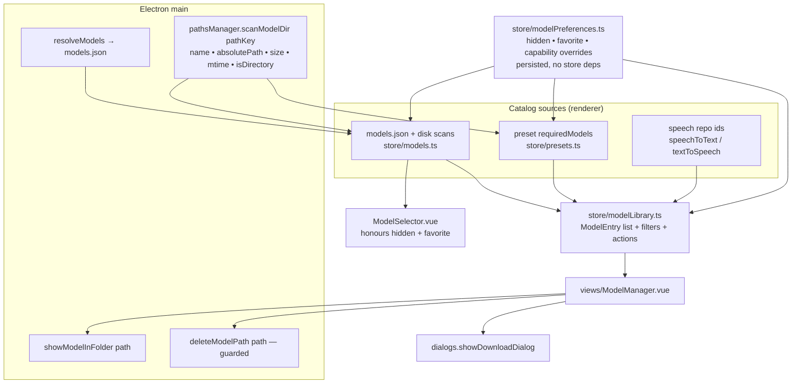

# Model Management — Design Plan

Plan for a dedicated **Model Management** view (an LM Studio–style "My Models" page, simplified and
tailored to AI Playground) plus the data-layer work it needs.

Status: **proposal**. Nothing in this document is implemented yet.

All renderer paths below are relative to `WebUI/src/`, all main-process paths to `WebUI/electron/`.

**The shape of the change, in four points:**

1. One row type, `ModelEntry`, unifies the three model universes that exist today (LLM/embedding in
   the `models` store, media models in `imageGenerationPresets`, speech models in the STT/TTS stores).
2. A new `modelPreferences` store adds the missing user layer — hidden, favorite, capability
   overrides — as the top-precedence override on any model, whatever its source. `hidden` applies to
   every picker and to the Home Agent tools, but deliberately never to model *resolution*.
3. Three new main-process capabilities: a scan that also reports size / mtime / absolute path, reveal
   in file manager, and a permanent, path-guarded delete.
4. A full-screen `ModelManager.vue` view on top of that, which reuses the existing (already
   multi-model) `DownloadDialog` for both single and batch downloads.

---

## 1. Goal

Today a model's lifecycle in the UI is one-way: you can *add* a model (and set its capabilities once,
while adding), and models found on disk simply appear — often without capabilities and with no way to
correct them. There is no way to remove, hide, inspect, or bulk-download models.

The target is a single place where a user can see **every** model the app knows about and act on it:

| Interaction | Applies to |
|---|---|
| Show in folder | downloaded models |
| Delete from disk (permanent, with a warning) | downloaded models |
| Hide from the model picker | any model |
| Favorite (sorts to top) | any model |
| Edit capabilities | LLM models (vision / reasoning / tools / thinking toggle / NPU / context) |
| Download, with multi-select for batch downloads | known-but-not-downloaded models |

Filters: **name** and **capability** (the two the model picker already has), plus **backend** and
**use case** (LLM / embedding / media creation).

Non-goals for the first iteration: editing model directories (tracked as a follow-up in
[§9 Phase 4](#phase-4--follow-ups)), a HuggingFace browse/search experience, per-model runtime
parameter presets (context length, offload) as LM Studio offers on its **Load** tab — AI Playground
keeps those in the chat preset and `textInference`, and this view should not become a second home
for them.

---

## 2. Where we are today

### 2.1 The pieces that exist

| Concern | Current implementation |
|---|---|
| LLM + embedding catalog | [`store/models.ts`](../WebUI/src/assets/js/store/models.ts) `refreshModels()` merges `models.json` (via `loadModels` IPC) with three disk scans |
| Predefined catalog | [`external/models.json`](../WebUI/external/models.json), 58 entries, `type` ∈ `llamaCPP \| openVINO \| embedding`; validated by `ModelSchema` in [`types/shared.ts`](../WebUI/src/types/shared.ts); optionally overridden from GitHub by [`remoteUpdates.ts`](../WebUI/electron/remoteUpdates.ts) |
| Disk scans | [`pathsManager.ts`](../WebUI/electron/pathsManager.ts) — `scanGGUFLLMModels()`, `scanOpenVINOModels()`, `scanEmbedding()`, `scanComfyUIModels(type)` |
| Directory layout | [`external/model_config.json`](../WebUI/external/model_config.json) maps 19 path keys (`ggufLLM`, `openvinoLLM`, `embedding`, `STT`, `TTS`, `openvino-image`, `checkpoints`, `unet`, `clip`, `vae`, `lora`, …) to directories |
| Custom (user-added) models | `AddLLMDialog.vue` → `models.addModel()` → `customModelMetadata` (persisted in `localStorage` via `demoAwareStorage`) |
| Capability model | [`assets/js/capabilities.ts`](../WebUI/src/assets/js/capabilities.ts) — `CapabilityKey = 'vision' \| 'reasoning' \| 'tools'`, rendered by `CapabilityIcons.vue` in `display` or `filter` mode |
| Picker with filters | [`ModelSelector.vue`](../WebUI/src/components/ModelSelector.vue) — substring search on the last path segment + AND-ed capability filters + preset-driven filters |
| Download | `dialogs.showDownloadDialog(DownloadModelParam[])` → `DownloadDialog.vue` → [`lib/modelDownloader.ts`](../WebUI/src/lib/modelDownloader.ts) → Flask `ai-backend` `/api/getModelSize`, `/api/isModelGated`, `/api/isAccessGranted`, `/api/downloadModel` (SSE) |
| Media (ComfyUI) models | **Not** in `models.json`. Discovered per type by `getComfyUIModels(type)` and from each preset's `requiredModels[]` — see `loadModelOptionsForActivePreset` in [`store/imageGenerationPresets.ts`](../WebUI/src/assets/js/store/imageGenerationPresets.ts) |
| Speech models | Hard-coded repo ids in `speechToText.ts`, `textToSpeech.ts`, `qwen3TextToSpeech.ts` with `getMissing*Model(s)` helpers |
| Reveal in file manager | Exists for **generated images only** (`openImageInFolder` IPC, `main.ts`) |

The download stack is the good news: `DownloadDialog` is **already multi-model** — it renders a
confirm table of every entry with size / gated / license columns and drives one overall progress bar.
Batch download is therefore mostly a matter of building the right `DownloadModelParam[]`.

### 2.2 The gaps

1. **No delete.** No IPC removes model files, and there is no way to drop a custom entry from
   `customModelMetadata` either — a mistyped model name is listed forever.
2. **No hide, no favorite.** No user preference layer exists for models at all.
3. **Capabilities are effectively write-once.** `AddLLMDialog` sets them at add time. Disk-scanned
   models get none. And `refreshModels()` merges with priority
   `{ ...customMetadata, ...existingModel, ...predefinedModel }`
   ([`models.ts`](../WebUI/src/assets/js/store/models.ts)) — a `models.json` entry always wins, so a
   user edit of a predefined model would silently be discarded on the next refresh.
4. **No size / modified-at anywhere.** All four scan functions return names only.
5. **No reveal for weights.** `showItemInFolder` is wired for generated images only.
6. **Three disjoint model universes** (LLM+embedding in `models`, media in `imageGenerationPresets`,
   speech in the STT/TTS stores) with no common shape to render in one list.
7. **`models.download()` is a stub** and `models.downloadList` is exported but never written.

---

## 3. Constraints discovered while surveying (these shape the design)

**On-disk names are not derivable from a model name without duplicating Python logic.**
The downloader ([`service/model_downloader.py`](../service/model_downloader.py),
[`service/utils.py`](../service/utils.py)) writes:

- default: `<dir>/<owner>---<repo>/<remaining path segments>`
- `faceswap` / `facerestore`: a **flat file** `<dir>/<owner>---<repo>---<file>`, *and* a copy into
  ComfyUI's own `models/insightface` / `models/facerestore_models`
- `nsfwdetector`: `<dir>/vit-base-nsfw-detector/<remaining segments>`
- OpenVINO LLM / embedding: a **directory** per model, not a file
- embeddings: under a `llamaCPP` / `openVINO` sub-directory

⇒ **The renderer must never reconstruct a disk path.** The scan that finds a model returns its
absolute path, and destructive actions only ever operate on a path that came from a scan. This avoids
a second, drifting copy of the naming rules in TypeScript.

**The "unit of deletion" differs by type.** One `.gguf` file may sit in a repo directory next to other
quantizations, so deleting a GGUF model deletes a *file*; deleting an OpenVINO model deletes a
*directory*. The scan already knows which, so it reports `isDirectory`.

**Hiding a model must never break generation.** ComfyUI presets reference models by name in
`requiredModels[]` and in `model`-typed settings. A hidden model that a preset requires must still be
offered for that preset (see the invariants in [§7](#7-behavior-contracts)).

**Model directories can be read-only.** `pathsManager.isModelDirWritable()` surfaces as
`globalSetup.state.modelFolderReadOnly` and already disables `DownloadDialog`; delete must respect it
as well.

**Loaded models hold file handles.** llama.cpp / OVMS keep the weights open; on Windows deletion fails
with `EBUSY`. Deleting the model that is currently selected/loaded needs an explicit path.

---

## 4. Proposed architecture



### 4.1 One row shape for every model

New file `assets/js/models/types.ts` (types only, no store — keeps it importable from both stores and
from pure helpers that are easy to unit-test):

```ts
export type ModelUseCase = 'llm' | 'embedding' | 'media' | 'speech'

/** Which service consumes the weights. Doubles as the download API's `backend` value. */
export type ModelServiceBackend = 'llama_cpp' | 'openvino' | 'comfyui'

/** Where the app learned about this model. */
export type ModelSource = 'catalog' | 'disk' | 'custom'

export type ModelEntry = {
  /** Stable identity: `${pathKey}:${name}`. Unique — the same file name can exist under two path keys. */
  id: string
  /** Catalog-form name, e.g. `bartowski/Llama-3.2-3B-Instruct-GGUF/Llama-3.2-3B-Instruct-Q4_K_S.gguf`. */
  name: string
  /** Last path segment — what the pickers already show. */
  label: string
  useCase: ModelUseCase
  /** `model_config.json` key: 'ggufLLM' | 'openvinoLLM' | 'embedding' | 'checkpoints' | 'lora' | … */
  pathKey: string
  serviceBackend: ModelServiceBackend
  source: ModelSource
  downloaded: boolean
  /** Present only when found on disk. Never reconstructed in the renderer — see §3. */
  absolutePath?: string
  sizeBytes?: number
  modifiedAt?: number
  isDirectory?: boolean
  /** Effective capabilities after user overrides. Meaningful for `llm`. */
  capabilities: ModelCapabilityValues
  /** True when the user has edited any capability, so the UI can offer "reset to defaults". */
  hasCapabilityOverrides: boolean
  hidden: boolean
  favorite: boolean
  /** Preset names that list this model in `requiredModels` — drives the "used by" column + delete warning. */
  requiredByPresets: string[]
}
```

`ModelCapabilityValues` is the existing optional capability subset of `Model`
(`supportsVision`, `supportsToolCalling`, `supportsReasoning`, `supportsThinkingToggle`,
`npuSupport`, `largeMoe`, `maxContextSize`, `mmproj`, `toolParser`), extracted so both `Model` and
`ModelEntry` reference one definition instead of repeating the field list a fourth time.

Use-case mapping is a table over path keys, not scattered conditionals:

| `useCase` | path keys | `serviceBackend` |
|---|---|---|
| `llm` | `ggufLLM` | `llama_cpp` |
| `llm` | `openvinoLLM` | `openvino` |
| `embedding` | `embedding` (`llamaCPP` / `openVINO` sub-dirs) | per sub-dir |
| `media` | `checkpoints`, `unet`, `diffusion_models`, `clip`, `vae`, `lora`/`loras`, `controlNet`, `upscale`, `inpaint`, `faceswap`, `facerestore`, `nsfwdetector` | `comfyui` |
| `media` | `openvino-image` | `openvino` |
| `speech` | `STT`, `TTS` | `openvino` |

Cloud models (`type: 'cloud'`, injected by `textInference` from the provider's `/v1/models`) are
**excluded**: nothing about them is local, so every action in this view is a no-op for them.

### 4.2 New preference store

New `store/modelPreferences.ts` — an infrastructure store with **no store dependencies**, following
the `errors` / `activities` precedent so any store can import it without cycle risk:

```ts
export type ModelPreferences = {
  hidden?: boolean
  favorite?: boolean
  /** Only keys present here override the catalog/disk value. */
  capabilities?: Partial<ModelCapabilityValues>
}

// keyed by ModelEntry.id
const preferences = ref<Record<string, ModelPreferences>>({})
```

Persisted with the existing `demoAwareStorage` (so demo mode gets a per-session copy that resets —
the desired behaviour for a kiosk).

This is deliberately **separate from `customModelMetadata`**, which keeps its current meaning: *this
user-added model exists, and here is its base metadata*. Preferences are the top-precedence override
layer applied on top of any source. Consequences:

- "Edit capabilities" always writes to `modelPreferences`, whatever the model's source is.
- "Reset to defaults" is just deleting the override entry.
- Editing a **predefined** model's capabilities finally works, and survives a `models.json` update.

**Merge precedence** becomes, highest last:

```
customModelMetadata  <  previous in-memory entry  <  models.json  <  modelPreferences
```

`refreshModels()` gets a `pickDefined()` helper so an override object never clobbers a defined value
with `undefined` — the current spread of a fully-materialised `Model` literal (whose absent
capabilities are explicit `undefined`) makes that a real hazard. Unit-tested (see [§10](#10-testing)).

### 4.3 New store for the view

New `store/modelLibrary.ts` (`useModelLibrary`), a domain store composing
`modelPreferences`, `models`, `presets`, `dialogs` and `backendServices`:

- `entries: ComputedRef<ModelEntry[]>` — the union of the three catalogs, deduped by `id`
- `filters` — `{ search, useCase, backend, capabilities: CapabilityKey[], downloadState, showHidden }`
- `visibleEntries` — `entries` after filters, sorted favorites-first
- `selection: Set<string>` — multi-select for batch actions
- actions: `revealInFolder(id)`, `deleteFromDisk(ids)`, `setHidden(id, v)`, `setFavorite(id, v)`,
  `saveCapabilities(id, caps)`, `resetCapabilities(id)`, `removeCustomEntry(id)`,
  `downloadSelected()`, `refresh()`

Media-catalog derivation (the downloadable set for `useCase: 'media'`) is
`presets.presets.flatMap(p => p.requiredModels ?? [])`, deduped on `type + model`. This also yields
`requiredByPresets` for free, which powers the "used by" column and the delete warning. It means the
media catalog is exactly "models some preset can use" — a better scope than an arbitrary list, and it
needs no change to `models.json`.

`presets` has no dependency on `models` today, and `modelPreferences` has no dependencies at all, so
the added edges (`models → modelPreferences`, `imageGenerationPresets → modelPreferences`,
`modelLibrary → {presets, models, modelPreferences, dialogs, backendServices}`) introduce no cycles.

### 4.4 New main-process capabilities

Three additions, each following the IPC three-file rule (`electron/main.ts`, `electron/preload.ts`,
`src/env.d.ts`).

**(a) `scanModelLibrary(pathKeys?)` — scan with stats.**

```ts
type ScannedModel = {
  pathKey: string
  /** Catalog-form name: `---` reversed to `/`, separators normalised to `/`. */
  name: string
  absolutePath: string
  sizeBytes: number
  /** Newest mtime within the model (max over children for directory models). */
  modifiedAt: number
  isDirectory: boolean
}
```

Implemented by generalising the four existing scanners in `pathsManager.ts` into one
`scanModelDir(pathKey, { entryKind: 'file' | 'directory', extension?: '.gguf' })` that collects
`fs.Dirent` + `statSync` in the single walk it already performs, and keeping
`scanGGUFLLMModels()` / `scanOpenVINOModels()` / `scanEmbedding()` / `scanComfyUIModels()` as thin
name-only wrappers so no existing caller changes. One IPC round trip for all path keys instead of one
per type.

**(b) `showModelInFolder(absolutePath)`** — mirrors the existing `openImageInFolder` handler
(`explorer.exe /select,` on Windows, `shell.showItemInFolder` elsewhere), with the same containment
guard as (c).

**(c) `deleteModelPath(absolutePath)`** — a **hard delete** (`fs.rm`), not a move to trash, so the
disk space is reclaimed immediately, which is normally the whole point of deleting a model. Returns
`{ success, error? }` per the IPC convention:

1. Resolve with `fs.realpathSync` and require the result to sit inside one of
   `pathsManager.modelPaths` (reject `..`, symlink escapes, and the model root itself).
2. Refuse when `!pathsManager.isModelDirWritable()`.
3. `fs.rm(resolved, { recursive: true })` — no `force`, so a vanished path is an error the UI can
   report rather than a silent success.
4. Also remove the mirrored ComfyUI copy for `faceswap` / `facerestore` (see [§3](#3-constraints-discovered-while-surveying-these-shape-the-design)); the copy locations are a
   short explicit table, covered by a unit test.

Because the deletion is irreversible, the guard in step 1 is the single most important piece of code
in this feature — it is what stands between a mis-derived path and a user's unrelated files. It gets
its own test file, and the renderer only ever passes it a path that came from a scan
([§3](#3-constraints-discovered-while-surveying-these-shape-the-design)). The confirmation dialog
warns explicitly that the files are removed permanently, not trashed
([§5.4](#54-row-actions)).

### 4.5 Reuse, not reinvention

| Need | Reuse |
|---|---|
| Download (single or batch) | `dialogs.showDownloadDialog(DownloadModelParam[])` — already multi-row |
| `DownloadModelParam` for an LLM incl. its `mmproj` companion | `textInference.getDownloadParamsForCurrentModelIfRequired`'s logic, extracted into a pure helper so both call sites share it |
| `DownloadModelParam` for media | `getMissingComfyuiBackendModels()` in `store/imageGenerationUtils.ts` |
| Capability icons + filter toggles | `CapabilityIcons.vue` in `mode="filter"`, exactly as `ModelSelector` uses it |
| Name search semantics | extract `ModelSelector`'s "substring on the last path segment" into a shared predicate so picker and manager cannot drift |
| Capability edit form | extract the checkbox grid + max-context field from `AddLLMDialog.vue` into `ModelCapabilityFields.vue`, used by both the add dialog and the edit dialog |
| Errors | `errors.report()` with typed `AppError`s — see [§8](#8-cross-cutting-concerns) |

---

## 5. UI design

### 5.1 Placement

A **full-screen overlay**, not a side modal: the sidebars are `w-100` / `w-130`, far too narrow for a
table this wide.

`views/ModelManager.vue` mounts inside the `loadingState === 'running'` `<main>` in
[`App.vue`](../WebUI/src/App.vue), above the mode views but **below** the dialog layer, so
`DownloadDialog` / delete confirmation appear on top of it. Visibility is a new `showModelManager`
flag on [`store/ui.ts`](../WebUI/src/assets/js/store/ui.ts) (which already owns the history panel and
has no dependencies).

Entry points:

1. A title-bar button next to the existing backend/help buttons, `aria-label="Model management"`.
2. A **"Manage models"** button next to the existing **"Add Model"** button in `SettingsChat.vue` —
   discoverability where users already go looking.
3. From `DownloadDialog`'s completion state, a "Manage models" link (optional, Phase 4).

Escape closes it; opening it does not disturb `promptStore.currentMode`, so closing returns the user
exactly where they were.

### 5.2 Layout

```
┌ Models ──────────────────────────────────────────────────────────────── [Close] ┐
│ ┌──────────────┐  ┌───────────────────────────────────────────────────────────┐ │
│ │ All       71 │  │ [🔍 search        ] [👁 🧠 🔧] [Backend ▾] [Status ▾]     │ │
│ │ LLM       52 │  │ [☐ Show hidden]           [Add model] [Download 2 models] │ │
│ │ Embedding  6 │  ├───────────────────────────────────────────────────────────┤ │
│ │ Media     13 │  │ ☐ ★ Model            Use case  Backend   Size  Modified ⋯ │ │
│ │ Speech     - │  │ ☑ ★ Llama-3.2-3B…    LLM 👁🔧  llama.cpp 1.9 GB  2d ago ⋯ │ │
│ └──────────────┘  │ ☑   Qwen3-8B-int4-ov LLM 🧠🔧  OpenVINO  — (not on disk) ⋯ │ │
│                   └───────────────────────────────────────────────────────────┘ │
└─────────────────────────────────────────────────────────────────────────────────┘
```

Columns: select checkbox · favorite star · name + `CapabilityIcons` (display mode) · use case ·
backend · size · modified · status badge (`On disk` / `Not downloaded` / `Hidden`) · actions menu.

Sorting: favorites always pinned first, then the active sort column (default: on-disk before
not-downloaded, then name). Size and Modified are sortable.

Counts next to each use case make it obvious that e.g. media models exist even before the user clicks.

### 5.3 Filters

| Filter | Control | Semantics |
|---|---|---|
| Use case | left sidebar list | single select incl. `All` |
| Name | `Input` in the toolbar | case-insensitive substring on the **last path segment**, identical to `ModelSelector` |
| Capability | `CapabilityIcons mode="filter"` | AND across selected keys; deselected keys don't filter — same as `ModelSelector` |
| Backend | `dropdown-menu` | llama.cpp / OpenVINO / ComfyUI |
| Status | `dropdown-menu` | All / On disk / Not downloaded |
| Hidden | checkbox | off by default; hidden rows are shown greyed with a `Hidden` badge when on |

Deliberately **not** carried over from `ModelSelector`: the preset-driven filters
(`requiresVision`, `filterTxt2TxtOnly`, `filterLargeMoeOnly`, NPU splitting, `advancedMode` gating).
Those exist to keep a *picker* consistent with the active preset; a management view must show
everything, or the model you want to delete is the one you cannot see.

### 5.4 Row actions

A `dropdown-menu` per row, trigger `aria-label="<label> actions"` (icon-only buttons need an
accessible name — the e2e rules in `AGENTS.md` forbid test-ids):

| Action | Enabled when | Notes |
|---|---|---|
| Download | `!downloaded` | single-model `showDownloadDialog` |
| Show in folder | `downloaded` | `showModelInFolder(absolutePath)` |
| Edit capabilities… | `useCase === 'llm'` | `EditModelCapabilitiesDialog`; disabled with a tooltip for other use cases |
| Reset capabilities | `hasCapabilityOverrides` | deletes the `modelPreferences` override |
| Hide / Unhide from picker | always | |
| Favorite / Unfavorite | always | |
| Remove from list | `source === 'custom'` | drops the `customModelMetadata` entry — the "I typo'd a model name" escape hatch that is missing today |
| Delete from disk | `downloaded && !modelFolderReadOnly` | confirmation dialog, see below |

Delete is a **permanent** removal from disk, so its confirmation carries a real warning rather than a
neutral "are you sure". It states plainly:

- that the files are deleted **permanently and cannot be recovered** — they do not go to the system
  trash (the confirming button is labelled for the destructive action, e.g. "Delete permanently",
  never a bare "OK", and is styled as destructive);
- exactly what will be removed: the absolute path, whether it is a single file or a whole folder, and
  the space that will be reclaimed;
- that a predefined model **stays listed** afterwards and can be re-downloaded, so deleting is not
  the same as removing it from the app;
- when applicable, that the model is **required by presets** (listing `requiredByPresets`) or is the
  model **currently selected** in Chat Settings — the two cases where deleting visibly breaks
  something the user is using.

Batch delete uses the same dialog, listing every affected model and the total space reclaimed.

### 5.5 Batch download

Checkbox column + a header "select all (filtered)" checkbox. The toolbar's primary button becomes
**"Download N models"** whenever the selection contains not-downloaded rows.

It maps the selection to `DownloadModelParam[]` (adding `mmproj` companions for vision LLMs and
`additionalLicenseLink` for media models), dedupes on `repo_id`, and hands the array to
`dialogs.showDownloadDialog(...)`. `DownloadDialog` then does what it already does: fetch sizes,
flag gated repos, collect the terms acknowledgement once, and run the downloads with one overall
progress bar. On success the callback triggers `modelLibrary.refresh()`.

Batch **delete** falls out of the same selection mechanism for free, behind the same confirmation
dialog described in [§5.4](#54-row-actions).

### 5.6 Editing capabilities

`EditModelCapabilitiesDialog.vue` reuses `ModelCapabilityFields.vue` (extracted from
`AddLLMDialog.vue`) and shows, per field, whether the value comes from the catalog or from a user
override, with a per-dialog **Reset to defaults**. Saving writes `modelPreferences[id].capabilities`
and calls `models.refreshModels()`, so `ModelSelector`, `ModelCapabilities.vue` and the chat request
kwargs pick the change up immediately.

The editor is available in **both product modes**, `essentials` included. Capability metadata is how a
model becomes usable at all — a vision model whose `supportsVision` is missing simply cannot be picked
by a vision preset — so gating the fix behind `studio` would leave `essentials` users with a broken
model and no recourse.

Two fields beyond the `AddLLMDialog` set are editable here, both of which need a tooltip because their
effect is not obvious from the label:

- **`toolParser`** (OpenVINO only) — today settable only via `models.json` and consumed by
  `openVINOBackendService.resolveToolParser`; a wrong parser breaks tool calling with no UI recourse.
- **`largeMoe`** — this is not a plain capability flag but a **hardware gate**. `ModelSelector`
  contains `if (m.largeMoe && !backendServices.phisonSsdDetected) return false`, because such models
  only load via Phison aiDAPTIV+ SSD offload. So ticking it on a machine without that hardware makes
  the model **disappear from the picker**, which looks exactly like a bug unless the UI says so. The
  tooltip must state both halves: that it marks a Mixture-of-Experts model too large for VRAM, and
  that it restricts the model to machines with Phison aiDAPTIV+ SSD offload. Worth showing the
  machine's current detection state (`backendServices.phisonSsdDetected`) inline next to the field, so
  the consequence is concrete rather than hypothetical.

### 5.7 New files

| File | Purpose |
|---|---|
| `assets/js/models/types.ts` | `ModelEntry`, `ModelUseCase`, `ModelCapabilityValues`, path-key → use-case table |
| `assets/js/models/library.ts` | pure derivation + filter/sort predicates (unit-tested, no Pinia) |
| `assets/js/models/visibility.ts` | the shared hidden/keep-selected picker predicate every existing picker imports ([§6.1](#61-where-hidden-must-be-applied--and-where-it-must-not)) |
| `assets/js/store/modelPreferences.ts` | persisted hidden / favorite / capability overrides |
| `assets/js/store/modelLibrary.ts` | entries, filters, selection, actions |
| `views/ModelManager.vue` | overlay shell + layout |
| `components/models/ModelLibraryToolbar.vue` | search, filters, batch buttons |
| `components/models/ModelLibraryTable.vue` + `ModelLibraryRow.vue` | table |
| `components/models/ModelRowActions.vue` | row dropdown menu |
| `components/models/ModelCapabilityFields.vue` | extracted from `AddLLMDialog.vue`, shared |
| `components/models/EditModelCapabilitiesDialog.vue` | capability editing |
| `components/models/DeleteModelDialog.vue` | delete confirmation (single + batch) |
| `components/ui/table/*` | shadcn-vue `Table` primitives — absent today; `DownloadDialog`, `InstallationManagement` and `SettingsBasic` all hand-roll `<table>` and can migrate later |

All Vue components use `<script setup lang="ts">` with `defineProps<{…}>()` / `defineEmits<{…}>()`;
all new types use `type`, and no classes are introduced (per the mandatory rules in `AGENTS.md`).

---

## 6. What changes outside the new view

Hidden means hidden **everywhere**, not just in the chat picker, so this section enumerates every
surface — missing one is what makes a preference like this feel broken.

### 6.1 Where `hidden` must be applied — and where it must not

The tempting implementation is to filter `textInference.llmModels`, since everything reads from it.
**That would be wrong.** `llmModels` is not only a picker source: `activeModel`, the capability
computeds, `getDownloadParamsForCurrentModelIfRequired` and therefore inference itself all resolve
through it. Filtering it would mean hiding the selected model silently breaks the next chat turn.

So `hidden` and `favorite` become **fields** on `LlmModel` (which already carries every capability
field and is mapped one-to-one in the `llmModels` computed), and filtering happens at each
*presentation* site through one shared predicate in `assets/js/models/visibility.ts` that always keeps
the currently selected value. Resolution keeps seeing the full list; only humans and the LLM see the
filtered one.

| Surface | Behaviour |
|---|---|
| `ModelSelector.vue` | hidden filtered out, favorites sorted to the top; the currently selected model always stays in the list, rendered with a `Hidden` badge |
| `SettingsChat.vue` embedding dropdown | same filter, same keep-selected rule |
| `SettingsImageComfyDynamic.vue` model inputs | hidden media models dropped from the `modelOptionsByType` options built by `loadModelOptionsForActivePreset`, **except** models the active preset requires ([§7](#7-behavior-contracts) invariant 1) and except the currently selected value |
| Cloud Mode models | the cloud branch of the `llmModels` computed carries `hidden` from preferences too, keyed by model name, so a noisy provider list can be trimmed |
| `listHomeAgentModels` (`assets/js/tools/configureHomeAgent.ts`) | hidden models are omitted from the JSON catalog handed to the LLM — otherwise the agent happily offers a model the user has deliberately retired |
| `configureHomeAgent` (same file) | rejects a hidden model name with a message saying it is hidden, rather than silently switching to it |
| `PromptStatusBar.vue`, `SettingsChat.vue` capability icons | unchanged — they display the *active* model, which is resolved, never filtered |

### 6.2 Surfaces that are deliberately unaffected

Worth stating explicitly, since "agentic model choice" sounds like it belongs in the table above:

- **The agentic ComfyUI tools choose presets, not models.** `getAvailableWorkflows()` in
  `assets/js/tools/comfyUi.ts` and `getAvailableEditWorkflows()` in
  `assets/js/tools/comfyUiImageEdit.ts` build a `z.enum` of *preset names*, already filtered by
  `textInference.isWorkflowPresetEnabled`. Hiding a model changes nothing there. The Home Agent config
  tools above are the only agentic surface that picks a model.
- **The Home Agent `/imgGen` picker lists presets too** (`showImgGenPresetPicker` reads
  `getPresetsByCategories(['create-images'], 'comfy')` and filters `excludeFromHomeAgentPicker`), so
  it is unaffected — and a preset's required media models stay downloadable even when hidden, per
  invariant 1.
- **Hiding a *preset*** is out of scope. `excludeFromHomeAgentPicker` and
  `excludeFromChatPresetPicker` are preset-authoring flags, not user preferences, and presets are not
  models.

### 6.3 Other changes

- `SettingsChat.vue` gains a "Manage models" button next to "Add Model".
- The title bar gains a model-management button.

---

## 7. Behavior contracts

Invariants worth asserting in tests, because breaking any of them turns a convenience feature into a
broken app:

1. **Hiding never blocks a run.** A hidden model that the active preset requires is still offered in
   that preset's picker and is still downloaded by `ensureModelsAreAvailable()`. Hiding is a
   *presentation* preference, never a capability gate.
2. **Hiding never strands a selection.** The currently selected chat/embedding model always remains
   selectable, and `hidden` never reaches the resolution path (`activeModel`, capability computeds,
   download-param derivation) — see [§6.1](#61-where-hidden-must-be-applied--and-where-it-must-not).
3. **Delete is path-guarded.** `deleteModelPath` only ever removes a real path inside a configured
   model directory, and only paths that came from a scan. Since the delete is permanent, this guard is
   the feature's most safety-critical code and is tested on its own.
4. **Delete is honest about consequences.** A predefined model stays in the catalog as
   `downloaded: false`; only a `custom` entry can be removed from the list, and that is a separate
   action.
5. **Preferences are additive.** Removing `modelPreferences` entirely returns the app to exactly
   today's behaviour. This makes the whole feature safely revertible and makes "reset" trivial.
6. **No path reconstruction in the renderer.** Enforced by `ModelEntry.absolutePath` being the only
   source of a path, and by delete/reveal taking paths rather than names.
7. **Read-only model directories disable every destructive action**, matching how `DownloadDialog`
   already behaves.

---

## 8. Cross-cutting concerns

**Errors** route through `errors.report()` with typed `AppError`s carrying `model/*` codes
(`model/scan-failed`, `model/delete-failed`, `model/delete-in-use`, `model/reveal-failed`).
`ErrorCategory` in [`errors/types.ts`](../WebUI/src/assets/js/errors/types.ts) has no member that fits
model-file operations, so this adds `'model'` to that union — a one-line extension to a plain string
union, consistent with how the other categories carve up the app. Delete failures surface as `toast`;
a scan failure for one path key must not blank the whole table — it reports and the other path keys
still render.

**Progress state stays local.** The activity sink is deliberately *not* used here: `ActivityCategory`
has no model member, `ActivityScope` is only `{ kind: 'chat' } | { kind: 'imageGen' }`, and its two
consumers (`ChatActivityIndicator.vue`, `PromptArea.vue`) would not render a library scan anyway.
Wiring it up would mean a new category, a new scope and a new consumer for no benefit, so
`modelLibrary` keeps a plain `scanning` / `deleting` flag and renders its own spinner. Revisit only if
model operations ever need to be visible from outside the view.

**i18n**: every string goes into `en-US.json` under a `MODEL_MANAGER_*` namespace **and all 12 other
locales in the same commit**, per the AGENTS.md rule. Note that a handful of `SETTINGS_MODEL_SD_*`,
`SETTINGS_MODEL_DOWNLOAD`, `SETTINGS_MODEL_DOWNLOAD_DESC`, `SETTINGS_MODEL_LIST_CHANGE_TIP` and
`SETTINGS_MODEL_EXIST` keys already exist in all 13 locales but are referenced by no code — the
model-paths editor in Phase 4 should adopt those rather than adding duplicates.

**Accessibility / e2e**: every control gets a role + accessible name (`getByRole` only, no test-ids).
The table uses real `<table>` semantics; the use-case sidebar is a `role="tablist"` or a
`role="navigation"` with named items; row action triggers get `aria-label="<label> actions"`; the
overlay is `role="dialog"` with `aria-label="Model management"`. Scope the close button inside the
overlay region — an unscoped `getByRole('button', { name: 'Close' })` matches the window-close X and
quits the app.

**Demo mode**: destructive actions (delete, remove from list) are wrapped in `DemoModeBlocker`, like
the existing dev-tools button.

**Product mode**: nothing in the view is mode-specific. The capability editor, including `toolParser`
and `largeMoe`, is exposed in `essentials` as well as `studio` — see
[§5.6](#56-editing-capabilities) for why.

**Performance**: adding `statSync` to the existing walk is cheap for hundreds of files but the
recursive size of HF snapshot directories could be noticeable on a spinning disk with many models.
Plan: implement it single-pass, measure with a realistic model directory, and only if it is slow split
into names-first + `getModelSizes(paths)` on demand, with a main-process cache keyed on directory
mtime. Not a v1 blocker, but the seam should exist.

---

## 9. Phasing

Each phase is independently shippable and independently verifiable.

### Phase 1 — data layer (no new UI)

- `assets/js/models/types.ts` + `library.ts` (pure derivation, filters, sort)
- `store/modelPreferences.ts` with persistence
- `refreshModels()` precedence fix + `pickDefined()`; capability overrides applied
- `scanModelLibrary` IPC (scan with stats), existing scanners refactored to wrappers
- `showModelInFolder` + `deleteModelPath` IPC with the containment guard
- `hidden` / `favorite` added as fields on `LlmModel`, plus the shared keep-selected picker predicate
- every surface in [§6.1](#61-where-hidden-must-be-applied--and-where-it-must-not) honours them:
  `ModelSelector`, the embedding dropdown, the comfy model inputs, the cloud branch, and the
  `listHomeAgentModels` / `configureHomeAgent` tools

Verification: Vitest unit tests (below) + a manual check that hiding the *selected* model via the dev
console removes it from the picker while a chat turn still runs (invariant 2), and that nothing else
changed.

### Phase 2 — the view

- `views/ModelManager.vue` + toolbar + table + row actions
- entry points (title bar, `SettingsChat`)
- reveal, hide, favorite, delete (single), edit capabilities, remove custom entry
- `shadcn` `Table` primitives; `ModelCapabilityFields.vue` extraction
- i18n keys across all 13 locales

Verification: manual walkthrough on Linux via `DISPLAY=:1 npm run dev` (screenshots/recording), plus
the Playwright page object below.

### Phase 3 — batch download

- multi-select + select-all-filtered
- `DownloadModelParam[]` derivation incl. `mmproj` companions and media `additionalLicenceLink`
- media catalog from preset `requiredModels`, `requiredByPresets` column
- batch delete behind the shared confirmation

Verification: e2e — select two undownloaded models, assert `DownloadDialog` lists both (assert on the
confirm table, don't actually download, to keep the run fast); one real single download of the small
dev model `LFM2.5-350M-Q4_K_M.gguf` end-to-end.

### Phase 4 — follow-ups

- Speech (STT/TTS) models as a fourth use case: enumerate the hard-coded repo ids in
  `speechToText.ts` / `textToSpeech.ts` / `qwen3TextToSpeech.ts` into exported constants
- Model **paths** editor: wire the already-existing `models.applyPathsSettings()` and the unused
  `FolderSelector.vue`, and fix `restorePathsSettings` (it resets only the 3 LLM keys, not the
  ComfyUI ones)
- Lazy size computation + cache, if measurement calls for it
- Retire dead code this work supersedes: `models.download()` stub, `models.downloadList`,
  `ModelDropDownItem.vue`, the unused `AddLLMDialog` import in `App.vue`

---

## 10. Testing

**Vitest** (`**/*.test.ts`, so renderer helpers are covered by the existing config):

| Test | Subject |
|---|---|
| `electron/test/pathsManager.scan.test.ts` | `scanModelDir` on temp dirs: `---` reversal, nested GGUF quants, directory models, size/mtime, missing + unreadable dir |
| `electron/test/modelDelete.test.ts` | containment guard: rejects `..`, symlink escape, the model root itself, and a path outside every configured model dir; accepts a nested path; removes a directory model recursively; removes the faceswap/facerestore ComfyUI mirror; errors (not silently succeeds) on a vanished path |
| `src/assets/js/models/library.test.ts` | entry derivation + dedupe by `id`, use-case mapping, filter predicates (search / capability AND / backend / status / hidden), favorites-first sort |
| `src/assets/js/models/visibility.test.ts` | the shared picker predicate: hidden models dropped, the **currently selected** model kept even when hidden, and a preset-required media model kept even when hidden (invariants 1 and 2) |
| `src/assets/js/models/overrides.test.ts` | merge precedence incl. `pickDefined` (an override of a predefined model wins; `undefined` never clobbers) |
| `src/assets/js/models/downloadParams.test.ts` | `ModelEntry[] → DownloadModelParam[]`: `mmproj` companion, media `additionalLicenceLink`, dedupe by `repo_id` |

**Playwright e2e** (`WebUI/e2e/`): a `ModelManagerPage` page object (role + accessible name only),
and one spec starting from `app.installAllBackends()` that opens the manager, filters by name and
capability, hides a model and asserts it disappears from `SettingsChat`'s picker, favorites one and
asserts it sorts first, and batch-selects two undownloaded models and asserts both appear in the
download confirm table.

Before claiming completion: `npm run lint:ci`, `npm run format:ci`, `npx vue-tsc --noEmit`,
`npm test`, and `npx playwright test --config playwright-e2e.config.ts --list`.

---

## 11. Decisions

The six questions this plan opened have been answered; the body above already reflects them. Recorded
here so the reasoning is not lost, and so a later reader does not re-litigate them.

| # | Question | Decision |
|---|---|---|
| 1 | Trash or hard delete? | **Hard delete, with an explicit warning.** Freeing the space immediately is the point of deleting a model. See [§4.4(c)](#44-new-main-process-capabilities) and the confirmation copy in [§5.4](#54-row-actions). |
| 2 | Are `hidden` / `favorite` per machine or per profile? | **Per machine**, in `localStorage` via `demoAwareStorage`, like every other model preference today ([§4.2](#42-new-preference-store)). |
| 3 | Does hiding apply to the Home Agent and agentic paths? | **Yes — hidden everywhere**, except where a preset requires the model. Enumerated in [§6.1](#61-where-hidden-must-be-applied--and-where-it-must-not); note that the only agentic surface that picks a *model* is the Home Agent config tools, since the agentic ComfyUI tools pick presets ([§6.2](#62-surfaces-that-are-deliberately-unaffected)). |
| 4 | Preset-derived media catalog, or grow `models.json`? | **Stays preset-derived** ([§4.3](#43-new-store-for-the-view)) — no second catalog to maintain, and it yields `requiredByPresets` for free. |
| 5 | Capability editing in `essentials`? | **Exposed in both modes.** Missing capability metadata makes a model unusable, so the fix cannot be studio-only ([§5.6](#56-editing-capabilities)). |
| 6 | Is `largeMoe` editable? | **Yes, with a tooltip.** It is a hardware gate, not a plain capability — ticking it hides the model on machines without Phison aiDAPTIV+ SSD offload, so the tooltip must say so and the field shows the current detection state ([§5.6](#56-editing-capabilities)). |

Two consequences are worth flagging to reviewers, because they are where this feature can bite:

- **Delete is irreversible.** The path-containment guard in `deleteModelPath` is the only thing
  standing between a mis-derived path and unrelated user files, which is why the renderer never
  constructs a path and why the guard gets its own test file.
- **`hidden` must not reach model resolution.** Filtering `textInference.llmModels` — the obvious
  implementation — would break inference the moment a user hides the selected model. The plan carries
  `hidden` as a field and filters at each presentation site instead
  ([§6.1](#61-where-hidden-must-be-applied--and-where-it-must-not)).
