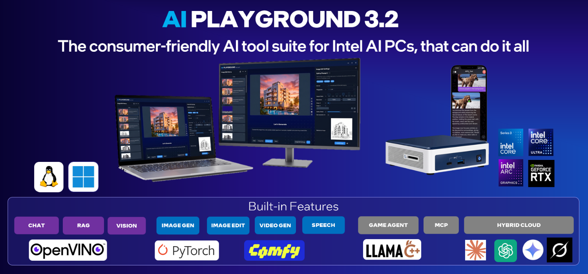
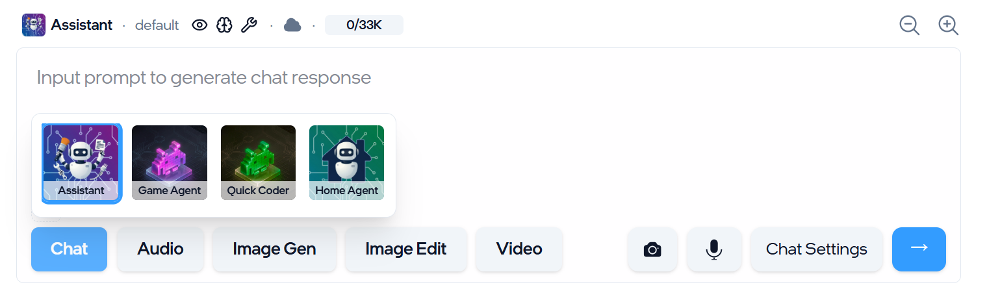
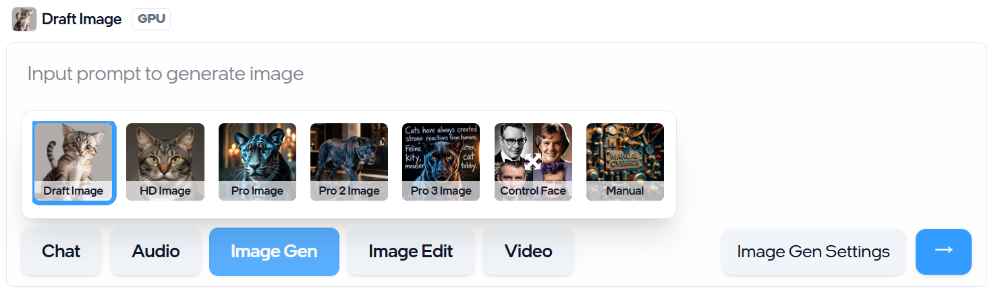
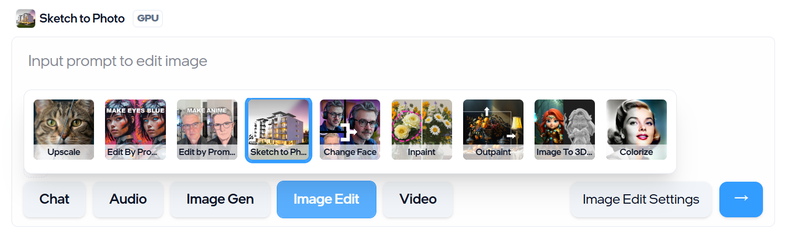
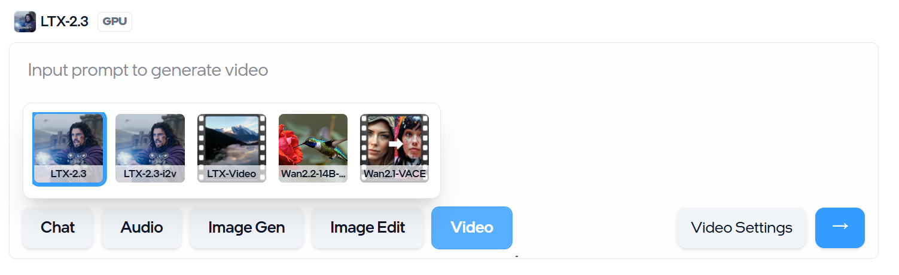
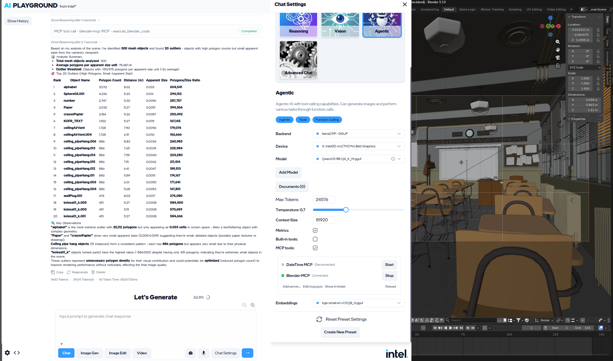
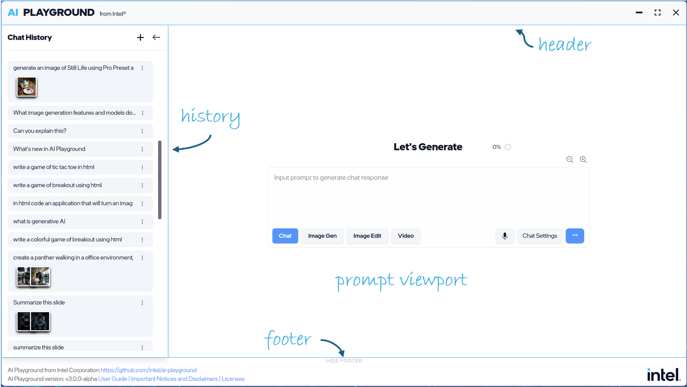
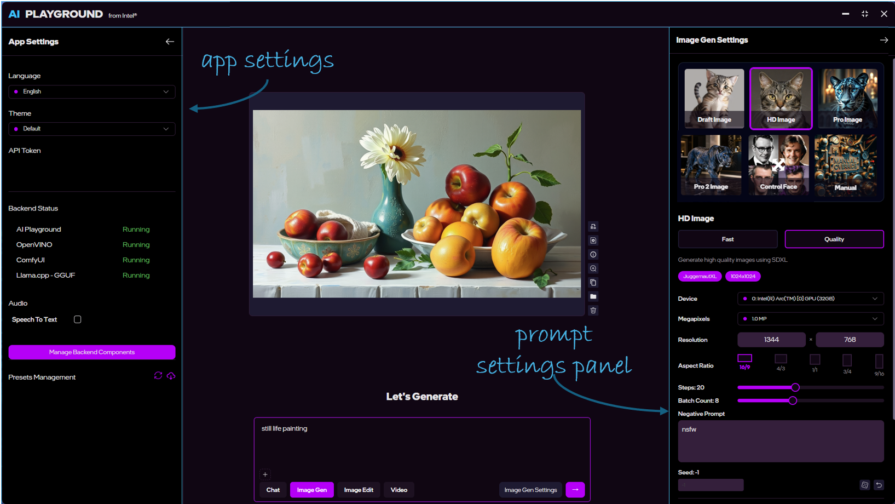

<a href="https://scan.coverity.com/projects/ai-playground">
  
</a>

# AI PLAYGROUND



Welcome to AI Playground open source project and AI PC generative AI application suite. This application provides a full suite of generative AI features for chat, image generation, video generation, code assistance, document search, image analysis, and more. Features can run offline on your PC’s Intel® Core™ Ultra with built-in Intel Arc GPU, Intel Arc™ dGPU Series A or B with 8GB+ of vRAM, or NVIDIA RTX GPUs—or you can optionally use Hybrid Cloud mode to run frontier models from providers such as ChatGPT, Claude, Gemini, and Grok while you manage models, cost, and control of your data.

AI Playground is intended to act as an offline alternative to cloud tools such as Gemini, ChatGPT, and Grok.  AI Playground leverages libraries from GitHub and Huggingface including:
- Image Diffusion (PyTorch): Stable Diffusion 1.5, SDXL, Flux.1-Schnell, Flux.1 Kontext[dev], Flux.2 Klein, Z-Image, ERNIE-Image, Wan 2.1/2.2, LTX-Video, LTX-2.3
- LLM: GGUF (Llama.cpp Vulkan) - Gemma 4, Qwen3.5, Qwen3.6, Qwen3 VL, GPT-OSS 20B, DeepSeek R1 Distilled, Phi3, Mistral 7B, Llama 3.2: OpenVINO - TinyLlama, Mistral 7B, Phi3 mini, Phi3.5 mini, DeepSeek R1 Distill (1.5B, 7B). Optional Hybrid Cloud backends connect to hosted models via your API keys.


As a local alternative to cloud AI services, AI Playground is intended to give consumers and AI curious prosumers easy and intuitive access to a wide variety of generative AI features using their Intel powered AI PC. This means you can be offline, without loading sensitive or personal data to 3rd party sites, for free, in a single app without having to know how to install and manage multiple AI backend frameworks.   Key features:
- Chat Assistant: One preset for vision, reasoning, document RAG, tool calling, and MCP—run image, video, and editing workflows from chat when tools are enabled
- Latest chat models: Gemma 4, Qwen3.5, Qwen3.6, Qwen3 VL, Mistral 7B, DeepSeek R1, GPT-OSS, and more via Llama.cpp or OpenVINO; browse, favorite, and download from the Model Manager (cylinder icon in the title bar)
- Game Agent & Quick Coder: Agentic presets to create HTML games (plan, debug, play-test, and thumbnails with Game Agent; faster one-shot creation with Quick Coder)
- Audio mode: Speech-to-text and text-to-speech presets (including voice design and custom voices)
- Hybrid Cloud (optional): Use frontier models from top providers when you configure API keys in the Set Up wizard—local features still work without it
  

Image generation presets	Image editing presets	Video generation presets
- Agentic chat & MCP: Tool calling connects chat to built-in media tools and external apps (for example Blender via MCP)

- Image Generation: From Stable Diffusion 1.5, SDXL, Flux.1, Z-Image, and ERNIE-Image—draft through Pro-quality presets with strong prompt adherence
- Image Editing: Subscription free and private control for upscaling, inpainting, outpainting, 2D to 3D mesh or editing images in a variety of ways.  Good for editing personal photos to taking sketches and generated images to the next level with greater control.
- Video Generation: Text- and image-guided clips (LTX, WAN, and related presets; best on discrete GPUs or high-memory Core Ultra systems)
- Remote access — Home Agent: Run AI Playground from Telegram, Slack, or a LAN web chat on your phone while your home PC does the work
- Help mode: Toggle contextual guidance in the UI (? icon) for presets, settings, and core areas

### UI overview
Figure 1: Screenshot of user interface with the light color theme and Chat History Panel and Footer Panel exposed



Figure 2: Screenshot of user interface using the default color theme, with the App Settings Panel and Prompt Settings Panel exposed



## README.md
- English (readme.md)

## Min Specs
AI Playground alpha and beta installers are currently available downloadable executables, or available as a source code from our Github repository.  To run AI Playground you must have a PC that meets the following specifications

*	Windows OS or Linux Ubuntu
*	AI Playground Essentials: Intel Core Series 3 with 12GB of system memory (basic chat, RAG chat, basic image gen and editing)
*	AI Playground Studio: Intel Core Ultra (Series 3, Series 2 V/H, or Series 1 H) or Intel Arc discrete GPU (Series A or B) with at least 8GB of vRAM (full feature set in the [Users Guide](https://github.com/intel/AI-Playground/blob/main/AI%20Playground%20Users%20Guide.pdf))
*	AI Playground Studio for NVIDIA CUDA: PC with NVIDIA GeForce RTX discrete GPU with 8GB+ of vRAM (experimental; OpenVINO is not supported in this mode)
*	82GB+ of disk space recommended (application ~6GB; models require additional space)
*	Home Agent feature requires a minimum of 32GB of system memory on Intel Core Ultra laptops, or 16GB of vRAM on discrete GPU systems

## Installation - Packaged Installer: 
This is a single packaged installer for all supported hardware mentioned above. This installer simplifies the process for end users to install AI Playground on their PCs. Please note that while this makes the installation process easier, this is open-source beta software, and there may be component and version conflicts. Refer to the Troubleshooting section for known issues.

### Download the installer
:new: **AI Playground 3.2.0 beta (all SKUs)** - [Release Notes](https://github.com/intel/AI-Playground/releases/tag/v3.2.0-beta-rc2) | [Windows Installer](https://github.com/intel/AI-Playground/releases/download/v3.2.0-beta-rc2/AI-Playground-installer.exe) | [Linux Installer](https://github.com/intel/AI-Playground/releases/download/v3.2.0-beta-rc2/AI-Playground-installer.deb)

Previous release: [AI Playground 3.1.2 beta-hf3](https://github.com/intel/AI-Playground/releases/tag/v3.1.2-beta_hf3)

### Installation Process for v3.x
1. The packaged installer targets all supported hardware above and prepares the AI Playground runtime for first launch.
2. On first run, the AI Playground Set Up wizard appears. Choose a hardware mode (Essentials, Studio, or Studio for NVIDIA CUDA) and install backend components (Llama.cpp, OpenVINO, ComfyUI, and optional Home Agent, Hybrid Cloud, and Audio). It is recommended to keep default hardware settings and enable all components, then click Install and Continue. This step needs a clear, unfiltered internet connection (corporate VPNs often cause failures) and may **take several minutes**.
3. Download the Users Guide for full application information: [AI Playground Users Guide v3.2](https://github.com/intel/AI-Playground/blob/main/AI%20Playground%20Users%20Guide.pdf)

### Troubleshooting Installation
The following are known situations where your installation may be blocked or interrupted.  Review the following to remedy installations issues.  If installation issues persist, generate a copy of the log by typing CTRL+SHIFT+I, select the console tab and copy the last few entries of the log written where the installer failed.  Provide these details to us via the issues tab here, or via the Intel Insiders Discord, or Graphics forum on Intel's support site.

1. **Llama.cpp embedding issues**: At the time of this release, Llama.cpp embeddings may have issues with:
  * Recent drivers, and may require DDU to clean driver cache.
  * Anti-Virus software - features needed to read and write embedding cache may not be properly installed:  Disable anti-virus, restart 
2. **Restart**: Time-out issues have been sighted, which show as a failed install but resolve when restarting AI Playground
3. **Verify Intel Arc GPU**: Ensure your system has an Intel Arc GPU with the lastest driver. Go to your Windows Start Menu, type "Device Manager," and under Display Adapters, check the name of your GPU device. It should describe an Intel Arc GPU. If so, then you you have a GPU that means our minimum specifications.  If it says "Intel(R) Graphics," your system does not have a built-in Intel Arc GPU and does not meet the minimum specifications. If your GPU is an discrete GPU such as Intel Arc A or B series GPU, then you can troubleshoot a troubled installation by disabling the iGPU in Device Manager
4. **Interrupted Installation**: The online installation for backend components can be interrupted or blocked by an IT network, firewall, corporate VPN, or sleep settings. Disconnect from corporate VPN for the Set Up wizard when possible; otherwise use an open network, with the firewall off, and set sleep settings to stay awake when powered on.
5. **Missing Libraries**: Some Windows systems may be missing needed libraries. This can be fixed by installing the 64-bit VC++ redistribution from Microsoft [here](https://learn.microsoft.com/en-us/cpp/windows/latest-supported-vc-redist?view=msvc-170). It is recommended this be done after updating the Graphics drivers. Then install AI Playground.
6. **Python Conflict**: Some PCs with an existing installation of Python can cause a conflict with AI Playground installation, where the wrong or conflicting packages are installed due to the incorrect version or location of Python on the system.  This is usually remedied by uninstalling Python environment, restarting and reinstalling AI Playground
7.  **Temp Files**: Should the installation be interrupted because of any of the above issues it is possible that temporary installation files have been left behind and trying to install with these files in place can block the installation. Remove these files or do a clean install of AI Playground to remedy

## Project Development
### Checkout Source Code

To get started, clone the repository and navigate to the project directory:

```cmd
git clone -b dev https://github.com/intel/AI-Playground.git
cd AI-Playground
```

### Install Node.js Dependencies

1. Install the **Node.js ≥ 20** development environment.

   - **Windows / macOS:** download the installer from [Node.js](https://nodejs.org/en/download).
   - **Ubuntu 24.04 / Debian:** the distro's `apt install nodejs` ships Node 18
     (no `npm`) and is **too old**. Install Node 22 LTS via NodeSource instead:

     ```bash
     curl -fsSL https://deb.nodesource.com/setup_22.x | sudo -E bash -
     sudo apt install -y nodejs
     node --version    # expect: v22.x
     npm  --version    # expect: 10.x
     ```

     Behind a corporate proxy that intercepts `deb.nodesource.com`, prefix the
     `curl` with `--proxy "$http_proxy"` and ensure `https_proxy` is exported.

2. Navigate to the `WebUI` directory and run the one-time setup:

```bash
cd WebUI
npm run setup
```

This installs the Node.js dependencies, fetches external resources (`uv`, 7-Zip
and other tools — see [Fetch External Resources](#fetch-external-resources)
below), provisions the Electron binary, and installs the git pre-commit hook
(Ruff for the Python backends, ESLint + Prettier for the WebUI — see
`.pre-commit-config.yaml`). The hook step is best effort: if `pre-commit` is
unavailable it prints how to install it and continues. You can re-run just the
hook install at any time with `npm run install-hooks`. (Plain `npm install`
still works if you only want the Node.js dependencies.)

### Fetch External Resources

1. In the `WebUI` directory, execute the `fetch-external-resources` script to download required external resources:

This will download `uv` (Python package manager) and other required tools to the `build/resources/` directory.

### Launch the application

To start the application in development mode, run:

```
npm run dev
```

### (Optional) Build the installer

To build the installer, run:

```
npm run build
```

The installer executable will be located in the `build/electron` folder. Its name
identifies the build it came from: a release tag when the build was started by
pushing one (`AI.Playground-3.2.0-alpha.test8.exe`), otherwise the app version
plus the short commit (`AI.Playground-3.2.0-alpha.8adad7c.exe`). The same commit
and tag are shown when hovering the version in the app's footer.

### Build and run on Linux (AppImage or .deb)

> Linux support is experimental. The frontend, AI Backend, LlamaCPP and ComfyUI
> backends run on Ubuntu x64. The packaged installer/AppImage/.deb supports Ubuntu 24
> or newer only. Complete host GPU setup **before** installing the app — see
> [`docs/linux-intel-gpu-setup.md`](docs/linux-intel-gpu-setup.md) (Intel OMIX +
> Vulkan).

The Linux build produces both a single, portable **AppImage** (no installation, no
root) and a **`.deb`** package for a system-wide install via `apt`.

1. Build it from the `WebUI` directory:

   ```bash
   cd WebUI
   npm install                        # install build dependencies
   npm run fetch-external-resources   # one-time: downloads uv/7zip
   npm run build:linux
   ```

   Both `AI.Playground-<build>.AppImage` and `AI.Playground-<build>.deb` are
   written to `build/electron`. The build host needs `ar` (from `binutils`,
   usually already present) to assemble the `.deb`.

2. Install FUSE once (required to run any AppImage):

   ```bash
   sudo apt install -y libfuse2t64
   ```

3. Make it executable and start the app:

   ```bash
   cd build/electron
   chmod +x AI.Playground-*.AppImage
   ./AI.Playground-*.AppImage
   ```

   `--no-sandbox` is baked into the launcher (see `build/scripts/after-pack.cjs`),
   so you can also start the app by double-clicking the AppImage in your file
   manager — provided the file manager is allowed to run executables (in GNOME
   Files: Preferences → "Executable Text Files" / right-click → Run, or
   `chmod +x` as above). Do **not** start it with `sudo` — Electron refuses to
   run as root.

   Alternatively, install the **`.deb`** instead of running the AppImage. `apt`
   resolves the runtime dependencies declared in the package
   (`libgtk-3-0`, `libnss3`, `libasound2`, `libdbus-1-3`, `pciutils`, `python3`,
   `git`):

   ```bash
   cd build/electron
   sudo apt install ./AI.Playground-*.deb
   ```

   This installs the app system-wide; launch it as **AI Playground** from your
   application menu or run `ai-playground` from a terminal. `--no-sandbox` is
   baked into the launcher here too. Uninstall with `sudo apt remove ai-playground`.

4. OpenVINO Ubuntu dependencies are checked during OpenVINO backend setup.

   If required packages are missing, AI Playground can open a terminal installer.
   The terminal asks for your sudo password and runs the package install command.

   On Ubuntu, the install command is:

   ```bash
   sudo apt-get update
   sudo apt-get install -y python3 python3-venv libtbb12 libhwloc15 libgomp1 libnuma1 ocl-icd-libopencl1 libfuse2t64
   ```

5. ComfyUI Ubuntu build dependencies are checked during ComfyUI backend setup.

   ComfyUI is cloned with `git` and some of its Python dependencies (e.g.
   `insightface`) are compiled from source during install, which needs a C
   compiler and the CPython headers. On a fresh Ubuntu these are missing, so
   AI Playground prompts to install them automatically. To install them
   manually:

   ```bash
   sudo apt-get update
   sudo apt-get install -y git build-essential python3-dev
   ```

### Behind a corporate / HTTP proxy

AI Playground downloads tools at build time (`uv`, `7zip`) and backend binaries
on first run (llama.cpp, OpenVINO/OVMS). Both honor the standard proxy
environment variables when they are set — export them before building or
launching:

```bash
export https_proxy="http://proxy.example.com:port"
export http_proxy="http://proxy.example.com:port"
export no_proxy="localhost,127.0.0.1"   # hosts to reach directly
```

With these set:

- **Build** (`npm run fetch-external-resources` / `npm run build:linux`) routes
  Node's downloads through the proxy (the script runs with
  `NODE_USE_ENV_PROXY=1`).
- **Runtime** the app reads the same variables at startup and points Electron's
  network stack (`net.fetch`) at the proxy, so llama.cpp and OVMS downloads
  succeed.

> ⚠️ **Launching from a file manager won't pick up the proxy.** Double-clicking
> the AppImage starts it from the desktop session, which does **not** inherit
> `http_proxy` exported in `~/.profile` or `~/.bashrc`. Either launch the
> AppImage from a terminal where the variables are exported, or configure a
> system-wide proxy (e.g. GNOME Settings → Network → Network Proxy) so the
> desktop session provides them.

If your network blocks the downloads entirely, you can also pre-place the build
tools manually: drop the extracted `uv`/`7zip` binaries into
`WebUI/build/resources/` (the fetch script skips any file already present)
before running the build.

#### Corporate proxy + Intel-owned external hosts

A common gotcha on Intel networks: `apt` and `curl` honor `no_proxy` exactly,
but a **broad** entry like `no_proxy=*.intel.com` will **also** match the
externally-hosted CDN `repositories.intel.com` (resolves to AWS), causing
`apt update` to hang trying to reach it directly through the corporate firewall.

Work around it by **scoping the proxy override per-host** rather than rewriting
`no_proxy`:

```bash
# /etc/apt/apt.conf.d/99-intel-proxy
Acquire::http::Proxy::repositories.intel.com  "http://proxy.example.com:port";
Acquire::https::Proxy::repositories.intel.com "http://proxy.example.com:port";
```

For interactive `curl` calls (e.g. fetching the NPU driver tarball from
`github.com` which redirects to AWS), pass `--proxy "$http_proxy"` explicitly.

## Model Support
AI Playground does not ship with generative AI models pre-installed. When a task needs a model that is not on disk, the app prompts you to download it (after you accept the model’s terms on the provider site). Use the Model Manager (cylinder icon in the title bar) to browse, search, filter, favorite, download, add Hugging Face paths, and remove models. You can also download models from HuggingFace.co or CivitAI.com and place them in the appropriate model folder. 

Models currently linked from the application 

<details>
  <summary><h3>AI Model & License Registry</h3> </summary>

| Model Path / Name | Model Card (HF) | License Link |
| :--- | :--- | :--- |
| AdamCodd/vit-base-nsfw-detector | [Model Card](https://huggingface.co/AdamCodd/vit-base-nsfw-detector) | [Apache 2.0](https://www.apache.org/licenses/LICENSE-2.0) |
| Aitrepreneur/insightface/inswapper_128.onnx | [Model Card](https://huggingface.co/Aitrepreneur/insightface) | [Non-Commercial](https://huggingface.co/Aitrepreneur/insightface#license) |
| alimama-creative/FLUX.1-Turbo-Alpha | [Model Card](https://huggingface.co/alimama-creative/FLUX.1-Turbo-Alpha) | [FLUX.1-dev License](https://huggingface.co/black-forest-labs/FLUX.1-dev/blob/main/LICENSE.md) |
| BGE Small EN v1.5 (GGUF) | [Model Card](https://huggingface.co/BAAI/bge-small-en-v1.5) | [MIT License](https://opensource.org/licenses/MIT) |
| black-forest-labs/FLUX.2-klein-4b-fp8/flux-2-klein-4b-fp8.safetensors | [Model Card](https://huggingface.co/black-forest-labs/FLUX.2-klein-4b-fp8) | [Apache 2.0](https://www.apache.org/licenses/LICENSE-2.0) |
| city96/t5-v1_1-xxl-encoder-gguf/t5-v1_1-xxl-encoder-Q3_K_M.gguf | [Model Card](https://huggingface.co/city96/t5-v1_1-xxl-encoder-gguf) | [Apache 2.0](https://www.apache.org/licenses/LICENSE-2.0) |
| city96/t5-v1_1-xxl-encoder-gguf/t5-v1_1-xxl-encoder-Q4_K_M.gguf | [Model Card](https://huggingface.co/city96/t5-v1_1-xxl-encoder-gguf) | [Apache 2.0](https://www.apache.org/licenses/LICENSE-2.0) |
| city96/umt5-xxl-encoder-gguf/umt5-xxl-encoder-Q4_K_M.gguf | [Model Card](https://huggingface.co/city96/umt5-xxl-encoder-gguf) | [Apache 2.0](https://www.apache.org/licenses/LICENSE-2.0) |
| comfyanonymous/flux_text_encoders/clip_l.safetensors | [Model Card](https://huggingface.co/comfyanonymous/flux_text_encoders) | [Apache 2.0](https://www.apache.org/licenses/LICENSE-2.0) |
| comfyanonymous/flux_text_encoders/t5xxl_fp8_e4m3fn_scaled.safetensors | [Model Card](https://huggingface.co/comfyanonymous/flux_text_encoders) | [Apache 2.0](https://www.apache.org/licenses/LICENSE-2.0) |
| Comfy-Org/flux1-kontext-dev/flux1-dev-kontext_fp8_scaled.safetensors | [Model Card](https://huggingface.co/Comfy-Org/flux1-kontext-dev) | [FLUX.1-dev License](https://huggingface.co/black-forest-labs/FLUX.1-dev/blob/main/LICENSE.md) |
| Comfy-Org/Lumina_Image_2.0_Repackaged/ae.safetensors | [Model Card](https://huggingface.co/Comfy-Org/Lumina_Image_2.0_Repackaged) | [Apache 2.0](https://www.apache.org/licenses/LICENSE-2.0) |
| Comfy-Org/Real-ESRGAN_repackaged/RealESRGAN_x4plus.safetensors | [Model Card](https://huggingface.co/Comfy-Org/Real-ESRGAN_repackaged) | [BSD-3-Clause](https://opensource.org/licenses/BSD-3-Clause) |
| Comfy-Org/Wan_2.1_ComfyUI_repackaged/wan_2.1_vae.safetensors | [Model Card](https://huggingface.co/Comfy-Org/Wan_2.1_ComfyUI_repackaged) | [Wan 2.1 License](https://huggingface.co/Wan-AI/Wan2.1-T2V-14B/blob/main/LICENSE) |
| Comfy-Org/z_image_turbo/ae.safetensors | [Model Card](https://huggingface.co/Comfy-Org/z_image_turbo) | [Apache 2.0](https://www.apache.org/licenses/LICENSE-2.0) |
| Comfy-Org/z_image_turbo/qwen_3_4b.safetensors | [Model Card](https://huggingface.co/Comfy-Org/z_image_turbo) | [Apache 2.0](https://www.apache.org/licenses/LICENSE-2.0) |
| Comfy-Org/z_image_turbo/z_image_turbo_bf16.safetensors | [Model Card](https://huggingface.co/Comfy-Org/z_image_turbo) | [Apache 2.0](https://www.apache.org/licenses/LICENSE-2.0) |
| DeepSeek-R1-Distill-Qwen 1.5B | [Model Card](https://huggingface.co/deepseek-ai/DeepSeek-R1-Distill-Qwen-1.5B) | [MIT License](https://opensource.org/licenses/MIT) |
| DeepSeek-R1-Distill-Qwen 7B | [Model Card](https://huggingface.co/deepseek-ai/DeepSeek-R1-Distill-Qwen-7B) | [MIT License](https://opensource.org/licenses/MIT) |
| Gemma 3 4B IT (Unsloth) | [Model Card](https://huggingface.co/unsloth/gemma-3-4b-it) | [Gemma License](https://ai.google.dev/gemma/terms) |
| gmk123/GFPGAN/GFPGANv1.4.pth | [Model Card](https://huggingface.co/gmk123/GFPGAN) | [Apache 2.0](https://www.apache.org/licenses/LICENSE-2.0) |
| GPT-OSS 20B (Unsloth) | [Model Card](https://huggingface.co/unsloth/gpt-oss-20b) | [Apache 2.0](https://www.apache.org/licenses/LICENSE-2.0) |
| InternVL2 4B (OV) | [Model Card](https://huggingface.co/OpenGVLab/InternVL2-4B) | [Apache 2.0](https://www.apache.org/licenses/LICENSE-2.0) |
| latent-consistency/lcm-lora-sdv1-5/pytorch_lora_weights.safetensors | [Model Card](https://huggingface.co/latent-consistency/lcm-lora-sdv1-5) | [OpenRAIL++](https://huggingface.co/spaces/CompVis/stable-diffusion-license) |
| latent-consistency/lcm-lora-sdxl/pytorch_lora_weights.safetensors | [Model Card](https://huggingface.co/latent-consistency/lcm-lora-sdxl) | [OpenRAIL++](https://huggingface.co/spaces/CompVis/stable-diffusion-license) |
| Lightricks/LTX-Video/ltxv-2b-0.9.6-distilled-04-25.safetensors | [Model Card](https://huggingface.co/Lightricks/LTX-Video) | [Apache 2.0](https://www.apache.org/licenses/LICENSE-2.0) |
| Llama 3.2 3B Instruct | [Model Card](https://huggingface.co/meta-llama/Llama-3.2-3B-Instruct) | [Llama 3.2 License](https://github.com/meta-llama/llama-models/blob/main/models/llama3_2/LICENSE) |
| lllyasviel/fooocus_inpaint/fooocus_inpaint_head.pth | [Model Card](https://huggingface.co/lllyasviel/fooocus_inpaint) | [OpenRAIL](https://huggingface.co/spaces/CompVis/stable-diffusion-license) |
| lllyasviel/fooocus_inpaint/inpaint_v26.fooocus.patch | [Model Card](https://huggingface.co/lllyasviel/fooocus_inpaint) | [OpenRAIL](https://huggingface.co/spaces/CompVis/stable-diffusion-license) |
| Lykon/DreamShaper/DreamShaper_8_pruned.safetensors | [Model Card](https://huggingface.co/Lykon/DreamShaper) | [OpenRAIL-M](https://huggingface.co/spaces/CompVis/stable-diffusion-license) |
| Lykon/dreamshaper-8-inpainting/text_encoder/model.safetensors | [Model Card](https://huggingface.co/Lykon/dreamshaper-8-inpainting) | [OpenRAIL-M](https://huggingface.co/spaces/CompVis/stable-diffusion-license) |
| Lykon/dreamshaper-8-inpainting/unet/model.safetensors | [Model Card](https://huggingface.co/Lykon/dreamshaper-8-inpainting) | [OpenRAIL-M](https://huggingface.co/spaces/CompVis/stable-diffusion-license) |
| Lykon/dreamshaper-8-inpainting/vae/model.safetensors | [Model Card](https://huggingface.co/Lykon/dreamshaper-8-inpainting) | [OpenRAIL-M](https://huggingface.co/spaces/CompVis/stable-diffusion-license) |
| Meta-Llama 3.1 8B Instruct | [Model Card](https://huggingface.co/meta-llama/Meta-Llama-3.1-8B-Instruct) | [Llama 3.1 License](https://github.com/meta-llama/llama-models/blob/main/models/llama3_1/LICENSE) |
| Mistral 7B Instruct v0.2 (OV) | [Model Card](https://huggingface.co/mistralai/Mistral-7B-Instruct-v0.2) | [Apache 2.0](https://www.apache.org/licenses/LICENSE-2.0) |
| Mistral 7B Instruct v0.3 | [Model Card](https://huggingface.co/mistralai/Mistral-7B-Instruct-v0.3) | [Apache 2.0](https://www.apache.org/licenses/LICENSE-2.0) |
| Mistral 7B Instruct v0.3 (OV) | [Model Card](https://huggingface.co/mistralai/Mistral-7B-Instruct-v0.3) | [Apache 2.0](https://www.apache.org/licenses/LICENSE-2.0) |
| Nomic Embed Text v1.5 (GGUF) | [Model Card](https://huggingface.co/nomic-ai/nomic-embed-text-v1.5) | [Apache 2.0](https://www.apache.org/licenses/LICENSE-2.0) |
| Phi-3 Mini 4k Instruct (OV) | [Model Card](https://huggingface.co/microsoft/Phi-3-mini-4k-instruct) | [MIT License](https://opensource.org/licenses/MIT) |
| Phi-3.5 Mini Instruct (OV) | [Model Card](https://huggingface.co/microsoft/Phi-3.5-mini-instruct) | [MIT License](https://opensource.org/licenses/MIT) |
| QuantStack/Wan2.1_14B_VACE-GGUF/Wan2.1_14B_VACE-Q8_0.gguf | [Model Card](https://huggingface.co/QuantStack/Wan2.1_14B_VACE-GGUF) | [Apache 2.0](https://www.apache.org/licenses/LICENSE-2.0) |
| Qwen2-VL 7B Instruct (OV) | [Model Card](https://huggingface.co/Qwen/Qwen2-VL-7B-Instruct) | [Apache 2.0](https://www.apache.org/licenses/LICENSE-2.0) |
| Qwen3 4B (OV) | [Model Card](https://huggingface.co/Qwen/Qwen2.5-4B) | [Apache 2.0](https://www.apache.org/licenses/LICENSE-2.0) |
| Qwen3 4B (Unsloth) | [Model Card](https://huggingface.co/unsloth/Qwen2.5-4B) | [Apache 2.0](https://www.apache.org/licenses/LICENSE-2.0) |
| Qwen3 4B Instruct 2507 (Unsloth) | [Model Card](https://huggingface.co/unsloth/Qwen2.5-4B-Instruct) | [Apache 2.0](https://www.apache.org/licenses/LICENSE-2.0) |
| Qwen3-VL 4B Instruct (Unsloth) | [Model Card](https://huggingface.co/unsloth/Qwen2-VL-7B-Instruct) | [Apache 2.0](https://www.apache.org/licenses/LICENSE-2.0) |
| RunDiffusion/Juggernaut-XL-v9/RunDiffusionPhoto_v2.safetensors | [Model Card](https://huggingface.co/RunDiffusion/Juggernaut-XL-v9) | [OpenRAIL-M](https://huggingface.co/spaces/CompVis/stable-diffusion-license) |
| SmolLM2 1.7B Instruct | [Model Card](https://huggingface.co/HuggingFaceTB/smollm2-1.7b-instruct) | [Apache 2.0](https://www.apache.org/licenses/LICENSE-2.0) |
| stabilityai/control-lora/rank128-canny-rank128.safetensors | [Model Card](https://huggingface.co/stabilityai/control-lora) | [SAI Community](https://huggingface.co/stabilityai/control-lora#license) |
| tencent/Hunyuan3D-2.1/hunyuan3d-dit-v2-1/model.fp16.ckpt | [Model Card](https://huggingface.co/tencent/Hunyuan3D-2.1) | [Hunyuan3D License](https://huggingface.co/tencent/Hunyuan3D-2.1/blob/main/LICENSE.txt) |
| tencent/Hunyuan3D-2/hunyuan3d-dit-v2-0/model.fp16.safetensors | [Model Card](https://huggingface.co/tencent/Hunyuan3D-2) | [Hunyuan3D License](https://huggingface.co/tencent/Hunyuan3D-2/blob/main/LICENSE.txt) |
| TinyLlama 1.1B Chat (OV) | [Model Card](https://huggingface.co/TinyLlama/TinyLlama-1.1B-Chat-v1.0) | [Apache 2.0](https://www.apache.org/licenses/LICENSE-2.0) |
| Whisper (OV) | [Model Card](https://huggingface.co/openai/whisper-large-v3) | [Apache 2.0](https://www.apache.org/licenses/LICENSE-2.0) |

</details>

Be sure to check license terms for any model used in AI Playground especially taking note of any restrictions.

### Use Alternative Models
Check the [User Guide](https://github.com/intel/AI-Playground/blob/main/AI%20Playground%20Users%20Guide.pdf) for details or [watch this video](https://www.youtube.com/watch?v=1FXrk9Xcx2g) on how to add alternative Stable Diffusion models to AI Playground


## Notices and Disclaimers: 
For information on AI Playground terms, license and disclaimers, visit the project and files on GitHub repo:</br >
[License](https://github.com/intel/AI-Playground/blob/main/LICENSE) | [Notices & Disclaimers](https://github.com/intel/AI-Playground/blob/main/notices-disclaimers.md)

The software may include third party components with separate legal notices or governed by other agreements, as may be described in the Third Party Notices file accompanying the software.

## Credit
License details for borrowed code and components can be found in our [3rdpartynoticeslicense](3rdpartynoticeslicenses.txt) file.  
Additionally, these entities and their work stand out as are fundamental to AI Playground.
*	PyTorch - https://pytorch.org/ 
*	Stable Diffusion - https://github.com/Stability-AI/stablediffusion
*	ComfyUI -  https://github.com/comfyanonymous/ComfyUI
*	OpenVINO - https://openvinotoolkit.github.io/openvino.genai/ 
*	Llama.cpp - https://github.com/ggml-org/llama.cpp 
*	Vue.js - https://vuejs.org/ 
*	Plus countless other open-source projects and contributors that make this work possible!

